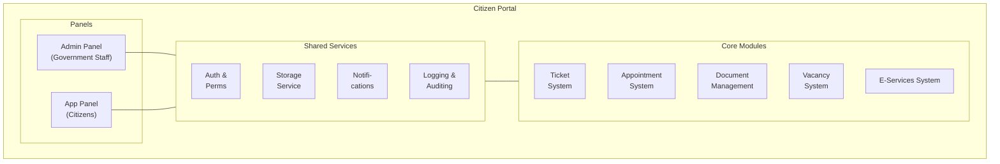

## Platform Purpose and Overview

The Citizen Portal is a comprehensive digital platform designed to streamline interactions between government entities and citizens. Built on modern web technologies, this platform serves as a centralized hub for various government services, enabling efficient management of administrative tasks, citizen requests, and public information.

<Note>
The platform addresses several key challenges in government administration:

- **Fragmented Service Delivery**: Consolidates various government services into a single, unified platform
- **Administrative Inefficiency**: Automates routine tasks and streamlines workflows
- **Limited Accessibility**: Provides 24/7 online access to government services
- **Communication Gaps**: Facilitates direct communication between citizens and government officials
- **Resource Management**: Optimizes allocation and utilization of government resources
</Note>

## Technology Stack

The platform is built using a robust and modern technology stack:

  <table className="min-w-full">
    <thead>
      <tr>
        <th className="px-4 py-2 bg-slate-100 dark:bg-slate-800">Component</th>
        <th className="px-4 py-2 bg-slate-100 dark:bg-slate-800">Technology</th>
        <th className="px-4 py-2 bg-slate-100 dark:bg-slate-800">Version</th>
      </tr>
    </thead>
    <tbody>
      <tr>
        <td className="border px-4 py-2">Backend Framework</td>
        <td className="border px-4 py-2">Laravel</td>
        <td className="border px-4 py-2">11.x</td>
      </tr>
      <tr>
        <td className="border px-4 py-2">Admin Panel</td>
        <td className="border px-4 py-2">FilamentPHP</td>
        <td className="border px-4 py-2">3.2.x</td>
      </tr>
      <tr>
        <td className="border px-4 py-2">UI Interactivity</td>
        <td className="border px-4 py-2">Livewire</td>
        <td className="border px-4 py-2">3.x</td>
      </tr>
      <tr>
        <td className="border px-4 py-2">Database</td>
        <td className="border px-4 py-2">MariaDB</td>
        <td className="border px-4 py-2">10.x</td>
      </tr>
      <tr>
        <td className="border px-4 py-2">Authentication</td>
        <td className="border px-4 py-2">Laravel Sanctum & FilamentBreezy</td>
        <td className="border px-4 py-2">4.0.x & 2.4.x</td>
      </tr>
      <tr>
        <td className="border px-4 py-2">Authorization</td>
        <td className="border px-4 py-2">Spatie Permissions & FilamentShield</td>
        <td className="border px-4 py-2">3.2.x</td>
      </tr>
      <tr>
        <td className="border px-4 py-2">File Storage</td>
        <td className="border px-4 py-2">Spatie Media Library</td>
        <td className="border px-4 py-2">3.2.x</td>
      </tr>
      <tr>
        <td className="border px-4 py-2">UI Framework</td>
        <td className="border px-4 py-2">TailwindCSS</td>
        <td className="border px-4 py-2">3.x</td>
      </tr>
      <tr>
        <td className="border px-4 py-2">Icons</td>
        <td className="border px-4 py-2">Heroicons</td>
        <td className="border px-4 py-2">2.x</td>
      </tr>
      <tr>
        <td className="border px-4 py-2">Calendar</td>
        <td className="border px-4 py-2">Guava Calendar</td>
        <td className="border px-4 py-2">1.10.x</td>
      </tr>
      <tr>
        <td className="border px-4 py-2">API Documentation</td>
        <td className="border px-4 py-2">Rupadana API Service</td>
        <td className="border px-4 py-2">3.4.x</td>
      </tr>
    </tbody>
  </table>

<Tip>
This stack provides a balance of developer productivity, performance, and maintainability while leveraging the ecosystem of Laravel and FilamentPHP.
</Tip>

## Panel Descriptions

The platform consists of two distinct panels, each serving different user groups:

<Tabs>
  <Tab title="Admin Panel">
    The Admin Panel is designed for government staff and administrators. It provides a comprehensive set of tools for managing government operations, citizen requests, and internal workflows. Key features include:

    - **Tenant-Based Architecture**: Each government ministry (entity) operates within its own isolated environment
    - **Role-Based Access Control**: Different permission levels for administrators, managers, and staff
    - **Comprehensive Dashboard**: Real-time analytics and insights into government operations
    - **Advanced Management Tools**: For appointments, tickets, documents, vacancies, and e-services
  </Tab>
  <Tab title="App Panel">
    The App Panel serves as the citizen-facing interface of the platform. It provides a user-friendly experience for accessing government services, submitting requests, and tracking their status. Key features include:

    - **Personalized Dashboard**: Displays information relevant to the logged-in citizen
    - **Service Request System**: For submitting and tracking various government service requests
    - **Document Management**: Access to personal documents and government forms
    - **Appointment Booking**: Schedule meetings with government officials
    - **Job Application System**: Apply for government job vacancies
  </Tab>
</Tabs>

## System Architecture Overview

The platform follows a multi-tenant architecture with a clear separation between the Admin and App panels:
<Frame>

</Frame>
The system uses Laravel's robust ORM for database interactions and follows the MVC (Model-View-Controller) pattern. FilamentPHP provides the admin panel framework, while Livewire enables dynamic, reactive user interfaces without complex JavaScript.

## Key Features Summary

<Tabs>
  <Tab title="For Government Staff (Admin Panel)">
    <CardGroup cols={2}>
      <Card title="Entity Management" icon="building">
        Create and manage government ministries and departments
      </Card>
      <Card title="User Management" icon="users">
        Administer staff accounts, roles, and permissions
      </Card>
      <Card title="Ticket System" icon="ticket">
        Handle citizen inquiries and service requests
      </Card>
      <Card title="Appointment Management" icon="calendar">
        Schedule and manage meetings with citizens
      </Card>
      <Card title="Document Library" icon="file-lines">
        Organize and share official documents
      </Card>
      <Card title="Vacancy Management" icon="briefcase">
        Post job openings and process applications
      </Card>
      <Card title="E-Services Administration" icon="gears">
        Configure and manage online government services
      </Card>
      <Card title="Analytics Dashboard" icon="chart-line">
        Monitor key performance indicators and service metrics
      </Card>
    </CardGroup>
  </Tab>
  <Tab title="For Citizens (App Panel)">
    <CardGroup cols={2}>
      <Card title="Service Requests" icon="clipboard-list">
        Submit and track various government service requests
      </Card>
      <Card title="Appointment Booking" icon="calendar-check">
        Schedule meetings with government officials
      </Card>
      <Card title="Document Access" icon="folder-open">
        View and download personal documents and forms
      </Card>
      <Card title="Job Applications" icon="file-signature">
        Apply for government job vacancies
      </Card>
      <Card title="E-Services" icon="laptop">
        Access and use online government services
      </Card>
      <Card title="Profile Management" icon="user-gear">
        Update personal information and preferences
      </Card>
      <Card title="Notifications" icon="bell">
        Receive updates on request status and important announcements
      </Card>
    </CardGroup>
  </Tab>
</Tabs>

<Note>
  This platform represents a significant step forward in digital government services, providing a seamless experience for both government staff and citizens while ensuring security, efficiency, and accessibility.
</Note>