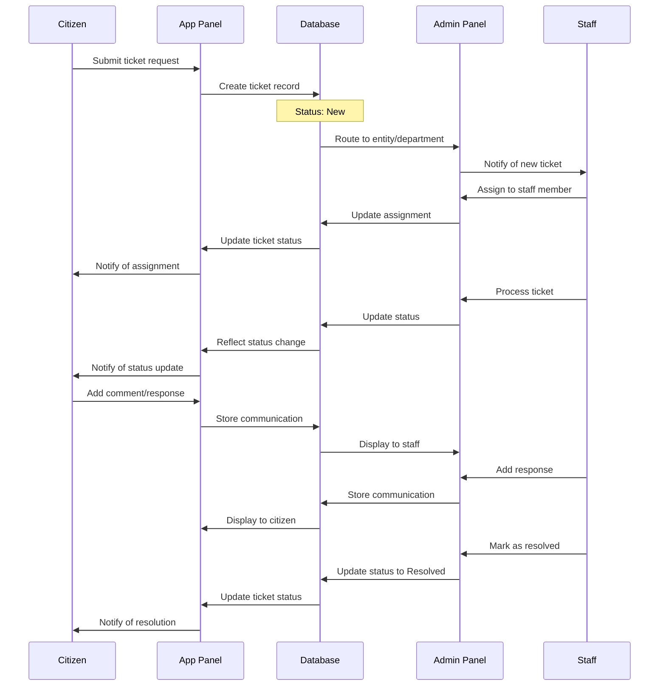
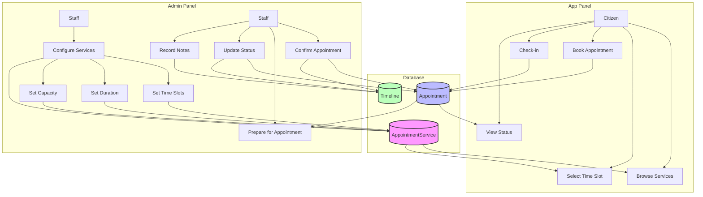
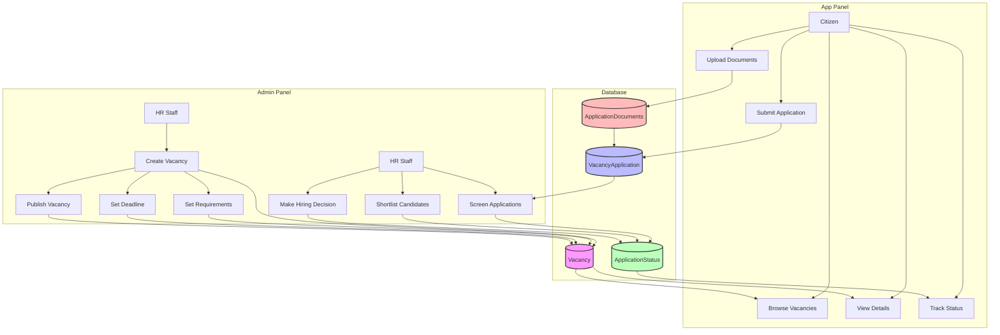
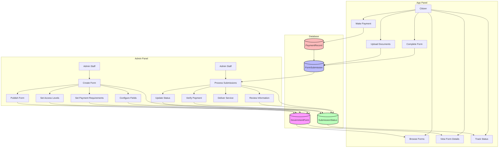
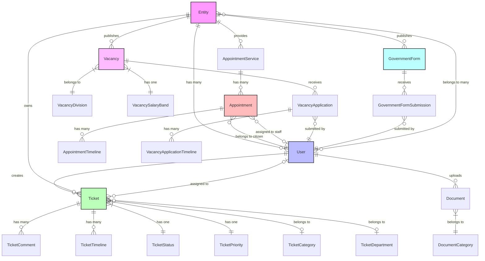

# Module Functionalities

This section provides a detailed breakdown of the specific modules available in both the Admin and App panels of the Government Administration Portal.

## Admin Panel Modules

The Admin Panel provides government staff with comprehensive tools to manage various aspects of government operations.

### Entity Management

The Entity Management module allows super administrators to create and manage government ministries and departments within the system.

#### Purpose

- Create and configure government entities (ministries, departments)
- Manage entity information, contact details, and branding
- Assign users to entities for proper access control
- Maintain a centralized directory of all government organizations

#### Features

- **Entity Creation**: Set up new government entities with comprehensive information
- **Entity Configuration**: Customize settings for each entity including contact details
- **User Assignment**: Associate staff users with specific entities for proper access control
- **Entity Branding**: Upload logos and set entity-specific styling for consistent visual identity
- **Entity Directory**: Maintain a searchable list of all government entities
- **Role-Based Access**: Restrict entity management to super administrators only

#### Technical Details

- Entities are managed through the `EntityResource` class which extends Filament's `Resource` class
- Entity data is stored in the `entities` table with relationships to users
- Super administrators can see and manage all entities, while regular administrators can only see entities they are assigned to
- Entity logos are managed through Spatie Media Library with a dedicated 'logos' collection
- The system enforces proper access control through the `getEloquentQuery` method which filters entities based on user permissions

#### Usage Instructions

1. **Creating a New Entity**:
   - Navigate to Entities in the Portal Management group
   - Click "New Entity"
   - Fill in the required information:
     - Name (required): Official name of the entity
     - Contact information:
       - Email: Official contact email
       - Phone: Main contact number
       - Website: Official website URL
     - Address: Physical location of the entity
   - Upload entity logo (recommended size: square format, minimum 200x200px)
   - Click "Create" to save the new entity

   > **Screenshot Suggestion**: *Entity creation form showing all fields and the logo upload area. Caption: "Entity creation form with all required fields and logo upload option."*

2. **Viewing Entity Details**:
   - From the entities list, click on an entity name or the "View" button
   - The entity detail page shows:
     - Logo and basic information in a split-view layout
     - Contact details including email, phone, website, and address
     - Number of assigned users

   > **Screenshot Suggestion**: *Entity detail view showing the split layout with logo on left and information on right. Caption: "Entity detail view displaying logo and contact information in an organized layout."*

3. **Editing an Entity**:
   - From the entity list or detail view, click the "Edit" button
   - Update any information as needed
   - Click "Save" to apply changes

   > **Screenshot Suggestion**: *Entity edit form with pre-populated fields. Caption: "Entity edit form allowing administrators to update entity information and branding."*

4. **Managing Entity Users**:
   - Navigate to the Users section in the Shield group
   - Use the Entity filter to view users assigned to a specific entity
   - Add or remove users as needed

   > **Screenshot Suggestion**: *Users list filtered by entity showing assigned users. Caption: "User management interface filtered by entity, showing all staff assigned to a specific department."*

#### Access Control Notes

- Only users with the `super_admin` role can create and manage all entities
- Regular administrators can only view and manage entities they are assigned to
- Entity assignments determine which data users can access throughout the system

### User Management

The User Management module allows administrators to create and manage user accounts, assign roles and permissions, and control access to different parts of the system.

#### Purpose

- Create and manage user accounts for government staff
- Assign roles and permissions to users based on job responsibilities
- Associate users with specific government entities
- Ensure proper access control throughout the system
- Monitor user activity and access for security and compliance

#### Features

- **User Creation**: Create new user accounts with appropriate roles and entity assignments
- **Role Assignment**: Assign predefined roles to users (e.g., admin, manager, staff)
- **Entity Association**: Connect users to specific government entities they work for
- **Permission Management**: Fine-tune user permissions through role assignments
- **Access Control**: Restrict user access based on roles and entity assignments
- **User Directory**: Maintain a searchable list of all system users
- **Security Enforcement**: Prevent regular administrators from creating super admin accounts

#### Technical Details

- Users are managed through the `UserResource` class which extends Filament's `Resource` class
- User data is stored in the `users` table with relationships to roles and entities
- The system uses a role-based access control system with entity-based scoping
- Super administrators can see and manage all users, while regular administrators can only manage users within their entities
- The system prevents non-super-admin users from creating or managing super admin accounts
- Entity assignments create a many-to-many relationship between users and entities

#### Usage Instructions

1. **Creating a New User**:
   - Navigate to Users in the Shield group
   - Click "New User"
   - Fill in the required information:
     - Name (required): Full name of the user
     - Email (required): Work email address (used for login)
     - Password (required): Initial password (user should change after first login)
     - Role (required): Select appropriate role from dropdown
     - Entity (required): Select the government entity this user belongs to
   - Click "Create" to save the new user

   > **Screenshot Suggestion**: *User creation form showing all fields including role and entity selection. Caption: "User creation form with required fields and role/entity assignment options."*

2. **Managing User Roles**:
   - Navigate to the user's edit page
   - In the main form or the Roles relation manager, update the user's role
   - Note: Non-super-admin users cannot assign the super_admin role
   - Click "Save" to update the user's roles

   > **Screenshot Suggestion**: *User edit form showing the role selection dropdown with available options. Caption: "Role assignment interface showing available roles based on administrator permissions."*

3. **Assigning Users to Entities**:
   - Navigate to the user's edit page
   - In the main form or the Entities relation manager, select the appropriate entity
   - Users can be assigned to multiple entities if needed
   - Click "Save" to update the user's entity assignments

   > **Screenshot Suggestion**: *Entity assignment interface showing available entities in a dropdown or multi-select field. Caption: "Entity assignment interface allowing administrators to connect users to government departments."*

4. **Filtering and Finding Users**:
   - Use the search box to find users by name or email
   - Use the entity filter to view users from a specific entity
   - Sort by columns to organize the user list
   - Toggle column visibility to customize the view

   > **Screenshot Suggestion**: *Users list with search box, filters, and column options visible. Caption: "User management interface with search and filtering options to quickly locate specific users."*

#### Access Control Notes

- Only super administrators can see and manage all users in the system
- Regular administrators can only manage users within their assigned entities
- Regular administrators cannot create or manage super admin accounts
- User permissions are primarily determined by their assigned role
- Entity assignments further restrict what data users can access

### Ticket Management

The Ticket Management module provides a comprehensive system for handling citizen inquiries, support requests, and internal tasks through a structured ticketing system.

#### Purpose

- Process and respond to citizen support tickets and inquiries
- Track ticket status from creation through resolution
- Assign tickets to appropriate staff members based on expertise
- Categorize and prioritize tickets for efficient handling
- Maintain complete history of all communications and actions
- Provide analytics on ticket volume, resolution time, and staff performance

#### Features

- **Ticket Dashboard**: Overview of all tickets with status indicators and key metrics
- **Ticket Assignment**: Assign tickets to specific staff members for handling
- **Category Management**: Organize tickets by predefined categories
- **Priority Levels**: Set and adjust ticket priorities based on urgency
- **Status Tracking**: Monitor ticket progress through various statuses
- **Department Routing**: Direct tickets to appropriate departments for specialized handling
- **Communication System**: Internal notes and citizen-facing responses
- **Timeline**: Complete chronological history of ticket activities and updates
- **Rich Text Editing**: Format ticket content with basic formatting options
- **Ticket Code**: Unique identifier for each ticket for easy reference

#### Technical Details

- Tickets are managed through the `TicketResource` class which extends Filament's `Resource` class
- The system uses a top navigation layout for ticket management with multiple sub-pages
- Tickets have relationships to priorities, statuses, departments, categories, and responsible users
- The system includes a TicketsOverview widget for analytics and quick status view
- Ticket comments and timeline entries are stored in separate related tables
- Each ticket is assigned a unique ticket code for reference

#### Usage Instructions

1. **Creating a New Ticket**:
   - Navigate to Tickets in the Ticket Management group
   - Click "New Ticket"
   - Fill in the required information:
     - Subject (required): Brief description of the issue
     - Priority (required): Select appropriate urgency level
     - Content (required): Detailed description of the issue or request
   - Click "Create" to generate the new ticket
   - The system automatically assigns a unique ticket code

   > **Screenshot Suggestion**: *Ticket creation form showing subject, priority dropdown, and rich text content area. Caption: "Ticket creation form with required fields for logging new citizen inquiries or support requests."*

2. **Processing a Ticket**:
   - From the tickets list, click on a ticket to manage it
   - Review the ticket details and citizen information
   - Assign the ticket to a staff member using the assignment dropdown
   - Set appropriate category, priority, and department
   - Update the status as you work on the ticket
   - Use the "Manage" action to access the full ticket management interface

   > **Screenshot Suggestion**: *Ticket management interface showing the ticket details, status options, and assignment controls. Caption: "Ticket management interface with controls for assigning, categorizing, and updating ticket status."*

3. **Responding to a Ticket**:
   - Navigate to the ticket's manage page
   - Scroll to the Comments section
   - Type your response in the comment field
   - Use the rich text editor to format your response if needed
   - Select "Visible to Citizen" if the comment should be shared with the citizen
   - Click "Post Comment" to send the response
   - Update the ticket status if needed

   > **Screenshot Suggestion**: *Comment section showing the rich text editor and visibility toggle. Caption: "Ticket response interface allowing staff to communicate with citizens and add internal notes."*

4. **Viewing Ticket History**:
   - Navigate to the ticket's logs page
   - Review the complete timeline of all actions taken on the ticket
   - See who made each change and when it occurred
   - Track the full history from creation to resolution

   > **Screenshot Suggestion**: *Ticket timeline showing chronological history of status changes, comments, and assignments. Caption: "Ticket timeline providing a complete audit trail of all actions and communications."*

5. **Using the Tickets Dashboard**:
   - View the TicketsOverview widget for key metrics
   - See tickets by status, priority, and department
   - Identify bottlenecks or areas needing attention
   - Use this information for resource allocation and performance monitoring

   > **Screenshot Suggestion**: *Tickets dashboard showing charts and metrics of ticket distribution by status, priority, and department. Caption: "Tickets analytics dashboard providing visual insights into ticket volume and distribution."*

#### Key Terminology

- **Ticket**: A record of a citizen inquiry, request, or internal task
- **Ticket Code**: Unique identifier assigned to each ticket
- **Priority**: Urgency level of the ticket (e.g., Low, Medium, High, Critical)
- **Status**: Current state of the ticket in its lifecycle (e.g., New, In Progress, Resolved)
- **Department**: Organizational unit responsible for handling the ticket
- **Category**: Type or subject matter of the ticket
- **Timeline**: Chronological record of all actions taken on a ticket

### Appointment Management

The Appointment Management module provides a comprehensive system for scheduling, tracking, and managing meetings between citizens and government staff.

#### Purpose

- Schedule and coordinate appointments between citizens and government staff
- Manage appointment services, availability, and resources
- Track appointment status throughout its lifecycle
- Coordinate meeting locations for in-person appointments
- Provide a calendar view for efficient scheduling
- Maintain complete history of appointment communications and status changes

#### Features

- **Appointment Calendar**: Visual calendar interface showing all scheduled appointments
- **Service Configuration**: Define available appointment services and their parameters
- **Time Slot Management**: Set and manage available time slots for appointments
- **Appointment Types**: Configure both in-person and virtual appointment options
- **Status Tracking**: Monitor appointment status (scheduled, completed, cancelled, etc.)
- **Staff Assignment**: Assign appointments to specific staff members
- **Appointment Code**: Unique identifier for each appointment for easy reference
- **Duration Management**: Set and track appointment duration
- **Location Coordination**: Specify meeting places for in-person appointments
- **Appointment Timeline**: Track complete history of appointment changes and communications

#### Technical Details

- Appointments are managed through the `AppointmentResource` class which extends Filament's `Resource` class
- The system uses a top navigation layout for appointment management with multiple sub-pages
- Appointments have relationships to services, responsible staff members, and status records
- The system includes an AppointmentsOverview widget for analytics and calendar views
- Appointment status is tracked using the AppointmentStatus enum
- Each appointment is assigned a unique code for reference

#### Usage Instructions

1. **Viewing Appointments**:
   - Navigate to Appointments in the Appointment Management group
   - View the list of all appointments with key information:
     - Appointment code
     - Service type
     - Assigned staff member
     - Status
     - Scheduled time and duration
   - Use filters to narrow down appointments by status or service type

   > **Screenshot Suggestion**: *Appointments list showing codes, services, staff assignments, statuses, and scheduled times. Caption: "Appointments list view showing all scheduled meetings with filtering options."*

2. **Managing an Appointment**:
   - Click on an appointment or use the "Manage" action button
   - View complete appointment details
   - Update status as needed (e.g., confirm, complete, cancel)
   - Reassign to different staff if necessary
   - Add comments or notes about the appointment
   - View the appointment timeline for complete history

   > **Screenshot Suggestion**: *Appointment management interface showing details, status controls, and comment section. Caption: "Appointment management interface for updating status, adding notes, and tracking changes."*

3. **Using the Appointment Calendar**:
   - Access the calendar view to see appointments visually organized by date and time
   - Identify scheduling conflicts or available time slots
   - Click on calendar events to view or manage specific appointments
   - Use different calendar views (day, week, month) as needed

   > **Screenshot Suggestion**: *Calendar view showing appointments as colored blocks organized by date and time. Caption: "Appointment calendar providing a visual overview of scheduled meetings across days or weeks."*

4. **Viewing Appointment History**:
   - Navigate to the appointment's logs page
   - Review the complete timeline of all actions and status changes
   - See who made each change and when it occurred
   - Track the full history from scheduling to completion

   > **Screenshot Suggestion**: *Appointment timeline showing chronological history of status changes, comments, and reassignments. Caption: "Appointment timeline providing a complete audit trail of all actions and communications."*

5. **Creating a New Appointment**:
   - Navigate to Appointments in the Appointment Management group
   - Click "Add Appointment"
   - Select the service type
   - Choose date and time
   - Assign to staff member if needed
   - Add any special instructions or notes
   - Set the initial status
   - Click "Create" to schedule the appointment

   > **Screenshot Suggestion**: *Appointment creation form showing service selection, date/time picker, and staff assignment options. Caption: "Appointment creation interface for scheduling new citizen meetings."*

#### Key Terminology

- **Appointment**: A scheduled meeting between a citizen and government staff
- **Appointment Code**: Unique identifier assigned to each appointment
- **Service**: Type of appointment or consultation being offered
- **Status**: Current state of the appointment (e.g., Scheduled, Completed, Cancelled)
- **Duration**: Length of time allocated for the appointment
- **Responsible Staff**: Government employee assigned to conduct the appointment
- **Timeline**: Chronological record of all actions taken regarding an appointment

### Document Library

The Document Library module provides a centralized system for storing, categorizing, and managing official documents with proper access controls and metadata.

#### Purpose

- Store and categorize official government documents
- Control document access based on domain and category
- Provide a searchable repository for quick document retrieval
- Track document metadata including type, size, and category
- Enable secure viewing of documents with proper access controls

#### Features

- **Document Upload**: Add new documents to the library with proper categorization
- **Category Management**: Organize documents by predefined categories
- **Domain Classification**: Classify documents by domain (e.g., Public, Internal, Restricted)
- **Metadata Tracking**: Store and display document type, size, and other attributes
- **Search Functionality**: Find documents by name, type, or category
- **Secure Viewing**: View documents with appropriate access controls
- **File Type Support**: Handle various document formats (PDF, Word, etc.)
- **Filtering Options**: Filter documents by category or domain

#### Technical Details

- Documents are managed through the `DocumentResource` class which extends Filament's `Resource` class
- Documents are stored using Spatie Media Library with appropriate disk configuration
- Document domains are defined using the DocumentDomain enum
- Documents are organized into categories through a relationship to the documentCategory model
- The system preserves original filenames and maintains file metadata
- Document visibility is controlled through the domain setting and disk visibility

#### Usage Instructions

1. **Uploading a New Document**:
   - Navigate to Documents in the Document Library group
   - Click "New Document"
   - Fill in the required information:
     - Select a document category from the dropdown (required)
     - Choose the appropriate domain (determines access level)
     - Upload the document file using the file uploader
   - Click "Create" to add the document to the library

   > **Screenshot Suggestion**: *Document upload form showing category dropdown, domain selection, and file upload area. Caption: "Document upload interface with category and domain classification options."*

2. **Browsing Documents**:
   - View the list of all documents with key information:
     - Document name
     - File type (MIME type)
     - File size
     - Domain classification (as a badge)
     - Category (as a badge)
   - Use filters to narrow down documents by category or domain
   - Use the search function to find specific documents

   > **Screenshot Suggestion**: *Document library list showing document names, types, sizes, domains, and categories with filter options visible. Caption: "Document library interface with filtering and search capabilities for efficient document retrieval."*

3. **Viewing a Document**:
   - Click the "View" action button next to a document
   - The document will open in a new tab or download based on the file type
   - The system ensures proper access control before displaying the document

   > **Screenshot Suggestion**: *Document view action and the resulting document display. Caption: "Document viewing interface showing secure access to official documents."*

#### Key Terminology

- **Document**: An official file stored in the document library
- **Category**: Classification grouping similar documents together
- **Domain**: Access level classification (e.g., Public, Internal, Restricted)
- **MIME Type**: Technical identifier of the file format (e.g., application/pdf)
- **File Size**: Storage space occupied by the document, typically in KB or MB

### Vacancy Management

The Vacancy Management module provides a comprehensive system for creating, publishing, and managing job vacancies across government entities, as well as tracking applications.

#### Purpose

- Publish and manage job vacancies for government positions
- Organize vacancies by division and salary band
- Track application status and candidate information
- Facilitate the hiring workflow from posting to selection
- Provide detailed job descriptions and application instructions
- Feature important vacancies for increased visibility

#### Features

- **Vacancy Creation**: Post new job openings with comprehensive information
- **Division Organization**: Categorize vacancies by government division
- **Salary Band Management**: Define and display salary ranges for positions
- **Application Tracking**: Monitor number and status of applications
- **Status Management**: Update vacancy status (Draft, Published, Closed, etc.)
- **Rich Text Descriptions**: Format job descriptions and instructions with rich text
- **Document Attachments**: Add supporting documents to vacancy listings
- **Featured Positions**: Highlight important vacancies with featured flag
- **Deadline Management**: Set and display application deadlines
- **Filtering Options**: Filter vacancies by status, division, or salary band

#### Technical Details

- Vacancies are managed through the `VacancyResource` class which extends Filament's `Resource` class
- The system uses a top navigation layout for vacancy management with multiple sub-pages
- Vacancy status is tracked using the VacancyStatus enum
- Vacancies have relationships to divisions and salary bands
- Rich text editors are configured with appropriate formatting options
- Attachments are stored using Spatie Media Library in the 'vacancies' collection
- The system tracks application counts through a relationship to applications

#### Usage Instructions

1. **Creating a New Vacancy**:
   - Navigate to Vacancies in the Vacancies Management group
   - Click "New Vacancy"
   - Fill in the required information:
     - Title (required): Position title
     - Reports To: Supervisor or reporting relationship
     - Location: Work location
     - Status: Current status (typically starts as Draft)
     - Deadline: Application closing date and time
     - Division (required): Department or organizational unit
     - Salary Band (required): Applicable salary range
     - Description: Detailed job description with responsibilities
     - Instructions: Application submission guidelines
   - Upload any supporting documents or attachments
   - Toggle "Featured" if this is a priority position
   - Click "Create" to save the vacancy

   > **Screenshot Suggestion**: *Vacancy creation form showing all fields including rich text editors for description and instructions. Caption: "Vacancy creation form with comprehensive fields for position details, requirements, and application instructions."*

2. **Managing Vacancies**:
   - View the list of all vacancies with key information:
     - Title
     - Division
     - Salary Band (with tooltip showing actual salary range)
     - Status
     - Number of applications received
   - Use filters to narrow down vacancies by status, division, or salary band
   - Click on a vacancy to view or edit its details

   > **Screenshot Suggestion**: *Vacancies list showing titles, divisions, salary bands, statuses, and application counts with filter options visible. Caption: "Vacancy management interface with filtering options and application tracking."*

3. **Viewing Vacancy Details**:
   - Click on a vacancy title to view its complete details
   - Review all information including description and instructions
   - See attached documents and download as needed
   - Check application statistics
   - Use sub-navigation to access different aspects of the vacancy

   > **Screenshot Suggestion**: *Vacancy detail view showing complete information including description, requirements, and attachments. Caption: "Vacancy detail view providing comprehensive information about the position and application process."*

4. **Managing Applications**:
   - Navigate to the Applications sub-page for a specific vacancy
   - View all applications received for this position
   - Track application status and progress
   - Review candidate information and submitted documents
   - Update application status as candidates move through the hiring process

   > **Screenshot Suggestion**: *Applications list for a specific vacancy showing candidate information and status. Caption: "Application management interface for tracking and processing candidate submissions."*

#### Key Terminology

- **Vacancy**: An open job position within a government entity
- **Division**: Department or organizational unit where the position exists
- **Salary Band**: Predefined salary range category (e.g., Band 1, Band 2)
- **Status**: Current state of the vacancy (Draft, Published, Closed, etc.)
- **Featured**: Flag indicating a high-priority or highlighted position
- **Deadline**: Closing date and time for applications
- **Application**: A candidate's submission for consideration for a vacancy

### E-Services Management

The E-Services Management module allows administrators to create, configure, and manage electronic government forms and services that citizens can access online.

#### Purpose

- Create and configure electronic government service forms
- Manage form status, access type, and payment requirements
- Track form submissions and processing status
- Provide citizens with self-service access to government forms
- Collect structured data through standardized forms
- Enable online payment for fee-based government services

#### Features

- **Form Creation**: Create custom forms with unique identifiers
- **Access Control**: Set form visibility as public, private, or both
- **Payment Configuration**: Enable payment requirements for fee-based services
- **Status Management**: Control form availability through status settings
- **Submission Tracking**: Monitor number of submissions for each form
- **Entity Association**: Track which government entity created each form
- **Form Identification**: Assign unique form IDs for reference
- **Filtering Options**: Filter forms by status, access type, or payment requirement

#### Technical Details

- E-Services forms are managed through the `GovernmentFormResource` class which extends Filament's `Resource` class
- Forms have configurable access types (Public, Private, Both)
- Payment requirements can be toggled and configured with amount and currency
- Form status options include Published, Draft, and Archived
- The system tracks submission counts through a relationship to submissions
- Each form is assigned a unique form ID for reference

#### Usage Instructions

1. **Creating a New E-Service Form**:
   - Navigate to E-Services Forms in the Government E-Services group
   - Click "New Form"
   - Fill in the required information:
     - Form ID (required): Unique identifier for the form
     - Title (required): Name of the form or service
     - Description: Detailed explanation of the form's purpose
     - Status (required): Current state (Published, Draft, Archived)
     - Payment Required: Toggle if payment is needed
     - Payment Amount: Fee amount (if payment required)
     - Payment Currency: Currency code (if payment required)
     - Access Type (required): Who can access the form (Public, Private, Both)
   - Click "Create" to save the new form

   > **Screenshot Suggestion**: *E-Service form creation interface showing all fields including payment configuration options. Caption: "E-Service form creation interface with fields for form details, access control, and payment settings."*

2. **Managing E-Service Forms**:
   - View the list of all forms with key information:
     - Form ID (as a badge)
     - Creating entity
     - Number of submissions received
     - Title
     - Status (color-coded badge)
     - Access type
     - Payment requirement
     - Payment amount and currency
     - Last update time
   - Use filters to narrow down forms by status, access type, or payment requirement
   - Click on a form to view or edit its details

   > **Screenshot Suggestion**: *E-Services forms list showing IDs, entities, submission counts, titles, statuses, and other key information with filter options visible. Caption: "E-Services management interface with filtering options and submission tracking."*

3. **Viewing Form Details**:
   - Click the "View" action button next to a form
   - Review complete form configuration and settings
   - Check submission statistics
   - View form structure and fields

   > **Screenshot Suggestion**: *Form detail view showing complete configuration including access settings and payment details. Caption: "E-Service form detail view providing comprehensive information about form configuration and usage."*

4. **Managing Form Submissions**:
   - Access the submissions related to a specific form
   - View submission details and provided information
   - Update submission status as processing progresses
   - Communicate with citizens about their submissions

   > **Screenshot Suggestion**: *Form submissions list showing submission details, status, and processing information. Caption: "Submission management interface for tracking and processing citizen form submissions."*

#### Key Terminology

- **E-Service Form**: An electronic form providing access to a government service
- **Form ID**: Unique identifier assigned to each form
- **Access Type**: Who can access the form (Public, Private, Both)
- **Status**: Current state of the form (Published, Draft, Archived)
- **Payment Required**: Whether the service requires payment
- **Submission**: A completed form submitted by a citizen
- **Entity**: Government department that created and manages the form

## App Panel Modules

The App Panel provides citizens with user-friendly access to government services and information.

### Dashboard

The Dashboard module provides citizens with an overview of their interactions with government services.

#### Purpose

- Provide a personalized overview of government services
- Display status updates for active service requests
- Highlight important announcements and deadlines
- Offer quick access to frequently used services

#### Features

- **Service Summary**: Overview of active service requests
- **Notification Center**: Important updates and alerts
- **Quick Actions**: Shortcuts to common tasks
- **Recent Activity**: Latest interactions with government services
- **Upcoming Appointments**: Reminders for scheduled meetings

#### Usage Instructions

1. **Accessing the Dashboard**:
   - Log in to the App Panel
   - The dashboard is displayed as the home page
   - View service summaries and notifications
   - Use quick action buttons to access common tasks

2. **Managing Notifications**:
   - Click on the notification bell icon in the top navigation bar
   - View all notifications in the dropdown menu
   - Click on a notification to view details or take action
   - Mark notifications as read or delete them

### Ticketing System

The Ticketing System module provides citizens with a structured way to submit, track, and manage service requests and inquiries to government entities.

#### Purpose

- Submit requests and inquiries to specific government entities
- Track ticket status and progress through resolution
- Communicate directly with government staff about requests
- Access complete history of past service requests
- Organize requests by department and category for efficient handling

#### Features

- **Ticket Creation**: Submit new service requests with detailed information
- **Entity Selection**: Direct requests to specific government entities
- **Department & Category Selection**: Route requests to appropriate departments and categories
- **Rich Text Formatting**: Format request descriptions with basic text formatting
- **Status Tracking**: Monitor request progress with color-coded status indicators
- **Communication Thread**: Exchange messages with government staff in a structured conversation
- **Timeline View**: Access chronological history of all ticket activities
- **Ticket Code**: Unique identifier for easy reference and tracking

#### Technical Details

- Tickets are managed through the `TicketResource` class in the App panel
- The system uses a top navigation layout for ticket management with multiple sub-pages
- Tickets are filtered to show only those belonging to the currently authenticated user
- Tickets have relationships to entities, departments, categories, and status records
- Each ticket is assigned a unique ticket code for reference

#### Usage Instructions

1. **Submitting a New Ticket**:
   - Navigate to Tickets in the main navigation
   - Click "New Ticket"
   - Fill in the required information:
     - Subject (required): Brief description of your request
     - Entity (required): Select the government entity to handle your request
     - Department: Choose the appropriate department (available after selecting entity)
     - Category: Select the relevant category (available after selecting entity)
     - Content (required): Detailed description of your request using the rich text editor
   - Click "Submit" to create the ticket
   - The system automatically assigns a unique ticket code

   > **Screenshot Suggestion**: *Ticket creation form showing subject field, entity dropdown, department and category selectors, and rich text content area. Caption: "Ticket submission form allowing citizens to provide detailed information about their service request."*

2. **Viewing Your Tickets**:
   - Navigate to Tickets in the main navigation
   - View the list of all your tickets with key information:
     - Subject and ticket code
     - Status (color-coded badge)
     - Assigned staff member (if any)
     - Entity and department
     - Creation date
   - Use filters to narrow down tickets by status or entity
   - Click on a ticket to view its details

   > **Screenshot Suggestion**: *Tickets list showing subjects, status badges, assigned staff, and other key information. Caption: "Ticket management interface showing all your service requests with status indicators and filtering options."*

3. **Managing a Ticket**:
   - Click on a ticket to access the management interface
   - View complete ticket details and current status
   - Read responses from government staff
   - Add comments or provide additional information
   - Track the complete timeline of ticket activities
   - Receive notifications when there are updates to your ticket

   > **Screenshot Suggestion**: *Ticket management page showing ticket details, status, comments section, and timeline. Caption: "Ticket detail view providing complete information about your service request and communication history."*

4. **Viewing Ticket History**:
   - Navigate to the ticket's logs page
   - Review the complete timeline of all actions taken on the ticket
   - See who made each change and when it occurred
   - Track the full history from creation to resolution

   > **Screenshot Suggestion**: *Ticket timeline showing chronological history of status changes, comments, and assignments. Caption: "Ticket timeline providing a complete audit trail of all actions and communications."*

#### Key Terminology

- **Ticket**: A record of a service request or inquiry submitted to a government entity
- **Ticket Code**: Unique identifier assigned to each ticket for easy reference
- **Entity**: Government ministry or department that will handle the ticket
- **Department**: Specific division within an entity responsible for the ticket
- **Category**: Type or subject matter of the ticket
- **Status**: Current state of the ticket in its lifecycle (e.g., New, In Progress, Resolved)

### Appointment Booking

The Appointment Booking module provides citizens with a comprehensive system for scheduling, tracking, and managing meetings with government officials and services.

#### Purpose

- Schedule appointments with specific government departments and services
- Select from available time slots based on service availability
- Track appointment status throughout its lifecycle
- Manage upcoming and past appointments in one place
- Communicate with staff about appointment details
- Access complete history of all appointment activities

#### Features

- **Service Selection**: Choose from available government services
- **Time Slot Booking**: Select convenient appointment times from available slots
- **Appointment Type**: Choose between in-person and virtual meetings
- **Appointment Code**: Unique identifier for easy reference and tracking
- **Status Tracking**: Monitor appointment status with color-coded indicators
- **Staff Assignment**: See which government official is assigned to your appointment
- **Duration Display**: View the scheduled duration of your appointment
- **Rescheduling**: Change or cancel appointments if needed
- **Timeline View**: Access chronological history of all appointment activities
- **Filtering Options**: Filter appointments by status or service type

#### Technical Details

- Appointments are managed through the `AppointmentResource` class in the App panel
- The system uses a top navigation layout for appointment management with multiple sub-pages
- Appointments are filtered to show only those belonging to the currently authenticated user
- Appointments have relationships to services, responsible staff members, and status records
- Appointment status is tracked using the AppointmentStatus enum
- Each appointment is assigned a unique code for reference

#### Usage Instructions

1. **Viewing Your Appointments**:
   - Navigate to Appointments in the main navigation
   - View the list of all your appointments with key information:
     - Appointment code
     - Service type
     - Assigned staff member
     - Status
     - Scheduled time and duration
   - Use filters to narrow down appointments by status or service type
   - Click on an appointment to view its details

   > **Screenshot Suggestion**: *Appointments list showing codes, services, staff assignments, statuses, and scheduled times. Caption: "Appointment management interface showing all your scheduled meetings with filtering options."*

2. **Booking a New Appointment**:
   - Navigate to Appointments in the main navigation
   - Click "Add Appointment"
   - Select the government service you need
   - Choose from available date and time slots
   - Select appointment type (in-person or virtual)
   - Provide any required additional information
   - Click "Book" to confirm the appointment
   - Receive a confirmation with your appointment code

   > **Screenshot Suggestion**: *Appointment booking form showing service selection, date/time picker, and type options. Caption: "Appointment booking interface for scheduling meetings with government officials."*

3. **Managing an Appointment**:
   - Click on an appointment to access the management interface
   - View complete appointment details:
     - Service information
     - Scheduled time and duration
     - Assigned staff member
     - Location or virtual meeting details
     - Current status
   - Add comments or questions about the appointment
   - Use the "Reschedule" or "Cancel" buttons if needed
   - View the timeline of all appointment activities

   > **Screenshot Suggestion**: *Appointment management interface showing details, status controls, and comment section. Caption: "Appointment detail view for tracking and managing your scheduled government meetings."*

4. **Viewing Appointment History**:
   - Navigate to the appointment's logs page
   - Review the complete timeline of all actions and status changes
   - See who made each change and when it occurred
   - Track the full history from scheduling to completion

   > **Screenshot Suggestion**: *Appointment timeline showing chronological history of status changes, comments, and reassignments. Caption: "Appointment timeline providing a complete audit trail of all actions and communications."*

#### Key Terminology

- **Appointment**: A scheduled meeting between a citizen and government staff
- **Appointment Code**: Unique identifier assigned to each appointment
- **Service**: Type of appointment or consultation being offered
- **Status**: Current state of the appointment (e.g., Scheduled, Completed, Cancelled)
- **Duration**: Length of time allocated for the appointment
- **Responsible Staff**: Government employee assigned to conduct the appointment

### Vacancies System

The Vacancies System module provides citizens with a comprehensive platform to browse, view, and apply for government job openings across various entities and divisions.

#### Purpose

- Browse available government job openings from all entities
- View detailed information about each vacancy
- Filter vacancies by entity, division, and salary band
- Submit job applications with required documents
- Track application status and progress
- Communicate with hiring managers throughout the recruitment process

#### Features

- **Vacancy Listings**: Browse published job openings with key details
- **Entity & Division Filtering**: Filter vacancies by government entity and division
- **Salary Information**: View salary bands with tooltip showing actual salary ranges
- **Deadline Tracking**: See application deadlines for each vacancy
- **Detailed Job Descriptions**: Access comprehensive information about each position
- **Application Submission**: Submit job applications directly through the platform
- **Status Tracking**: Monitor the progress of your applications
- **Document Management**: Upload and manage application documents

#### Technical Details

- Vacancies are managed through the `VacancyResource` class in the App panel
- The system uses a top navigation layout for vacancy management with multiple sub-pages
- Only published vacancies are displayed to citizens (filtered by VacancyStatus::Published)
- Vacancies have relationships to entities, divisions, and salary bands
- Salary information is displayed using the Number formatter for consistent currency presentation
- The system provides direct links to the application submission process

#### Usage Instructions

1. **Browsing Job Vacancies**:
   - Navigate to Vacancies in the main navigation
   - View the list of all published vacancies with key information:
     - Job title
     - Entity (government department)
     - Division
     - Salary band (with tooltip showing actual salary range)
     - Application deadline
   - Use filters to narrow down vacancies by:
     - Entity (government department)
     - Division
     - Salary band
   - Click on a vacancy to view detailed information

   > **Screenshot Suggestion**: *Vacancies list showing job titles, entities, divisions, salary bands, and deadlines with filter options visible. Caption: "Vacancies listing interface with filtering options to help you find relevant job opportunities."*

2. **Viewing Vacancy Details**:
   - Click on a vacancy title or the "View" button
   - Review complete vacancy information:
     - Job title and reference code
     - Entity and division
     - Salary range
     - Job description and responsibilities
     - Required qualifications and experience
     - Application deadline and process
     - Any attached documents or additional information
   - Use the sub-navigation to access different aspects of the vacancy

   > **Screenshot Suggestion**: *Vacancy detail view showing complete information including description, requirements, and application instructions. Caption: "Vacancy detail view providing comprehensive information about the position and application process."*

3. **Applying for a Vacancy**:
   - From the vacancy details page, click "Submit Application"
   - Fill in the required personal and professional information
   - Upload your resume, cover letter, and other required documents
   - Review your application for completeness
   - Click "Submit Application" to complete the process
   - Receive a confirmation with your application reference number

   > **Screenshot Suggestion**: *Application submission form showing personal information fields and document upload areas. Caption: "Vacancy application form for submitting your candidacy for government positions."*

4. **Tracking Your Applications**:
   - Navigate to My Applications in the Vacancies section
   - View the status of all your applications
   - Click on an application to view details
   - Check for messages or requests from hiring managers
   - Respond to interview invitations or requests for additional information

   > **Screenshot Suggestion**: *Applications list showing vacancy titles, submission dates, and status indicators. Caption: "Application tracking interface for monitoring the progress of your job applications."*

#### Key Terminology

- **Vacancy**: An open job position within a government entity
- **Entity**: Government ministry or department offering the position
- **Division**: Specific department or unit where the position is located
- **Salary Band**: Predefined salary range category (e.g., Band 1, Band 2)
- **Deadline**: Closing date and time for applications
- **Application**: Your submission for consideration for a vacancy
   - Navigate to My Applications in the Vacancies section
   - View the status of all your applications
   - Click on an application to view details
   - Check for messages or requests from hiring managers
   - Respond to interview invitations or requests for additional information

### E-Services

The E-Services module provides citizens with access to electronic government forms and services, allowing for convenient online submission and processing of various government applications.

#### Purpose

- Access standardized electronic government forms
- Submit applications for various government services
- Make payments for fee-based government services
- Track the status of submitted applications
- Access information about available government services
- Receive updates on application processing

#### Features

- **Form Catalog**: Browse available government e-forms
- **Form Details**: View comprehensive information about each form
- **Payment Information**: See fee requirements and payment options
- **Form Submission**: Complete and submit electronic forms online
- **Payment Processing**: Pay for services requiring fees
- **Status Tracking**: Monitor application progress
- **Secure Access**: Access forms based on their public/private status

#### Technical Details

- E-Services forms are managed through the `GovernmentFormResource` class in the App panel
- Only published forms are displayed to citizens (filtered by 'Published' status)
- Forms have clear labeling and descriptions for easy understanding
- Payment information is clearly displayed with amount and currency
- The system provides a streamlined view focused on citizen needs

#### Usage Instructions

1. **Browsing Available Forms**:
   - Navigate to E-Services Forms in the E-Services navigation group
   - View the list of all available forms with key information:
     - Form ID
     - Title
     - Brief description
     - Status
     - Fee information (if payment is required)
   - Click on a form to view its details

   > **Screenshot Suggestion**: *E-Services forms list showing form IDs, titles, descriptions, and fee information. Caption: "E-Services forms catalog showing available government services and associated fees."*

2. **Viewing Form Details**:
   - Click on a form title or the "View" button
   - Review complete form information:
     - Form ID and title
     - Detailed description
     - Required information and documents
     - Fee details (if payment is required)
     - Submission instructions
     - Processing timeframe
   - Decide whether to proceed with the application

   > **Screenshot Suggestion**: *Form detail view showing complete information including description, requirements, and fee details. Caption: "E-Service form detail view providing comprehensive information about the service and requirements."*

3. **Submitting a Form**:
   - From the form details page, click "Apply" or "Start Application"
   - Fill in the required information in the electronic form
   - Upload any required supporting documents
   - Review your submission for accuracy and completeness
   - If payment is required, proceed to the payment screen
   - Complete the payment process if applicable
   - Click "Submit" to complete the application
   - Receive a confirmation with your reference number

   > **Screenshot Suggestion**: *Form submission interface showing form fields, document upload areas, and payment section if applicable. Caption: "E-Service form submission interface for completing government applications online."*

4. **Tracking Your Submissions**:
   - Navigate to My Submissions in the E-Services section
   - View the status of all your form submissions
   - Click on a submission to view details
   - Check for messages or requests for additional information
   - Receive notifications when the status changes

   > **Screenshot Suggestion**: *Submissions list showing form titles, submission dates, and status indicators. Caption: "Submission tracking interface for monitoring the progress of your government applications."*

#### Key Terminology

- **E-Service Form**: An electronic form providing access to a government service
- **Form ID**: Unique identifier assigned to each form
- **Fee**: Payment required for certain government services
- **Status**: Current state of the form (Published forms are available to citizens)
- **Submission**: A completed form submitted by a citizen
   - Navigate to My Services in the E-Services section
   - View the status of all your service requests
   - Click on a request to view details
   - Check for messages or requests for additional information
   - Receive notifications when the status changes

## Data Flow Between Modules

The Government Administration Portal features a sophisticated integration system that enables seamless data flow between modules, ensuring a cohesive user experience and efficient administrative processes. This section explains how information moves between the Admin and App panels, and how different modules interact with each other.

### Citizen Ticket Request Lifecycle

The Ticket Management system demonstrates a complete request lifecycle from submission to resolution:

1. **Submission**:
   - Citizen submits a ticket service request through the App Panel's Ticketing System
   - System creates a new Ticket record with a unique ticket code
   - Initial status is set to "New"

2. **Routing**:
   - Request is automatically routed to the appropriate entity and department
   - Routing is based on the entity and department selected by the citizen
   - System applies business rules to determine priority based on category

3. **Assignment**:
   - Staff member is assigned to handle the request
   - Assignment can be manual or automatic based on workload balancing
   - Assigned staff receives notification of new ticket

4. **Processing**:
   - Staff processes the request through the Admin Panel
   - Status updates are recorded in the ticket timeline
   - Each status change triggers notifications to the citizen

5. **Communication**:
   - Staff and citizen exchange messages through the ticket interface
   - All communications are stored in the ticket timeline
   - Rich text formatting enables clear communication

6. **Resolution**:
   - Request is resolved and marked as completed
   - Final status update is recorded
   - Resolution details are documented

#### Technical Details

- Tickets are linked to entities, departments, categories, and statuses through database relationships
- The `TicketResource` class in both Admin and App panels provides different views of the same data
- The Admin panel filters tickets by assigned staff and entity permissions
- The App panel filters tickets by the authenticated user's ID
- Timeline entries are stored in a separate table with polymorphic relationships

**Figure 1: Ticket lifecycle showing how data moves between citizen and staff interfaces at each stage of processing**

### Appointment Management Workflow

The Appointment system demonstrates a complete service delivery workflow:

1. **Service Configuration**:
   - Staff configures available appointment services through the Admin Panel
   - Services include time slots, duration, and capacity settings
   - Configuration data is stored in the AppointmentService model

2. **Booking**:
   - Citizen books an appointment for a specific service through the App Panel
   - System checks availability based on service configuration
   - New Appointment record is created with a unique appointment code

3. **Confirmation**:
   - Staff member is assigned to handle the appointment and confirms
   - The system sends notification to the citizen
   - Confirmation includes appointment details and instructions

4. **Preparation**:
   - Staff prepares for the appointment using details in the Admin Panel
   - Relevant documents and information are gathered
   - Staff can view their appointment schedule

5. **Check-in**:
   - Citizen checks in for the appointment
   - Status is updated to "In Progress" by the staff member

6. **Fulfillment**:
   - Appointment takes place
   - Staff can add notes during the appointment through the comments system
   - Status is updated to "Completed"

#### Technical Details

- The `AppointmentServiceResource` manages service configuration with complex time slot settings
- The `AppointmentResource` in both Admin and App panels provides different views of the same data
- The Admin panel shows all appointments with filtering options
- The App panel shows only the authenticated user's appointments
- Appointment status is managed through the AppointmentStatus enum

**Figure 2: Appointment workflow showing how service configuration data influences the booking process and appointment fulfillment**

### Vacancy and Application Process

The Vacancy Management system demonstrates a complete recruitment workflow:

1. **Posting**:
   - Staff creates and publishes job vacancies in the Admin Panel
   - Vacancy details include title, description, requirements, and deadline
   - Status is set to "Published" when ready for public viewing

2. **Discovery**:
   - Citizens browse and find relevant job openings in the App Panel
   - Search and filter options help citizens find suitable positions
   - Only published vacancies are visible to citizens

3. **Application**:
   - Citizens submit job applications with required documents
   - Application form captures personal and professional information
   - Supporting documents are uploaded and stored securely

4. **Screening**:
   - Staff reviews and screens applications in the Admin Panel
   - Applications are evaluated against job requirements
   - Status updated are recorded and notified to the citizen

5. **Selection**:
   - Promising candidates are shortlisted
   - Status is updated to "Shortlisted" to reflect selection progress
   - Candidates can track their status in the App Panel

6. **Decision**:
   - Hiring decisions are made and communicated
   - Status is updated to "Acepted" or "Rejected"
   - Notifications are sent to candidates

#### Technical Details

- The `VacancyResource` class manages vacancies in both Admin and App panels
- The Admin panel shows all vacancies with full management capabilities
- The App panel filters vacancies by VacancyStatus::Published
- Applications are managed through the VacancyApplicationResource
- The Admin panel tracks applications with detailed status management
- The App panel shows only the authenticated user's applications

**Figure 3: Recruitment workflow showing how vacancy data and application information flow between citizen and staff interfaces**

### E-Services Integration

> **Work in progress**: *This section is a work in progress.*

The E-Services system demonstrates a complete service delivery workflow:

1. **Form Creation**:
   - Staff creates and configures e-service forms
   - Forms include fields, instructions, and payment requirements
   - Access levels determine form visibility

2. **Publication**:
   - Forms are published and made available to citizens
   - Only forms with "Published" status are visible in the App Panel
   - Citizens can browse available services

3. **Submission**:
   - Citizens complete and submit forms
   - Required information and documents are provided
   - Payments are processed if required

4. **Processing**:
   - Staff reviews and processes submissions in the Admin Panel
   - Status updates are recorded and visible to citizens
   - Additional information may be requested if needed

#### Technical Details

- The `GovernmentFormResource` class manages forms in both Admin and App panels
- The Admin panel provides full form management capabilities
- The App panel filters forms by "Published" status
- Form submissions are tracked through the GovernmentFormSubmissionResource
- Payment processing is integrated for fee-based services
- Status tracking provides visibility throughout the process

**Figure 4: E-service workflow showing how form configuration, submission data, and payment information flow through the system**

### Key Integration Points and Data Relationships

The system's modules are interconnected through several key integration points:

1. **Entity-Based Integration**:
   - Entities serve as organizational units that connect users, services, and data
   - Entity relationships enable proper data scoping and access control
   - Users are associated with entities, determining what they can see and do

2. **User-Based Integration**:
   - User accounts link activities across modules
   - User roles determine access levels and permissions
   - User actions are tracked for accountability

3. **Notification System**:
   - Status changes trigger notifications across modules
   - Notifications keep both staff and citizens informed
   - Notification preferences can be configured

4. **Document Management**:
   - Documents can be attached to records in any module
   - Document access is controlled based on record access
   - Document versioning maintains history

5. **Audit Logging**:
   - All significant actions are logged across modules
   - Logs provide accountability and traceability
   - Audit trails help troubleshoot issues

#### Technical Implementation

- Laravel's Eloquent relationships enable efficient data associations
- Polymorphic relationships allow flexible connections between models
- Event listeners trigger actions when data changes
- Middleware enforces access control consistently
- Tenant scoping ensures data isolation where appropriate

**Figure 5: Entity relationship diagram showing how data models are interconnected across modules to enable seamless information flow**

This integrated approach ensures that data flows seamlessly between the Admin and App panels, providing a unified experience for both government staff and citizens while maintaining appropriate access controls and data security. The system's architecture supports scalability, allowing new modules to be added while maintaining consistent data flow patterns.
