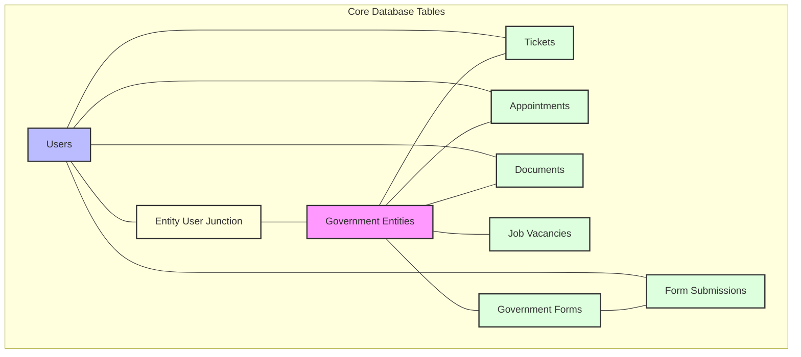

## Programming Methodology and Patterns

The Government Administration Portal follows several key programming methodologies and design patterns to ensure maintainability, scalability, and code quality:

### Multi-Tenant Architecture

<Tabs>
  <Tab title="Overview for Non-Technical Users">
    <Info>
      The Government Administration Portal uses a multi-tenant architecture, which means that each government ministry or department (such as the Ministry of Education, Ministry of Health, Ministry of Finance, etc.) has its own dedicated and isolated space within the same platform. Think of it like a large office building where each ministry has its own secure floor, but they all share common facilities like elevators, security, and utilities.
    </Info>

    In the context of the Tonga Government Administration Portal:

    - Each ministry or department is represented as an "Entity" in the system
    - Staff members can be assigned to one or multiple entities based on their roles
    - When staff members log in, they only see and manage data relevant to their assigned entities
    - Citizens interacting with the portal can submit requests to specific entities and track their progress

    <Note>
      This approach ensures that:

      1. **Ministry-Specific Data Privacy**: Information from one ministry doesn't mix with another (e.g., Health records stay within the Ministry of Health)
      2. **Streamlined Administration**: Each ministry can manage its own services, staff, and citizen interactions
      3. **Consistent User Experience**: Despite being separate, all ministries use the same interface and features
      4. **Centralized Maintenance**: The entire platform can be updated and maintained as a single system
    </Note>
  </Tab>
  <Tab title="Technical Implementation">
    From a technical perspective, the multi-tenant architecture is implemented using FilamentPHP's tenant feature, with the `Entity` model serving as the tenant model. Each Entity represents a government ministry or department with its own:

    - Name, contact information, and branding
    - Staff users (through a many-to-many relationship)
    - Ministry-specific data (tickets, appointments, documents, etc.)

    ```php
    // Entity model relationships
    public function users(): BelongsToMany
    {
        return $this->belongsToMany(User::class);
    }

    public function tickets(): HasMany
    {
        return $this->hasMany(Ticket::class, 'entity_id');
    }

    // Additional relationships for other entity-specific data...
    ```

    The tenant system is configured in the AdminPanelProvider:

    ```php
    ->tenant(Entity::class)
    ->tenantMiddleware([
        ApplyTenantScopes::class,
    ], isPersistent: true)
    ```

    When a user accesses the Admin Panel, they must select which Entity (ministry/department) they want to work with. The system then applies tenant scopes through the `ApplyTenantScopes` middleware, which automatically filters all database queries to only show data belonging to the selected entity:

    ```php
    // Example from ApplyTenantScopes middleware
    TicketCategory::addGlobalScope(
        fn (Builder $query) => $query->whereBelongsTo(Filament::getTenant()),
    );
    ```
  </Tab>
  <Tab title="Benefits and Real-World Application">
    This architecture provides significant advantages:

    <AccordionGroup>
      <Accordion title="Data Isolation">
        Each ministry's data is logically separated, ensuring that sensitive information remains within the appropriate context. For example, health-related appointments in the Ministry of Health are not visible to staff in the Ministry of Education.
      </Accordion>
      <Accordion title="Customization">
        Each ministry can have its own configurations and settings. The Ministry of Finance might have specific document categories related to taxation and budgeting, while the Ministry of Education would have categories for educational policies and school programs.
      </Accordion>
      <Accordion title="Security">
        Access controls are enforced at the tenant level, ensuring that staff members only access data from ministries they are authorized to work with. A user with roles in both the Ministry of Justice and the Ministry of Police would need to explicitly switch between these entities to access their respective data.
      </Accordion>
      <Accordion title="Scalability">
        New government entities can be added to the system without requiring architectural changes. If a new department is created, administrators can simply add a new Entity record, assign staff to it, and it becomes immediately operational with all the platform's features.
      </Accordion>
      <Accordion title="Operational Efficiency">
        Staff members working across multiple ministries can use the same familiar interface and switch between entities as needed, rather than learning different systems for each ministry.
      </Accordion>
    </AccordionGroup>
  </Tab>
  <Tab title="Visual Representation">
    ```mermaid
    flowchart TD
      subgraph GovernmentPortal["Citizen Portal"]
        subgraph Ministries["Government Ministries"]
          Education["Ministry of Education\n• Users\n• Tickets\n• Documents\n• Services"]
          Health["Ministry of Health\n• Users\n• Tickets\n• Documents\n• Services"]
          Finance["Ministry of Finance\n• Users\n• Tickets\n• Documents\n• Services"]
        end
        
        subgraph SharedInfrastructure["Shared Infrastructure"]
          Auth["Authentication"]
          UserMgmt["User Management"]
          FileStorage["File Storage"]
          Notifications["Notifications"]
          Logging["Logging"]
          Backups["Backups"]
        end
        
        Ministries --- SharedInfrastructure
      end
    ```

    In practice, when a government staff member logs into the Admin Panel, they first select which ministry they want to work with. Once selected, all their interactions—viewing tickets, managing appointments, accessing documents—are automatically scoped to that specific ministry. This ensures data integrity and security while providing a seamless user experience.
  </Tab>
</Tabs>
### Model-View-Controller (MVC) Pattern

The Government Administration Portal follows Laravel's implementation of the Model-View-Controller (MVC) architectural pattern, which separates the application into three interconnected components to promote modular design and code organization.

<Tabs>
  <Tab title="Technical Details">
    The MVC pattern provides several key benefits for maintaining and extending the platform:

    - **Separation of Concerns**: Each component has a specific responsibility, making the codebase more organized and easier to maintain
    - **Parallel Development**: Different team members can work on models, views, and controllers simultaneously
    - **Code Reusability**: Components can be reused across different parts of the application
    - **Easier Testing**: Components can be tested in isolation, improving test coverage and reliability
  </Tab>
  <Tab title="Implementation Details">
    <AccordionGroup>
      <Accordion title="Models">
        Represent database tables and define relationships between entities

        Models in the platform are located in the `app/Models` directory and extend Laravel's `Illuminate\Database\Eloquent\Model` class. They define the structure of database tables and the relationships between different entities.

        Example from the `Entity` model:

        ```php
        // app/Models/Entity.php
        class Entity extends Model implements HasMedia, HasAvatar
        {
            use HasFactory, InteractsWithMedia;

            protected $fillable = [
                'name',
                'website',
                'phone',
                'email',
                'address',
            ];

            // Relationship with users (many-to-many)
            public function users(): BelongsToMany
            {
                return $this->belongsToMany(User::class);
            }

            // Relationship with tickets (one-to-many)
            public function tickets(): HasMany
            {
                return $this->hasMany(Ticket::class, 'entity_id');
            }

            // Additional relationships...
        }
        ```

        This model defines the structure of the `entities` table (which represents government ministries or departments) and its relationships with other entities like users and tickets.
      </Accordion>
      <Accordion title="Views">
        Implemented using Blade templates and Livewire components

        Views in the platform are implemented using Laravel's Blade templating engine and Livewire components for reactive interfaces. They are responsible for presenting data to users and capturing user input.

        The platform uses two types of views:
        
        - **Blade Templates**: Located in `resources/views` directory, these are used for static content and layout structures
        - **Livewire Components**: Located in `app/Livewire` directory, these provide dynamic, reactive interfaces without requiring complex JavaScript

        Example of a Livewire component:

        ```php
        // app/Livewire/TicketComments.php
        class TicketComments extends Component implements HasForms
        {
            use InteractsWithRecord, InteractsWithForms;

            public string|int|null|Model $record;
            public ?array $data = [];

            public function form(Form $form): Form
            {
                return $form
                    ->schema([
                        RichEditor::make('comment')
                            ->toolbarButtons([
                                'bold', 'italic', 'redo', 'strike',
                                'bulletList', 'orderedList', 'underline', 'undo',
                            ])
                            ->fileAttachmentsDirectory('comments')
                            ->label('Add comment to ticket')
                            ->disabled(fn (Ticket $record) => $record->status->name === 'Closed')
                            ->filled()
                    ])
                    ->model($this->record)
                    ->statePath('data');
            }

            public function addComment(): void
            {
                // Implementation...
            }

            public function render()
            {
                return view('livewire.ticket-comments');
            }
        }
        ```

        This Livewire component handles the display and submission of comments on tickets, with the actual HTML rendering defined in the `livewire.ticket-comments` Blade view.
      </Accordion>
      <Accordion title="Controllers">
        Handle HTTP requests and coordinate between models and views

        Controllers in the platform are located in the `app/Http/Controllers` directory and are responsible for handling HTTP requests, interacting with models to retrieve or modify data, and returning appropriate responses.

        Example from the `UserFilesController`:

        ```php
        // app/Http/Controllers/UserFilesController.php
        class UserFilesController extends Controller
        {
            public function __invoke(Request $request, $node, $path)
            {
                // Abort if file not found
                abort_if(!Storage::disk('private')->exists($node . '/' .$path), 404);

                // Get the media by its node and path variables
                $media = Media::where('file_name', $path)->where('id', $node)->firstOrFail();

                // Locate the custom properties of the private file
                $media_tenant = $media->getCustomProperty('tenant');
                $media_author = $media->getCustomProperty('author');
                $media_tenant_model = Entity::findOrFail($media_tenant['id']);
                $media_user_model = User::findOrFail($media_author);

                // Abort if current logged-in user cant access to media tenant OR is not the owner of the file
                abort_if(!auth()->user()->canAccessTenant($media_tenant_model) && auth()->user()->id != $media_user_model->id, Response::HTTP_FORBIDDEN);

                return Storage::disk('private')->response($node . '/' .$path);
            }
        }
        ```

        This controller handles requests for private user files, checking permissions and returning the file if the user is authorized to access it.
      </Accordion>
    </AccordionGroup>
  </Tab>
</Tabs>
### Repository Pattern

While the platform doesn't explicitly implement traditional repository classes, it follows repository pattern principles through FilamentPHP's Resource classes and Laravel's Eloquent ORM, which abstract database interactions.

<Tabs>
  <Tab title="Technical Details">
    The repository pattern provides several advantages for the platform:

    - **Abstraction of Data Access Logic**: Database queries are encapsulated, making them easier to maintain and modify
    - **Consistent Data Access**: Standard methods for retrieving and manipulating data ensure consistency
    - **Reduced Duplication**: Common query patterns are defined once and reused throughout the application
    - **Improved Testability**: Data access can be mocked for unit testing
  </Tab>
  <Tab title="Implementation Details">
    In the Government Administration Portal, the repository pattern is primarily implemented through:

    <AccordionGroup>
      <Accordion title="FilamentPHP Resources">
        Located in `app/Filament/Resources` and `app/Filament/App/Resources`, these classes define how data is retrieved, displayed, and manipulated in the admin and app panels.

        Example of data retrieval in a Resource:

        ```php
        // Simplified example from a Resource class
        public static function getEloquentQuery(): Builder
        {
            return parent::getEloquentQuery()
                ->with(['category', 'status', 'priority'])
                ->whereHas('entity', function (Builder $query) {
                    $query->whereIn('id', auth()->user()->entities->pluck('id'));
                });
        }
        ```

        This method customizes how tickets are retrieved, ensuring they belong to entities the current user has access to and eager-loading related models for performance.
      </Accordion>
      <Accordion title="Eloquent Query Scopes">
        These are defined in model classes to encapsulate common query constraints.

        Example from the `Entity` model:

        ```php
        // app/Models/Entity.php
        public function scopeOfUserEntities(Builder $query, User $user): void
        {
            $assignedEntities = $user->entities->pluck('id');
            $query->whereIn('id', $assignedEntities);
        }
        ```

        This scope filters entities to only those assigned to a specific user, providing a reusable query component.
      </Accordion>
      <Accordion title="API Services">
        For external API access, the platform uses dedicated API service classes.

        Example:

        ```php
        // app/Filament/Resources/VacancyResource/Api/VacancyApiService.php
        class VacancyApiService extends ApiService
        {
            // Configuration and methods for the Vacancy API
        }
        ```

        These services abstract the data access logic for API endpoints, following repository pattern principles.
      </Accordion>
    </AccordionGroup>
  </Tab>
</Tabs>
### Service Layer Pattern

The platform implements the Service Layer pattern to encapsulate complex business logic and operations that span multiple models or require specialized processing.

<Tabs>
  <Tab title="Technical Details">
    The Service Layer pattern offers several benefits:

    - **Business Logic Isolation**: Complex operations are contained in dedicated classes
    - **Thin Controllers and Components**: UI-related code remains focused on presentation
    - **Reusability**: Service logic can be used by multiple controllers, commands, or Livewire components
    - **Maintainability**: Business rules are centralized, making them easier to update and maintain
  </Tab>
  <Tab title="Implementation Details">
    In the Government Administration Portal, the Service Layer pattern is implemented through:

    <AccordionGroup>
      <Accordion title="API Services">
        These classes handle the business logic for API operations.

        Example:

        ```php
        // app/Filament/Resources/AppointmentServiceResource/Api/AppointmentServiceApiService.php
        class AppointmentServiceApiService extends ApiService
        {
            protected static string | null $resource = AppointmentServiceResource::class;

            // Service methods for appointment service operations
        }
        ```
      </Accordion>
      <Accordion title="Support Classes">
        Located in the `app/Support` directory, these classes provide specialized business logic.

        Example:

        ```php
        // app/Support/Calendar.php (simplified example)
        class Calendar
        {
            public static function buildMonth(int $year, int $month, ?Carbon $selected_date = null, ?array $timing = null): array
            {
                // Complex business logic for building a calendar month
                // with available appointment slots
            }
        }
        ```

        This class encapsulates the complex logic for building calendar data structures with appointment availability.
      </Accordion>
      <Accordion title="Livewire Component Logic">
        While technically part of the presentation layer, Livewire components often contain significant business logic that would traditionally be in service classes.

        Example from `AppointmentCreate`:

        ```php
        // app/Livewire/AppointmentCreate.php (simplified)
        public function addAppointment()
        {
            $this->validate();

            try {
                DB::beginTransaction();

                // Complex business logic for creating an appointment
                $appointment = new Appointment();
                $appointment->code = Str::random(10);
                $appointment->entity()->associate($this->entity);
                // More logic...

                DB::commit();
            } catch (\Exception $e) {
                DB::rollBack();
                // Error handling...
            }
        }
        ```

        This method contains transaction management, entity creation, and relationship handling - all business logic that could be extracted to a dedicated service class in larger applications.
      </Accordion>
    </AccordionGroup>
  </Tab>
</Tabs>
### Trait-Based Composition

The platform uses PHP traits to share functionality across different classes, promoting code reuse and composition over inheritance.

<Tabs>
  <Tab title="Technical Details">
    Trait-Based Composition provides several advantages:

    - **Horizontal Reuse**: Functionality can be shared across unrelated classes
    - **Granular Composition**: Classes can selectively include only the functionality they need
    - **Maintainability**: Changes to shared functionality only need to be made in one place
    - **Flexibility**: Classes can compose multiple traits to build complex behavior
  </Tab>
  <Tab title="Implementation Details">
    In the Government Administration Portal, traits are used in several ways:

    <AccordionGroup>
      <Accordion title="Feature Traits">
        These encapsulate specific features that can be added to models or components.

        Example:

        ```php
        // app/Traits/AppointmentScheduler.php
        trait AppointmentScheduler
        {
            public int $day = 1;
            public int $month = 1;
            public int $year = 2024;

            #[Validate('required', message: 'An appointment date is required.')]
            public ?string $dateSelected = null;
            
            #[Validate('required', message: 'An appointment time slot is required.')]
            public ?string $timeSelected = null;

            public function mountAppointmentScheduler(): void
            {
                // Initialize scheduler state
                $this->day = Carbon::now()->day;
                $this->month = Carbon::now()->month;
                $this->year = Carbon::now()->year;
            }

            public function incrementMonth(): void
            {
                // Logic to increment the current month
            }

            public function decrementMonth(): void
            {
                // Logic to decrement the current month
            }

            // Additional methods for appointment scheduling
        }
        ```

        This trait encapsulates all the functionality related to appointment scheduling, which can be used by any Livewire component that needs this feature.
      </Accordion>
      <Accordion title="Behavior Traits">
        These add specific behaviors to models.

        Example:

        ```php
        // From the Entity model
        use HasFactory, InteractsWithMedia;
        ```

        These traits add factory support for testing and media handling capabilities to the Entity model.
      </Accordion>
      <Accordion title="Concern Traits">
        These group related functionality for Livewire components or other classes.

        Example:

        ```php
        // From various Livewire components
        use InteractsWithRecord, InteractsWithForms;
        ```

        These traits from Filament provide form handling and record interaction capabilities to Livewire components.
      </Accordion>
    </AccordionGroup>

    By using traits, the platform achieves a high degree of code reuse while maintaining flexibility in how features are composed across different classes.
  </Tab>
</Tabs>
## Project Folder Organization

The project follows a standard Laravel directory structure with additional organization for FilamentPHP components:

```
tongacp/
├── app/                      # Application code
│   ├── Enums/                # Enumeration classes
│   ├── Filament/             # FilamentPHP components
│   │   ├── App/              # Citizen panel components
│   │   │   ├── Pages/        # Citizen panel pages
│   │   │   ├── Resources/    # Citizen panel resources
│   │   │   └── Widgets/      # Citizen panel widgets
│   │   ├── Pages/            # Admin panel pages
│   │   ├── Resources/        # Admin panel resources
│   │   └── Widgets/          # Admin panel widgets
│   ├── Http/                 # HTTP layer
│   │   ├── Controllers/      # Request controllers
│   │   ├── Middleware/       # HTTP middleware
│   │   └── Requests/         # Form requests
│   ├── Infolists/            # Custom infolist components
│   ├── Livewire/             # Livewire components
│   ├── Mail/                 # Mail classes
│   ├── Models/               # Eloquent models
│   ├── Policies/             # Authorization policies
│   ├── Providers/            # Service providers
│   ├── Support/              # Helper classes
│   └── Traits/               # Reusable traits
├── bootstrap/                # Framework bootstrap files
├── config/                   # Configuration files
├── database/                 # Database migrations and seeds
│   ├── factories/            # Model factories
│   ├── migrations/           # Database migrations
│   └── seeders/              # Database seeders
├── docs/                     # Documentation
│   ├── en/                   # English documentation
│   └── to/                   # Tongan documentation
├── public/                   # Publicly accessible files
├── resources/                # Frontend resources
│   ├── css/                  # CSS files
│   ├── js/                   # JavaScript files
│   └── views/                # Blade templates
├── routes/                   # Route definitions
├── storage/                  # Application storage
└── tests/                    # Automated tests
```

### Key Directories

<Tabs>
  <Tab title="Overview">
    The project's organization can be understood as follows:

    <CardGroup cols={2}>
      <Card title="Data Layer" icon="database">
        The `app/Models` and `database` directories contain everything related to how data is stored, structured, and related. This is where the system defines what information is tracked and how different pieces of information connect to each other.
      </Card>
      <Card title="Business Logic Layer" icon="code">
        The `app/Support`, `app/Traits`, and parts of the models contain the rules and processes that govern how the system operates. This is where the "intelligence" of the system resides.
      </Card>
      <Card title="Interface Layer" icon="display">
        The `app/Filament`, `app/Livewire`, and `resources/views` directories contain everything related to what users see and interact with. This includes both the government staff interface (Admin Panel) and the citizen interface (App Panel).
      </Card>
      <Card title="Security Layer" icon="shield-halved">
        The `app/Policies`, `app/Http/Middleware`, and authentication-related code ensure that users can only access the data and features they're authorized to use, maintaining proper separation between different government entities and protecting citizen information.
      </Card>
    </CardGroup>

    This layered architecture ensures that the system is maintainable, secure, and can evolve over time as government needs change.
  </Tab>
  <Tab title="Technical Details">
    <AccordionGroup>
      <Accordion title="app/Filament/">
        Contains all FilamentPHP components, separated by panel (Admin and App)
        - **app/Filament/Resources/**: Admin panel resources for managing entities, users, tickets, etc.
        - **app/Filament/Pages/**: Custom admin panel pages like dashboards and calendars
        - **app/Filament/Widgets/**: Admin panel dashboard widgets for analytics and quick actions
        - **app/Filament/App/**: Citizen-facing panel components with similar structure (Resources, Pages, Widgets)
      </Accordion>
      <Accordion title="app/Models/">
        Contains Eloquent models representing database tables
        - These define the structure of database tables and relationships between entities
        - Implement business logic related to data integrity and relationships
        - Include scopes, accessors, mutators, and other data-related functionality
      </Accordion>
      <Accordion title="app/Livewire/">
        Contains Livewire components for reactive UI elements
        - Implements interactive UI components that update without page reloads
        - Handles real-time features like comments, sidebars, and form submissions
        - Provides a bridge between frontend interactivity and backend logic
      </Accordion>
      <Accordion title="app/Http/Controllers/">
        Contains traditional controllers for handling HTTP requests
        - Manages routes that don't fit into the Filament or Livewire paradigms
        - Handles API endpoints and file downloads
        - Implements authentication and authorization logic
      </Accordion>
      <Accordion title="app/Policies/">
        Contains authorization policies for models
        - Defines who can view, create, update, or delete specific resources
        - Implements fine-grained permission checks based on user roles and relationships
        - Ensures data security and proper access control
      </Accordion>
      <Accordion title="app/Traits/">
        Contains reusable traits for sharing functionality
        - Implements cross-cutting concerns like appointment scheduling
        - Promotes code reuse across different classes
        - Enables composition-based feature sharing
      </Accordion>
      <Accordion title="app/Support/">
        Contains helper classes and utilities
        - Provides specialized services like calendar generation
        - Implements business logic that doesn't belong in models or controllers
        - Offers utility functions used throughout the application
      </Accordion>
      <Accordion title="database/migrations/">
        Contains database structure definitions
        - Defines the schema for all database tables in a version-controlled way
        - Allows for tracking changes to the database structure over time
        - Enables consistent database setup across different environments
      </Accordion>
      <Accordion title="resources/views/">
        Contains Blade templates and component views
        - **resources/views/filament/**: Custom Filament component views
        - **resources/views/livewire/**: Templates for Livewire components
        - **resources/views/emails/**: Email templates for notifications
      </Accordion>
    </AccordionGroup>
  </Tab>
</Tabs>
## Database Structure

The platform's database is designed to support the multi-tenant architecture while maintaining relationships between entities. Below is an Entity-Relationship Diagram (ERD) showing the main tables and their relationships:



### Core Tables

<Tabs>
  <Tab title="Overview">
    The database structure can be understood as follows:

    <CardGroup cols={2}>
      <Card title="Identity and Access Management" icon="users">
        The `users`, `entities`, and `entity_user` tables manage who can access the system and what parts of the system they can access. This ensures that government staff only see information relevant to their ministry and that citizens only see their own data.
      </Card>
      <Card title="Service Management" icon="ticket">
        The `tickets`, `appointments`, and related tables handle citizen interactions with government services, tracking requests, inquiries, and scheduled meetings. This allows for efficient processing of citizen needs and proper follow-up.
      </Card>
      <Card title="Document Management" icon="file-lines">
        The `documents` table and related structures manage both official government documents and files submitted by citizens, ensuring proper organization and secure access.
      </Card>
      <Card title="Employment Management" icon="briefcase">
        The `vacancies` and related tables handle the job application process, from posting openings to tracking applications, making government hiring more transparent and accessible.
      </Card>
      <Card title="E-Services Platform" icon="laptop">
        The `government_forms` and `government_form_submissions` tables enable digital delivery of government services, reducing the need for in-person visits and paper forms.
      </Card>
    </CardGroup>

    This database structure supports the platform's goal of streamlining government-citizen interactions while maintaining proper data isolation between different government entities.
  </Tab>
  <Tab title="Technical Details">
    <AccordionGroup>
      <Accordion title="users">
        Stores user information for both government staff and citizens
        - Contains authentication details (email, password hash)
        - Stores personal information (name, contact details)
        - Tracks user preferences and settings
        - Links to roles and permissions through Spatie's Permission package
        - Created and updated timestamps for auditing
      </Accordion>
      <Accordion title="entities">
        Represents government ministries and departments (tenants)
        - Stores basic information about each ministry/department (name, contact details)
        - Acts as the central tenant model for the multi-tenant architecture
        - Contains branding information like logos (through media relationships)
        - Serves as the parent for all entity-specific data
      </Accordion>
      <Accordion title="entity_user">
        Junction table linking users to entities they can access
        - Implements the many-to-many relationship between users and entities
        - Enables staff members to be assigned to multiple ministries if needed
        - Controls which entities a user can access in the Admin Panel
        - Essential for the multi-tenant security model
      </Accordion>
      <Accordion title="tickets">
        Support tickets and service requests
        - Stores citizen inquiries and service requests
        - Contains metadata like subject, content, status, priority
        - Links to the entity responsible for handling the ticket
        - Tracks the citizen who created the ticket and staff assigned to it
        - Connects to categories, statuses, and priorities for organization
      </Accordion>
      <Accordion title="appointments">
        Scheduled meetings between citizens and government staff
        - Manages scheduling of in-person or virtual meetings
        - Stores timing information (start_time, end_time, duration)
        - Links to appointment services for specific meeting types
        - Tracks status (scheduled, completed, cancelled)
        - Associates with both citizens and responsible staff members
      </Accordion>
      <Accordion title="documents">
        Official documents and user-uploaded files
        - Stores metadata about documents (name, type, category)
        - Links to actual files stored via Spatie Media Library
        - Organizes documents by categories and domains
        - Controls access through entity and user relationships
        - Manages both government-issued documents and citizen-uploaded files
      </Accordion>
      <Accordion title="vacancies">
        Job openings posted by government entities
        - Contains job posting details (title, description, requirements)
        - Tracks location, division, and salary information
        - Manages application deadlines and status
        - Links to the entity posting the vacancy
        - Connects to applications submitted by citizens
      </Accordion>
      <Accordion title="government_forms">
        E-service forms available to citizens
        - Defines electronic government services and forms
        - Contains form structure, fields, and validation rules
        - Tracks payment requirements for paid services
        - Controls access and availability of forms
        - Links to the entity providing the service
      </Accordion>
      <Accordion title="government_form_submissions">
        Citizen submissions of e-service forms
        - Stores citizen responses to government forms
        - Tracks submission status and processing state
        - Manages payment status for paid services
        - Links to the citizen who submitted the form
        - Associates with the original form definition
      </Accordion>
    </AccordionGroup>
  </Tab>
</Tabs>
## Relationship Models and Schema

This section explains how different data entities in the Government Administration Portal relate to each other, forming a cohesive and secure data model.

### User and Entity Relationships

<Tabs>
  <Tab title="Overview">
    This relationship is an organizational chart for the government:
    - Each ministry or department is represented as an entity in the system
    - Government staff members can be assigned to one or more ministries
    - When staff log in, they choose which ministry they want to work with
    - This ensures that staff only see information relevant to their ministry
  </Tab>
  <Tab title="Technical Details">
    The platform implements a many-to-many relationship between users and entities, which is a fundamental aspect of the multi-tenant architecture:

    ```php
    // User model
    public function entities(): BelongsToMany
    {
        return $this->belongsToMany(Entity::class);
    }

    // Entity model
    public function users(): BelongsToMany
    {
        return $this->belongsToMany(User::class);
    }
    ```

    This relationship is implemented through the `entity_user` pivot table, which contains `user_id` and `entity_id` columns. The many-to-many relationship allows:

    - A single user (government staff) to be associated with multiple entities (ministries/departments)
    - Each entity to have multiple users assigned to it
    - Proper access control based on these associations

    When a user logs into the Admin Panel, they must select which entity they want to work with. The system then filters all data to show only information related to that entity.

    Implementation details:
    - The relationship is defined in both the `User` and `Entity` models
    - The `entity_user` table is automatically used by Laravel's Eloquent ORM
    - Additional pivot data can be stored if needed (e.g., role within the entity)
  </Tab>
</Tabs>

### Tenant-Based Resources

<Tabs>
  <Tab title="Overview">
    This relationship ensures that:
    - Each piece of information in the system belongs to a specific ministry
    - Information from one ministry doesn't mix with information from another
    - When staff select their ministry, they only see data relevant to that ministry
    - Citizens' requests are directed to the appropriate ministry for handling
  </Tab>
  <Tab title="Technical Details">
    Most resources in the system are associated with a specific entity (tenant) through a one-to-many relationship:

    ```php
    // Example: Ticket model
    public function entity(): BelongsTo
    {
        return $this->belongsTo(Entity::class);
    }
    ```

    This relationship pattern is repeated across most models in the system:
    - Each ticket belongs to one entity
    - Each appointment belongs to one entity
    - Each document belongs to one entity
    - Each vacancy belongs to one entity

    The `entity_id` foreign key in these tables creates a direct link to the specific ministry or department that owns or is responsible for the resource. This design:

    - Ensures data isolation between different government entities
    - Allows for efficient filtering of data by entity
    - Supports the multi-tenant architecture
    - Enables proper access control at the data level
  </Tab>
</Tabs>

### User-Owned Resources

<Tabs>
  <Tab title="Overview">
    This relationship ensures that:
    - Citizens can only see their own information
    - Each request, appointment, or application is linked to the citizen who created it
    - Citizens can track the status of their interactions with government
    - Government staff can easily identify which citizen submitted a request
  </Tab>
  <Tab title="Technical Details">
    Resources created by citizens are associated with their user account through another one-to-many relationship:

    ```php
    // Example: Document model
    public function user(): BelongsTo
    {
        return $this->belongsTo(User::class);
    }
    ```

    This relationship pattern applies to:
    - Documents uploaded by citizens
    - Tickets created by citizens
    - Appointments booked by citizens
    - Job applications submitted by citizens
    - Form submissions completed by citizens

    The `user_id` foreign key in these tables creates a direct link to the specific citizen who owns or created the resource. This design:

    - Allows citizens to access and manage their own data
    - Enables personalized dashboards showing only relevant information
    - Supports privacy and data protection requirements
    - Facilitates communication between government staff and the specific citizen
  </Tab>
</Tabs>

### Complex Relationships

<Tabs>
  <Tab title="Overview">
    These complex relationships enable advanced features like:
    - Tracking all interactions between a citizen and various government departments
    - Allowing comments and attachments on different types of requests
    - Organizing information hierarchically (e.g., document categories and subcategories)
    - Providing comprehensive views of related information across the system
  </Tab>
  <Tab title="Technical Details">
    The system also implements more complex relationships to support specific features:

    <AccordionGroup>
      <Accordion title="Many-to-Many with Pivot Data">
        Used for relationships that need additional attributes:

        ```php
        // Example: User roles with additional permissions
        public function roles()
        {
            return $this->belongsToMany(Role::class)->withPivot('additional_permissions');
        }
        ```
      </Accordion>
      <Accordion title="Has-Many-Through Relationships">
        Used to access related resources through intermediate tables:

        ```php
        // Example: Accessing all tickets from a user's entities
        public function entityTickets()
        {
            return $this->hasManyThrough(Ticket::class, Entity::class);
        }
        ```
      </Accordion>
      <Accordion title="Polymorphic Relationships">
        Used for features like comments that can belong to different types of resources:

        ```php
        // Example: Comments that can belong to tickets, appointments, etc.
        public function commentable()
        {
            return $this->morphTo();
        }
        ```
      </Accordion>
    </AccordionGroup>
  </Tab>
</Tabs>
## Technical Implementation Details

This section covers the key technical implementation details of the Government Administration Portal, explaining how various features are implemented and how they work together to create a secure, efficient system.

### Tenant Middleware

<Tabs>
  <Tab title="Overview">
    The tenant middleware acts as an automatic filter that ensures:
    - When staff select a ministry to work with, all data they see is automatically filtered to show only information from that ministry
    - Staff cannot accidentally access or modify data from other ministries
    - The system maintains proper separation between different government departments
    - Data privacy and security are maintained at all times

    This is similar to how different government offices have separate filing systems - the middleware ensures that staff can only access the "filing cabinet" for their own ministry.
  </Tab>
  <Tab title="Technical Details">
    The platform uses a custom middleware to apply tenant scopes to queries, which is a critical component of the multi-tenant architecture:

    ```php
    // ApplyTenantScopes middleware
    public function handle(Request $request, Closure $next)
    {
        // Apply tenant scopes to relevant models
        TicketCategory::addGlobalScope(
            fn (Builder $query) => $query->whereBelongsTo(Filament::getTenant()),
        );

        TicketDepartment::addGlobalScope(
            fn (Builder $query) => $query->whereBelongsTo(Filament::getTenant()),
        );

        VacancyDivision::addGlobalScope(
            fn (Builder $query) => $query->whereBelongsTo(Filament::getTenant()),
        );

        // Additional model scopes...
        
        return $next($request);
    }
    ```

    This middleware:
    - Is applied automatically when a user selects an entity in the Admin Panel
    - Uses FilamentPHP's `getTenant()` method to retrieve the currently selected entity
    - Adds global query scopes to relevant models using Laravel's query builder
    - Ensures that all database queries are automatically filtered by the selected entity
    - Prevents users from accessing data from entities they are not assigned to

    The middleware is registered in the `AdminPanelProvider`:

    ```php
    ->tenant(Entity::class)
    ->tenantMiddleware([
        ApplyTenantScopes::class,
    ], isPersistent: true)
    ```

    This approach provides a robust security layer that works at the database query level, ensuring that data isolation is enforced consistently across the entire application.
  </Tab>
</Tabs>

### Role-Based Access Control

<Tabs>
  <Tab title="Overview">
    The role-based access control system works like a government security clearance system:
    - Different staff members have different levels of access based on their role and responsibilities
    - Super administrators can manage the entire system
    - Entity administrators can manage their specific ministry
    - Regular staff have limited access based on their job function
    - Citizens can only access their own information and public services

    This ensures that sensitive information is only accessible to those who need it for their job functions, maintaining proper security and privacy.
  </Tab>
  <Tab title="Technical Details">
    The platform implements a comprehensive role-based access control system using Spatie's Laravel Permission package integrated with FilamentShield:

    ```php
    // User model
    use HasRoles, HasPanelShield;

    // Check if user can access panel
    public function canAccessPanel(Panel $panel): bool
    {
        if ($panel->getId() === 'admin'){
            // Only allow users with specific roles to access the admin panel
            if(!$this->hasAnyRole(['super_admin', 'administrator', 'staff'])){
                return false;
            }
            
            // Ensure the user is assigned to at least one entity
            if (!$this->entities()->exists()) {
                return false;
            }
        }
        
        return true;
    }
    ```

    The role system includes:
    - **Role Hierarchy**: From super_admin (full access) to panel_user (basic citizen access)
    - **Permission Granularity**: Fine-grained permissions for specific actions on specific resources
    - **Panel-Specific Access**: Different permissions for Admin and App panels
    - **Entity-Based Restrictions**: Access limited to assigned entities
    - **Resource Policies**: Additional authorization checks at the model level

    FilamentShield provides a user interface for managing roles and permissions, making it easy for administrators to control access without writing code.
  </Tab>
</Tabs>

### Media Management

<Tabs>
  <Tab title="Overview">
    The media management system provides:
    - Secure storage for all documents and files in the system
    - Automatic organization of files by ministry and type
    - Proper access controls to ensure files are only accessible to authorized users
    - Support for different file types (documents, images, etc.)
    - Automatic creation of thumbnails and previews for images

    This ensures that government documents are properly stored, organized, and protected while remaining accessible to those who need them.
  </Tab>
  <Tab title="Technical Details">
    The platform uses Spatie's Media Library for comprehensive file management:

    ```php
    // Document model
    use InteractsWithMedia;

    // Store a document
    $document->addMedia($file)
        ->withCustomProperties([
            'tenant' => ['id' => $entity->id, 'name' => $entity->name],
            'author' => auth()->id()
        ])
        ->toMediaCollection('documents');

    // Retrieve a document
    $url = $document->getFirstMediaUrl('documents');

    // Apply conversions (e.g., thumbnails)
    $document->addMedia($file)
        ->withResponsiveImages()
        ->toMediaCollection('documents');
    ```

    Key features of the media management system:
    - **Collections**: Files are organized into collections (documents, logos, attachments)
    - **Custom Properties**: Metadata can be attached to files for filtering and access control
    - **Responsive Images**: Automatic generation of image variants for different screen sizes
    - **Secure Storage**: Files can be stored in private or public storage with proper access control
    - **Tenant Isolation**: Files are associated with specific entities for proper data isolation

    The system also includes a custom controller for secure file access:

    ```php
    // UserFilesController
    public function __invoke(Request $request, $node, $path)
    {
        // Get the media by its node and path variables
        $media = Media::where('file_name', $path)->where('id', $node)->firstOrFail();

        // Locate the custom properties of the private file
        $media_tenant = $media->getCustomProperty('tenant');
        $media_author = $media->getCustomProperty('author');
        $media_tenant_model = Entity::findOrFail($media_tenant['id']);
        $media_user_model = User::findOrFail($media_author);

        // Abort if current logged-in user cant access to media tenant OR is not the owner of the file
        abort_if(!auth()->user()->canAccessTenant($media_tenant_model) &&
                auth()->user()->id != $media_user_model->id,
                Response::HTTP_FORBIDDEN);

        return Storage::disk('private')->response($node . '/' .$path);
    }
    ```
  </Tab>
</Tabs>

### Form Schema Generation

<Tabs>
  <Tab title="Overview">
    The form system provides:
    - User-friendly interfaces for entering and editing information
    - Clear validation messages when information is missing or incorrect
    - Consistent look and feel across different parts of the system
    - Support for uploading files and documents
    - Responsive design that works on different screen sizes

    This ensures that government staff can efficiently enter and manage data with minimal training and reduced chance of errors.
  </Tab>
  <Tab title="Technical Details">
    FilamentPHP is used to generate form schemas for data entry, providing a consistent and user-friendly interface:

    ```php
    // Example form schema
    public static function form(Form $form): Form
    {
        return $form
            ->schema([
                TextInput::make('title')
                    ->required()
                    ->maxLength(255),
                Textarea::make('description')
                    ->maxLength(65535),
                Select::make('status')
                    ->options([
                        'draft' => 'Draft',
                        'published' => 'Published',
                    ])
                    ->required(),
                FileUpload::make('attachments')
                    ->multiple()
                    ->directory('attachments')
                    ->visibility('private')
                    ->maxFiles(5),
            ]);
    }
    ```

    Key features of the form system:
    - **Declarative Syntax**: Forms are defined using a clear, readable syntax
    - **Validation Rules**: Built-in validation ensures data integrity
    - **Conditional Logic**: Fields can be shown/hidden based on other field values
    - **File Uploads**: Integrated file upload handling with preview and validation
    - **Layout Options**: Flexible layouts with tabs, sections, and columns
    - **Reusable Components**: Common form patterns can be extracted into reusable components

    Forms are used throughout the platform for data entry, filtering, and configuration, providing a consistent user experience.
  </Tab>
</Tabs>

### Database Migrations

<Tabs>
  <Tab title="Overview">
    The database migration system ensures that:
    - The database structure can evolve over time as government needs change
    - New features can be added without disrupting existing data
    - The system can be safely updated and upgraded
    - Data integrity is maintained throughout the life of the system

    This provides a solid foundation for the platform's data storage, ensuring that government information is properly structured and maintained.
  </Tab>
  <Tab title="Technical Details">
    The platform uses Laravel migrations for database schema management, providing a version-controlled approach to database changes:

    ```php
    // Example migration
    public function up(): void
    {
        Schema::create('entities', function (Blueprint $table) {
            $table->id();
            $table->text('name');
            $table->text('website')->nullable();
            $table->string('phone')->nullable();
            $table->string('email')->nullable();
            $table->string('address')->nullable();
            $table->timestamps();
        });
    }

    public function down(): void
    {
        Schema::dropIfExists('entities');
    }
    ```

    Key benefits of the migration system:
    - **Version Control**: Database schema changes are tracked in version control
    - **Rollback Support**: Changes can be rolled back if needed
    - **Team Collaboration**: Multiple developers can work on the database schema
    - **Environment Consistency**: Ensures consistent database structure across environments
    - **Deployment Automation**: Migrations can be run automatically during deployment

    The platform includes over 50 migrations that define the complete database schema, including tables, columns, indexes, and foreign keys.
  </Tab>
</Tabs>

### Notification System

<Tabs>
  <Tab title="Overview">
    The notification system ensures that:
    - Users are promptly informed about important events and updates
    - Notifications appear in the system interface and are also sent by email
    - Clicking a notification takes the user directly to the relevant information
    - Users can easily track the status of their requests and interactions
    - Communication between citizens and government staff is streamlined

    This improves the user experience and ensures that important information is not missed.
  </Tab>
  <Tab title="Technical Details">
    The platform implements a comprehensive notification system that delivers alerts through multiple channels:

    ```php
    // Send notification to user
    $user->addNotification(
        title: 'Ticket notification',
        operation: $operation,
        icon: 'heroicon-o-ticket',
        action: Action::make('manage')
            ->url(TicketResource::getUrl(
                name: 'manage',
                parameters: ['record' => $record->id],
                panel: $user->isCitizen() ? 'app' : 'admin',
                tenant: $user->isCitizen() ? null : $record->entity,
            ))
    );

    // Implementation of addNotification method
    public function addNotification(string $title, string $operation, string $icon, Action $action): void
    {
        // Send it to DB with actions
        Notification::make()
            ->title($title)
            ->body($operation)
            ->icon($icon)
            ->actions([$action])
            ->sendToDatabase($this);

        // Send it to the user email
        Mail::to($this->email)->send(new \App\Mail\Notification($this, $operation, $action->getUrl()));

        // Send it to UI
        Notification::make()
            ->title($title)
            ->body($operation)
            ->icon($icon)
            ->send();
    }
    ```

    Key features of the notification system:
    - **Multi-Channel Delivery**: Notifications are sent to the database, email, and UI
    - **Action Links**: Notifications include direct links to relevant resources
    - **Contextual Information**: Notifications provide clear context about what happened
    - **User Targeting**: Notifications are sent to specific users based on their involvement
    - **Panel-Aware URLs**: Links adapt to the user's panel (Admin or App)
  </Tab>
</Tabs>