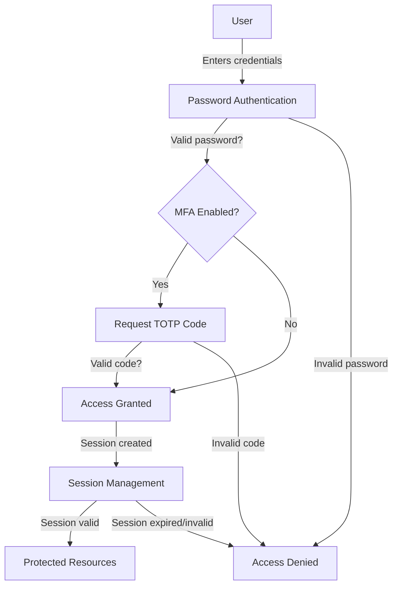
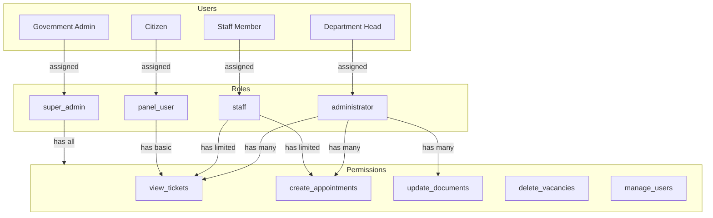
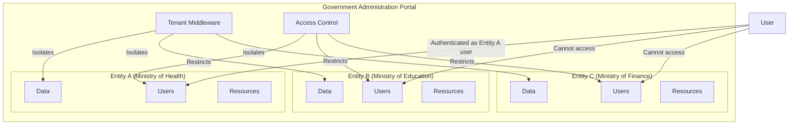
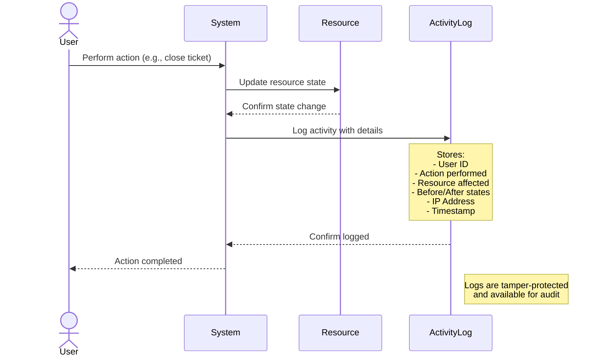
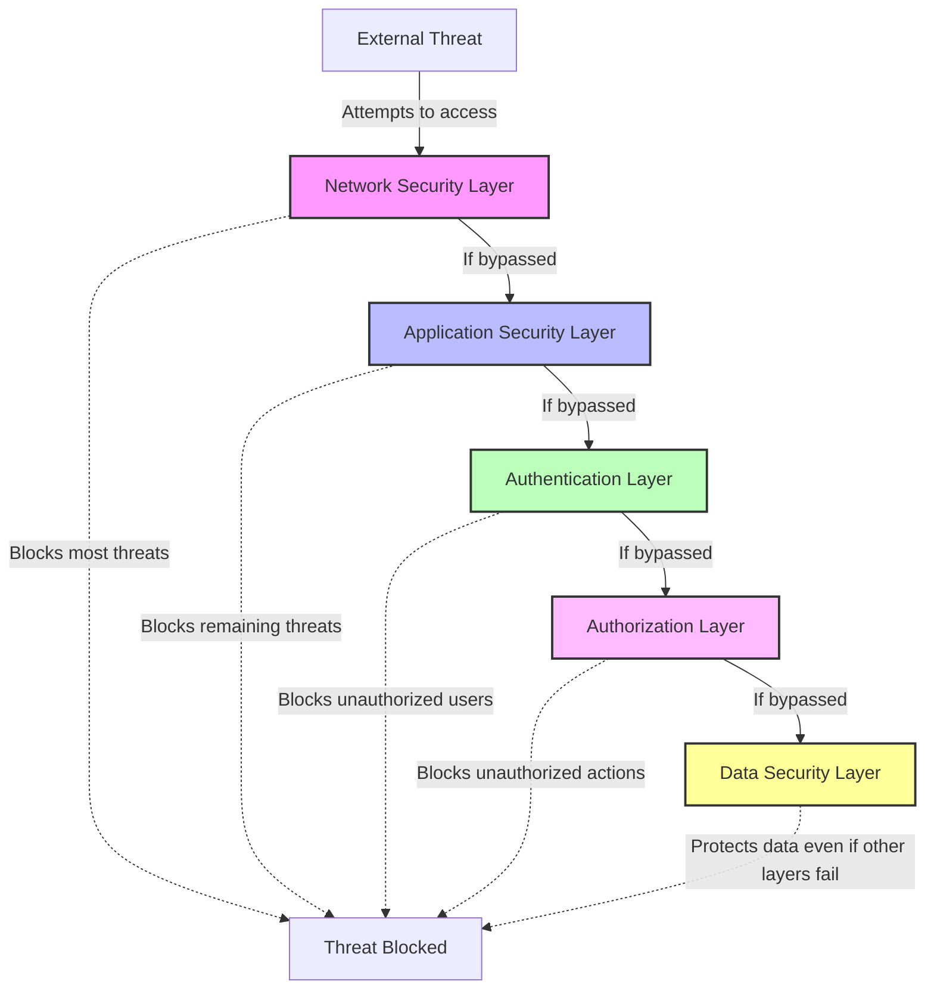
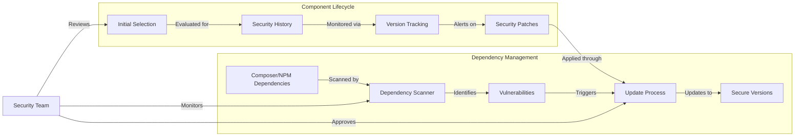

# Security

Security is a critical aspect of the Government Administration Portal, ensuring the protection of sensitive government data and citizen information. This section outlines the comprehensive security measures implemented throughout the platform.

> This document explains how the system keeps government and citizen data safe through multiple layers of protection. Each section includes both plain language explanations and technical details.

## Authentication Mechanisms

Authentication is the process of verifying that users are who they claim to be. The platform implements multiple layers of authentication to prevent unauthorized access.



### Password-Based Authentication

Password authentication is the most common way users prove their identity by entering a secret password that only they should know.

The primary authentication method uses Laravel's built-in authentication system with enhanced security features:

- **Password Requirements**:
  - Minimum 8 characters
  - Combination of uppercase and lowercase letters
  - At least one number
  - At least one special character
  - Not based on common dictionary words

- **Password Hashing**:
  - Passwords are hashed using bcrypt with a work factor of 12
  - Individual salts are applied to each password
  - Passwords are never stored in plaintext

- **Brute Force Protection**:
  - Rate limiting on login attempts
  - Account lockout after multiple failed attempts
  - Exponential backoff for repeated failures

### Multi-Factor Authentication (MFA)

MFA adds an extra layer of security by requiring a second form of verification beyond just a password, typically something you have (like your phone) in addition to something you know (your password).

The platform supports multi-factor authentication through FilamentBreezy, a component of the FilamentPHP v3 framework:

```php
BreezyCore::make()
    ->myProfile()
    ->enableTwoFactorAuthentication()
```

MFA implementation includes:

- **Time-Based One-Time Passwords (TOTP)**:
  - Compatible with authenticator apps like Google Authenticator, Authy, and Microsoft Authenticator
  - 30-second code validity window
  - Secure key generation and storage

  > After entering your password, you'll need to enter a 6-digit code from an app on your phone. This code changes every 30 seconds, making it much harder for someone to gain unauthorized access.

- **Recovery Codes**:
  - One-time use backup codes for emergency access
  - Automatically regenerated after use
  - Securely hashed in the database

  > Recovery codes are emergency backup codes you can use if you lose access to your phone. Keep these in a secure location.

### Session Management

Session management controls how long a user stays logged in and ensures their session remains secure.

Secure session handling is implemented throughout the platform:

- **Session Encryption**: All session data is encrypted. Information about your login session is scrambled so it can't be read if intercepted.
- **Secure Cookies**: HTTP-only and secure flags set on cookies. The tokens that keep you logged in are protected from being stolen by malicious scripts.
- **Session Timeout**: Automatic logout after period of inactivity. If you leave your computer unattended, the system will automatically log you out after a period of inactivity to prevent unauthorized access.
- **Session Invalidation**: Immediate session termination on logout or password change. When you change your password or log out, all active sessions are immediately terminated for security.

## Authorization and Access Control

While authentication verifies who you are, authorization determines what you're allowed to do in the system.

The platform implements a comprehensive authorization system to control access to resources and functionality.

### Role-Based Access Control (RBAC)

RBAC assigns permissions to roles, and then assigns roles to users, making it easier to manage who can do what.



The platform uses Spatie's Laravel Permission package integrated with FilamentShield to implement RBAC:

```php
// User model
use HasRoles, HasPanelShield;
```

Key roles in the system include:

- **super_admin**: Complete system access and configuration
- **administrator**: Full access to assigned entity resources
- **staff**: Limited access to assigned entity resources based on job function
- **panel_user**: Basic citizen access to the App panel

### Permission Structure

Permissions are specific actions that users are allowed to perform on specific resources.

Permissions are granular and follow a resource-action pattern:

- **View**: Ability to see a resource
- **Create**: Ability to create new instances of a resource
- **Update**: Ability to modify existing resources
- **Delete**: Ability to remove resources
- **Manage**: Comprehensive control over a resource

Example permission names:
- `view_tickets`
- `create_appointments`
- `update_documents`
- `delete_vacancies`
- `manage_users`

### Multi-Tenant Security

Multi-tenant security ensures that different government entities (tenants) can use the same system while keeping their data separate and secure.



The platform implements tenant-based isolation using FilamentPHP's tenant feature:

```php
->tenant(Entity::class)
->tenantMiddleware([
    ApplyTenantScopes::class,
], isPersistent: true)
```

This ensures:

- **Data Isolation**: Each entity's data is logically separated
- **Access Boundaries**: Users can only access data from their assigned entities
- **Cross-Tenant Protection**: Prevents unauthorized access across entity boundaries

### Policy-Based Authorization

Policies are rules that determine whether a user can perform a specific action on a specific resource.

Laravel policies are used to enforce fine-grained access control:

```php
// Example policy method
public function view(User $user, Ticket $ticket): bool
{
    // Allow if user created the ticket or has permission to view tickets
    return $user->id === $ticket->user_id ||
           $user->can('view_ticket');
}
```

Policies are registered for all major resources and enforce:

- **Ownership Checks**: Verify if a user owns a resource
- **Permission Checks**: Verify if a user has appropriate permissions
- **Entity Scoping**: Ensure users only access resources from their entities

## Data Encryption

Encryption converts data into a coded format that can only be read with the correct decryption key, protecting it from unauthorized access.

The platform implements encryption for sensitive data both at rest and in transit.

### Transport Layer Security (TLS)

TLS encrypts data as it travels between your device and the server, preventing eavesdropping.

All communication with the platform is secured using TLS:

- **Minimum TLS Version**: TLS 1.2 or higher required
- **Strong Cipher Suites**: Only secure cipher suites allowed
- **HTTP Strict Transport Security (HSTS)**: Enforced to prevent downgrade attacks

## Audit Logging

Audit logging records who did what and when, creating a trail of actions for security monitoring and compliance.

The platform maintains comprehensive audit logs to track user actions and system events.

### Activity Logging

Activity logging records user actions for security and accountability purposes.



The platform uses Spatie's Laravel Activitylog package:

```php
// Example of logged activity
activity()
    ->performedOn($ticket)
    ->causedBy($user)
    ->withProperties(['status' => 'closed'])
    ->log('Ticket was closed');
```

Key features include:

- **User Attribution**: All actions linked to specific users
- **Action Details**: What was changed and when
- **Resource Tracking**: Which resources were affected
- **Before/After States**: Record of changes made
- **IP Logging**: Origin of the request
- **Tamper Protection**: Logs are protected against modification

## Security Best Practices

Security best practices are established methods and procedures that help ensure the highest level of security throughout the system's lifecycle.

The platform follows industry-standard security best practices throughout its implementation:

### Defense in Depth

Defense in Depth is a security strategy that uses multiple layers of security controls throughout the system, so if one layer fails, others still provide protection.



- **Multiple Security Layers**: No single point of security failure.
- **Principle of Least Privilege**: Users have only necessary permissions.
- **Security by Default**: Secure configuration out of the box, the system starts with the most secure settings already enabled.
- **Fail Secure**: Systems default to secure state on failure. If something goes wrong, the system is designed to fail in a way that maintains security rather than exposing vulnerabilities.
- **Regular Updates**: Timely application of security patches. Security fixes are applied promptly to protect against known vulnerabilities.

### Third-Party Component Security

Third-party component security focuses on managing the security risks associated with external libraries, frameworks, and services used in the application.



- **Dependency Scanning**: Regular scanning of dependencies for vulnerabilities. The system automatically checks all external components for known security issues.
- **Version Control**: Tracking and updating of component versions. The system keeps track of which versions of external components are in use and when they need updating.
- **Minimal Dependencies**: Only necessary dependencies included. The system uses only the external components that are absolutely needed, reducing potential security risks.

This comprehensive security approach ensures that the Government Administration Portal provides a secure environment for both government operations and citizen interactions, protecting sensitive data while maintaining usability and accessibility.
