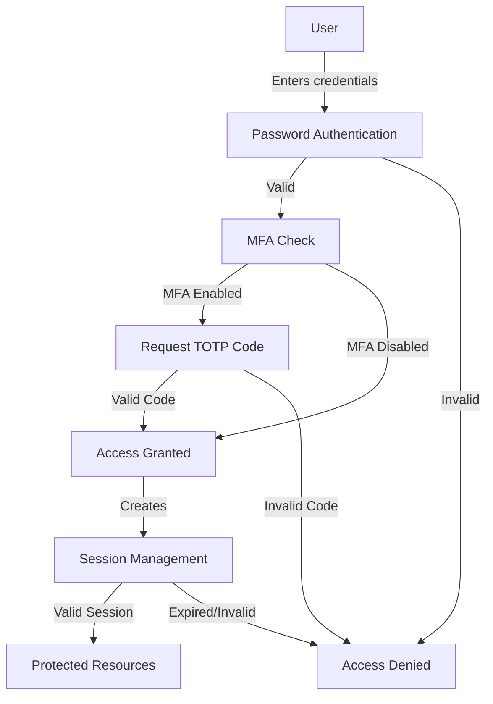
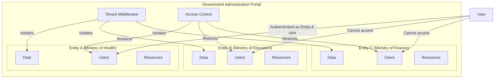
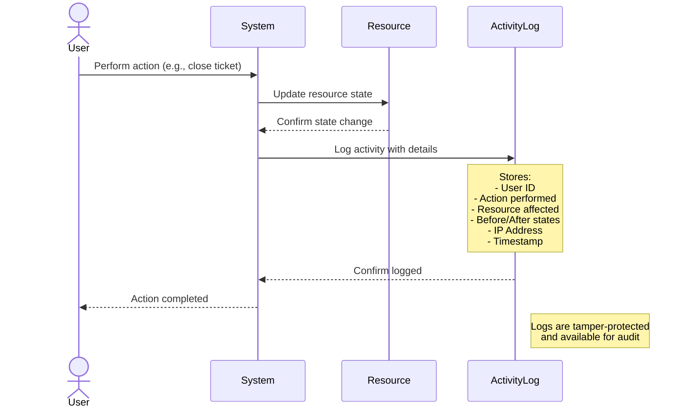
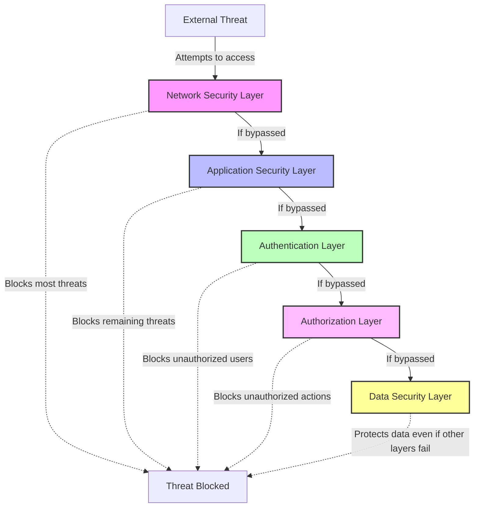
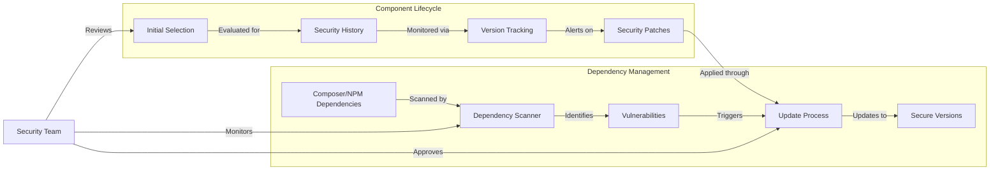

Security is a critical aspect of the Government Administration Portal, ensuring the protection of sensitive government data and citizen information. This section outlines the comprehensive security measures implemented throughout the platform.

<Note>
This document explains how the system keeps government and citizen data safe through multiple layers of protection. Each section includes both plain language explanations and technical details.
</Note>

## Authentication Mechanisms

Authentication is the process of verifying that users are who they claim to be. The platform implements multiple layers of authentication to prevent unauthorized access.



### Password-Based Authentication

<Info>
  Password authentication is the most common way users prove their identity by entering a secret password that only they should know.
</Info>

The primary authentication method uses Laravel's built-in authentication system with enhanced security features:

<AccordionGroup>
  <Accordion title="Password Requirements">
    - Minimum 8 characters
    - Combination of uppercase and lowercase letters
    - At least one number
    - At least one special character
    - Not based on common dictionary words
  </Accordion>
  <Accordion title="Password Hashing">
    - Passwords are hashed using bcrypt with a work factor of 12
    - Individual salts are applied to each password
    - Passwords are never stored in plaintext
  </Accordion>
  <Accordion title="Brute Force Protection">
    - Rate limiting on login attempts
    - Account lockout after multiple failed attempts
    - Exponential backoff for repeated failures
  </Accordion>
</AccordionGroup>

### Multi-Factor Authentication (MFA)

<Info>
  MFA adds an extra layer of security by requiring a second form of verification beyond just a password, typically something you have (like your phone) in addition to something you know (your password).
</Info>

The platform supports multi-factor authentication through FilamentBreezy, a component of the FilamentPHP v3 Infowork:

```php
BreezyCore::make()
    ->myProfile()
    ->enableTwoFactorAuthentication()
```

MFA implementation includes:

<Tabs>
  <Tab title="Time-Based One-Time Passwords (TOTP)">
    - Compatible with authenticator apps like Google Authenticator, Authy, and Microsoft Authenticator
    - 30-second code validity window
    - Secure key generation and storage

    <Tip>
      After entering your password, you'll need to enter a 6-digit code from an app on your phone. This code changes every 30 seconds, making it much harder for someone to gain unauthorized access.
    </Tip>
  </Tab>
  <Tab title="Recovery Codes">
    - One-time use backup codes for emergency access
    - Automatically regenerated after use
    - Securely hashed in the database

    <Tip>
      Recovery codes are emergency backup codes you can use if you lose access to your phone. Keep these in a secure location.
    </Tip>
  </Tab>
</Tabs>

### Session Management

<Info>
  Session management controls how long a user stays logged in and ensures their session remains secure.
</Info>

Secure session handling is implemented throughout the platform:

<CardGroup cols={2}>
  <Card title="Session Encryption" icon="lock">
    All session data is encrypted. Information about your login session is scrambled so it can't be read if intercepted.
  </Card>
  <Card title="Secure Cookies" icon="cookie">
    HTTP-only and secure flags set on cookies. The tokens that keep you logged in are protected from being stolen by malicious scripts.
  </Card>
  <Card title="Session Timeout" icon="clock">
    Automatic logout after period of inactivity. If you leave your computer unattended, the system will automatically log you out after a period of inactivity to prevent unauthorized access.
  </Card>
  <Card title="Session Invalidation" icon="right-from-bracket">
    Immediate session termination on logout or password change. When you change your password or log out, all active sessions are immediately terminated for security.
  </Card>
</CardGroup>

## Authorization and Access Control

While authentication verifies who you are, authorization determines what you're allowed to do in the system.

The platform implements a comprehensive authorization system to control access to resources and functionality.

### Role-Based Access Control (RBAC)

<Info>
  RBAC assigns permissions to roles, and then assigns roles to users, making it easier to manage who can do what.
</Info>

```mermaid
  flowchart TD
      subgraph Permissions
          P1[view_tickets]
          P2[create_appointments]
          P3[update_documents]
          P4[delete_vacancies]
          P5[manage_users]
      end
      
      subgraph Roles
          R1[super_admin]
          R2[administrator]
          R3[staff]
          R4[panel_user]
      end
      
      subgraph Users
          U1[Government Admin]
          U2[Department Head]
          U3[Staff Member]
          U4[Citizen]
      end
      
      R1 -->|has all| Permissions
      R2 -->|has many| P1
      R2 -->|has many| P2
      R2 -->|has many| P3
      R3 -->|has limited| P1
      R3 -->|has limited| P2
      R4 -->|has basic| P1
      
      U1 -->|assigned| R1
      U2 -->|assigned| R2
      U3 -->|assigned| R3
      U4 -->|assigned| R4
  ```

The platform uses Spatie's Laravel Permission package integrated with FilamentShield to implement RBAC:

```php
// User model
use HasRoles, HasPanelShield;
```

Key roles in the system include:

<CardGroup cols={2}>
  <Card title="super_admin" icon="user-shield">
    Complete system access and configuration
  </Card>
  <Card title="administrator" icon="user-gear">
    Full access to assigned entity resources
  </Card>
  <Card title="staff" icon="user-tie">
    Limited access to assigned entity resources based on job function
  </Card>
  <Card title="panel_user" icon="user">
    Basic citizen access to the App panel
  </Card>
</CardGroup>

### Permission Structure

<Info>
  Permissions are specific actions that users are allowed to perform on specific resources.
</Info>

Permissions are granular and follow a resource-action pattern:

<CardGroup cols={2}>
  <Card title="View" icon="eye">
    Ability to see a resource
  </Card>
  <Card title="Create" icon="plus">
    Ability to create new instances of a resource
  </Card>
  <Card title="Update" icon="pen-to-square">
    Ability to modify existing resources
  </Card>
  <Card title="Delete" icon="trash">
    Ability to remove resources
  </Card>
  <Card title="Manage" icon="gears">
    Comprehensive control over a resource
  </Card>
</CardGroup>

Example permission names:
- `view_tickets`
- `create_appointments`
- `update_documents`
- `delete_vacancies`
- `manage_users`

### Multi-Tenant Security

<Info>
  Multi-tenant security ensures that different government entities (tenants) can use the same system while keeping their data separate and secure.
</Info>



The platform implements tenant-based isolation using FilamentPHP's tenant feature:

```php
->tenant(Entity::class)
->tenantMiddleware([
    ApplyTenantScopes::class,
], isPersistent: true)
```

This ensures:

<CardGroup cols={3}>
  <Card title="Data Isolation" icon="database">
    Each entity's data is logically separated
  </Card>
  <Card title="Access Boundaries" icon="border-all">
    Users can only access data from their assigned entities
  </Card>
  <Card title="Cross-Tenant Protection" icon="shield-halved">
    Prevents unauthorized access across entity boundaries
  </Card>
</CardGroup>

### Policy-Based Authorization

<Info>
  Policies are rules that determine whether a user can perform a specific action on a specific resource.
</Info>

Laravel policies are used to enforce fine-grained access control:

```php
// Example policy method
public function view(User $user, Ticket $ticket): bool
{
    // Allow if user created the ticket or has permission to view tickets
    return $user->id === $ticket->user_id ||
           $user->can('view_ticket');
}
```

Policies are registered for all major resources and enforce:

<CardGroup cols={3}>
  <Card title="Ownership Checks" icon="user-check">
    Verify if a user owns a resource
  </Card>
  <Card title="Permission Checks" icon="key">
    Verify if a user has appropriate permissions
  </Card>
  <Card title="Entity Scoping" icon="building-lock">
    Ensure users only access resources from their entities
  </Card>
</CardGroup>

## Data Encryption

<Info>
  Encryption converts data into a coded format that can only be read with the correct decryption key, protecting it from unauthorized access.
</Info>

The platform implements encryption for sensitive data both at rest and in transit.

### Transport Layer Security (TLS)

<Info>
  TLS encrypts data as it travels between your device and the server, preventing eavesdropping.
</Info>

All communication with the platform is secured using TLS:

<CardGroup cols={3}>
  <Card title="Minimum TLS Version" icon="lock">
    TLS 1.2 or higher required
  </Card>
  <Card title="Strong Cipher Suites" icon="shield-halved">
    Only secure cipher suites allowed
  </Card>
  <Card title="HTTP Strict Transport Security" icon="lock">
    Enforced to prevent downgrade attacks
  </Card>
</CardGroup>

## Audit Logging

<Info>
  Audit logging records who did what and when, creating a trail of actions for security monitoring and compliance.
</Info>

The platform maintains comprehensive audit logs to track user actions and system events.

### Activity Logging

<Info>
  Activity logging records user actions for security and accountability purposes.
</Info>



The platform uses Spatie's Laravel Activitylog package:

```php
// Example of logged activity
activity()
    ->performedOn($ticket)
    ->causedBy($user)
    ->withProperties(['status' => 'closed'])
    ->log('Ticket was closed');
```

Key features include:

<CardGroup cols={2}>
  <Card title="User Attribution" icon="user">
    All actions linked to specific users
  </Card>
  <Card title="Action Details" icon="list-check">
    What was changed and when
  </Card>
  <Card title="Resource Tracking" icon="database">
    Which resources were affected
  </Card>
  <Card title="Before/After States" icon="code-compare">
    Record of changes made
  </Card>
  <Card title="IP Logging" icon="network-wired">
    Origin of the request
  </Card>
  <Card title="Tamper Protection" icon="shield-halved">
    Logs are protected against modification
  </Card>
</CardGroup>

## Security Best Practices

<Info>
  Security best practices are established methods and procedures that help ensure the highest level of security throughout the system's lifecycle.
</Info>

The platform follows industry-standard security best practices throughout its implementation:

### Defense in Depth

<Info>
  Defense in Depth is a security strategy that uses multiple layers of security controls throughout the system, so if one layer fails, others still provide protection.
</Info>



<CardGroup cols={2}>
  <Card title="Multiple Security Layers" icon="layer-group">
    No single point of security failure.
  </Card>
  <Card title="Principle of Least Privilege" icon="user-lock">
    Users have only necessary permissions.
  </Card>
  <Card title="Security by Default" icon="shield-check">
    Secure configuration out of the box, the system starts with the most secure settings already enabled.
  </Card>
  <Card title="Fail Secure" icon="shield-halved">
    Systems default to secure state on failure. If something goes wrong, the system is designed to fail in a way that maintains security rather than exposing vulnerabilities.
  </Card>
  <Card title="Regular Updates" icon="arrow-rotate-right">
    Timely application of security patches. Security fixes are applied promptly to protect against known vulnerabilities.
  </Card>
</CardGroup>

### Third-Party Component Security

<Info>
  Third-party component security focuses on managing the security risks associated with external libraries, Infoworks, and services used in the application.
</Info>



<CardGroup cols={3}>
  <Card title="Dependency Scanning" icon="magnifying-glass">
    Regular scanning of dependencies for vulnerabilities. The system automatically checks all external components for known security issues.
  </Card>
  <Card title="Version Control" icon="code-branch">
    Tracking and updating of component versions. The system keeps track of which versions of external components are in use and when they need updating.
  </Card>
  <Card title="Minimal Dependencies" icon="minimize">
    Only necessary dependencies included. The system uses only the external components that are absolutely needed, reducing potential security risks.
  </Card>
</CardGroup>

<Note>
  This comprehensive security approach ensures that the Government Administration Portal provides a secure environment for both government operations and citizen interactions, protecting sensitive data while maintaining usability and accessibility.
</Note>