## Content Management

### Posts

#### Definition

Posts are the primary content type in WordPress, representing dynamic, chronological entries such as blog articles, news updates, or announcements. They form the foundation of WordPress's content management system and are designed to be regularly updated and organized using categories and tags.

Key characteristics of Posts include:

- **Chronological organization**: Posts are displayed in reverse chronological order (newest first) by default
- **Categorization and tagging**: Posts can be organized using hierarchical categories and non-hierarchical tags
- **Archives**: Automatically organized into date-based archives (yearly, monthly, daily)
- **RSS feed integration**: Automatically included in the site's RSS feed for syndication
- **Comments**: Built-in commenting system for reader engagement
- **Permalinks**: Customizable URL structures for better SEO and readability
- **Featured images**: Visual representation of the post content
- **Excerpts**: Short summaries that can be displayed in listings

Posts are distinct from Pages (which are static, hierarchical content) and are ideal for time-sensitive content that benefits from chronological organization and categorization.

#### New Post Creation Process

Creating a new post in WordPress follows a structured workflow that can be performed by users with appropriate publishing permissions. Below is a detailed explanation of the post creation process:

1. **Accessing the Posts Section**
   - Log in to the WordPress admin dashboard
   - Navigate to "Posts" > "Add Post" in the left sidebar menu
    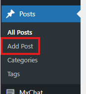

2. **Basic Post Elements**
   - **Title**: Enter a descriptive title at the top of the editor
   - **Content**: Add the main content using the block editor (Gutenberg) or Bricks editor
   - **Categories**: Assign the post to one or more categories
   - **Tags**: Add relevant tags to improve content discoverability
   - **Featured Image**: Set a representative image for the post
   - **Excerpt**: Create a custom summary or let WordPress generate one automatically
    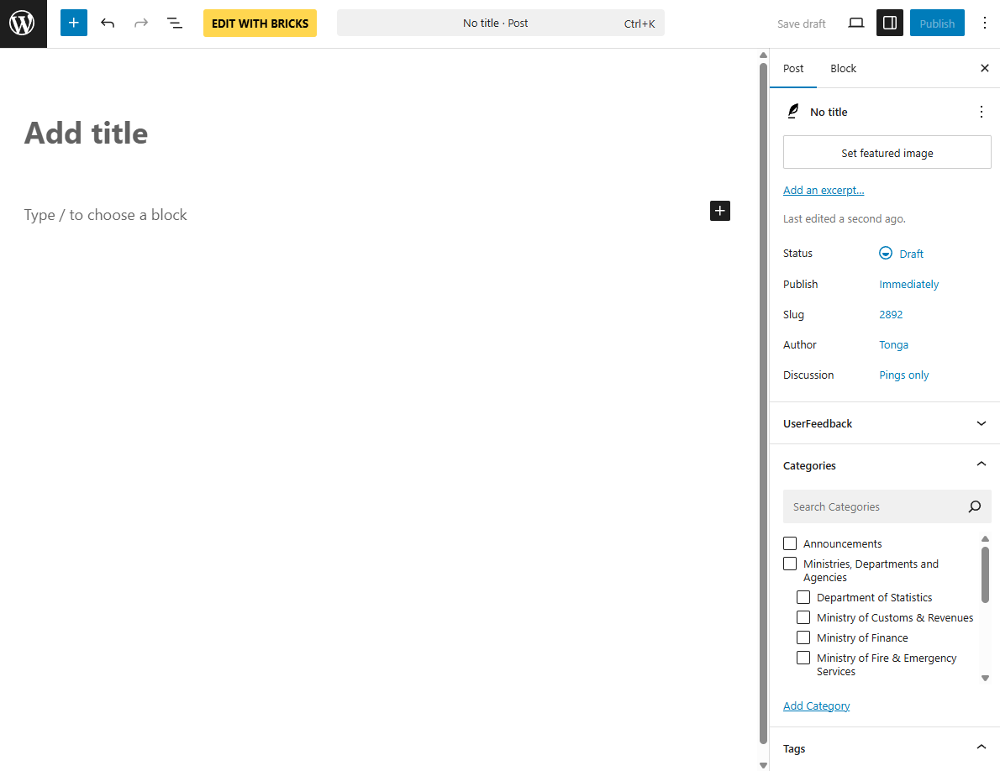

3. **Post Settings in the Sidebar**
   - **Status & Visibility**: Set publication status, visibility, and scheduling options
   - **Slug**: View and edit the post's URL
   - **Categories**: Assign to existing categories or create new ones
   - **Tags**: Add relevant keywords
   - **Featured Image**: Upload or select an image to represent the post
   - **Excerpt**: Add a custom summary of the post
   - **Discussion**: Enable/disable comments and pingbacks
   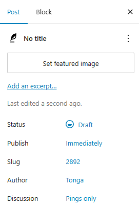

4. **Publishing Options**
   - **Draft**: Save the post without publishing
   - **Pending**: Waiting for review before publishing
   - **Private**: Only visible to site admins and editors
   - **Scheduled**: Publish automatically on a chosen date
   - **Published**: Make the post live on the site immediately
   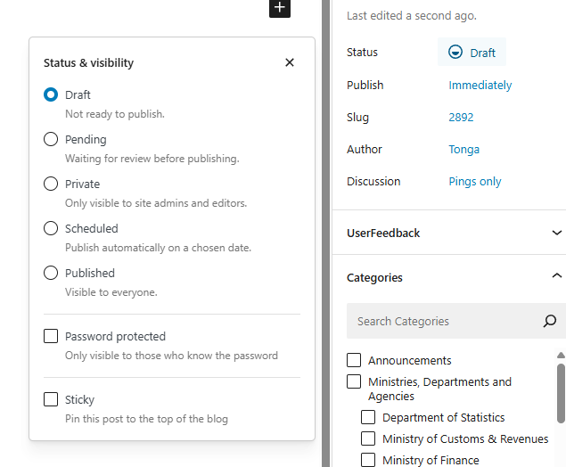

5. **Post-Publication Actions**
   - View the published post on the live site
   - Share the post on social media (manually or via plugins)
   - Monitor comments and engagement
   - Update the post as needed with new information

**Important Considerations:**

- Choose a clear, descriptive title that accurately represents the content
- Organize content logically using headings, paragraphs, and other block elements
- Select relevant categories and tags to improve content discoverability
- Include a compelling featured image that represents the post's content
- Review the post for errors before publishing
- Consider SEO best practices when creating post content and metadata

#### Post Taxonomies

Taxonomies in WordPress are systems for organizing and classifying content. For posts, the two primary built-in taxonomies are Categories and Tags, though custom taxonomies can also be created for more specialized classification needs.

1. **Categories**
   - **Definition**: Hierarchical taxonomy for broad content classification
   - **Characteristics**:
     - Hierarchical (can have parent-child relationships)
     - Required (posts must have at least one category)
     - Typically used for broad topic areas
     - Generate archive pages automatically
   - **Management**:
     - Navigate to "Posts" > "Categories" to manage all categories
     - Add new categories with name, slug, parent, and description
     - Edit or delete existing categories

2. **Adding Categories to Posts**
   - In the post editor, locate the Categories panel in the sidebar
   - Select existing categories by checking the boxes
   - Add new categories directly from the post editor using the "Add New Category" link
   - Set parent-child relationships for hierarchical organization
   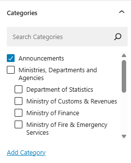

3. **Tags**
   - **Definition**: Non-hierarchical taxonomy for specific content keywords
   - **Characteristics**:
     - Non-hierarchical (flat structure)
     - Optional (posts don't require tags)
     - Typically used for specific keywords or micro-topics
     - Generate archive pages automatically
   - **Management**:
     - Navigate to "Posts" > "Tags" to manage all tags
     - Add new tags with name, slug, and description
     - Edit or delete existing tags

4. **Adding Tags to Posts**
   - In the post editor, locate the Tags panel in the sidebar
   - Enter tags separated by commas
   - Select from previously used tags as you type
   - Add as many tags as relevant to the content
   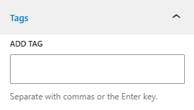

5. **Taxonomy Best Practices**
   - **Categories**:
     - Limit to 5-10 primary categories for the entire site
     - Use a logical hierarchy with no more than 2-3 levels
     - Name categories clearly and consistently
     - Assign each post to 1-3 most relevant categories
   - **Tags**:
     - Use specific, relevant keywords
     - Be consistent with singular vs. plural forms
     - Avoid overly generic tags
     - Limit to 5-15 tags per post for optimal relevance

**Important Considerations:**

- Plan your taxonomy structure before creating numerous categories or tags
- Use categories for broad classification and tags for specific details
- Consider SEO implications of your taxonomy structure
- Regularly audit and clean up unused or redundant taxonomy terms
- Create descriptive archive pages for important taxonomy terms
- Use consistent naming conventions across all taxonomies

### Pages

#### Definition

Pages are static, standalone content in WordPress designed for timeless information that isn't part of the regular chronological blog content flow. They represent permanent or semi-permanent content such as "About Us," "Contact," "Services," or "Privacy Policy" sections of a website.

Key characteristics of Pages include:

- **Hierarchical structure**: Pages can have parent-child relationships, creating nested navigation
- **Static content**: Designed for information that doesn't change frequently
- **No categorization or tagging**: Pages don't use the standard WordPress taxonomy system
- **No date organization**: Pages aren't organized chronologically or displayed in date archives
- **Custom templates**: Many themes offer page-specific templates for different layouts
- **Menu integration**: Commonly used as primary navigation items
- **No RSS inclusion**: Pages aren't included in the site's RSS feed by default
- **Permalinks**: Typically have simpler URL structures than posts

Pages are distinct from Posts (which are chronological, categorized content entries) and are ideal for essential website information that needs to be easily accessible and isn't time-sensitive.

#### New Page Creation Process

Creating a new page in WordPress follows a structured workflow that can be performed by users with appropriate publishing permissions. Below is a detailed explanation of the page creation process:

1. **Accessing the Pages Section**
   - Log in to the WordPress admin dashboard
   - Navigate to "Pages" > "Add Page" in the left sidebar menu
   

2. **Basic Page Elements**
   - **Title**: Enter a descriptive title at the top of the editor
   - **Content**: Add the main content using the block editor (Gutenberg) or Bricks editor
   - **Parent Page**: Optionally assign a parent page to create hierarchical structure
   - **Template**: Select a page template if your theme offers multiple options
   - **Featured Image**: Optionally set a representative image for the page

3. **Page Settings in the Sidebar**
   - **Status & Visibility**: Set publication status, visibility, and scheduling options
   - **Permalink**: View and edit the page's URL
   - **Featured Image**: Upload or select an image to represent the page
   - **Page Attributes**: Set parent page and template
   - **Discussion**: Enable/disable comments and pingbacks
   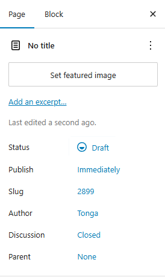

4. **Publishing Options**
   - **Save Draft**: Save the page without publishing
   - **Preview**: View how the page will appear on the site before publishing
   - **Publish**: Make the page live on the site immediately
   - **Schedule**: Set a future date and time for automatic publication
   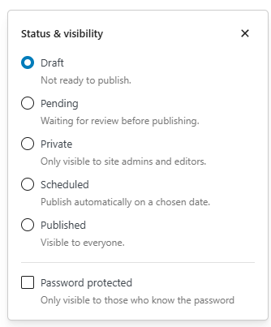

5. **Post-Publication Actions**
   - View the published page on the live site
   - Add the page to navigation menus
   - Create links to the page from other content
   - Update the page as needed with new information

**Important Considerations:**

- Choose a clear, descriptive title that accurately represents the content
- Organize content logically using headings, paragraphs, and other block elements
- Consider the page's position in the site's overall information architecture
- Select appropriate page templates based on the content's purpose
- Review the page for errors before publishing
- Consider SEO best practices when creating page content and metadata

#### Creation of Content using Gutenberg Editor Process

The Gutenberg editor is WordPress's default block-based content editor that provides a flexible and intuitive way to create rich content. Below is a detailed guide on creating posts or pages using the Gutenberg editor:

1. **Understanding the Gutenberg Interface**
   - **Top Toolbar**: Contains document-level controls and settings
   - **Content Area**: The main editing space where blocks are added and manipulated
   - **Block Toolbar**: Context-sensitive controls that appear when a block is selected
   - **Settings Sidebar**: Document and block-specific settings (toggle with the plus icon)
   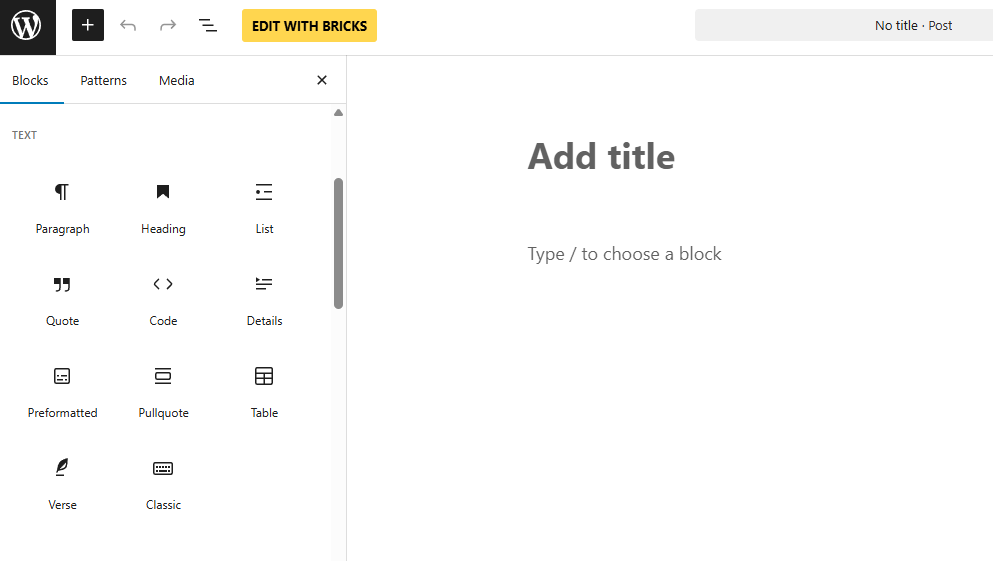

2. **Working with Blocks**
   - **Adding Blocks**: Click the "+" button in the top toolbar or at the beginning of a new line
   - **Block Types**: Choose from various block types:
     - **Text blocks**: Paragraph, Heading, List, Quote, etc.
     - **Media blocks**: Image, Gallery, Video, Audio, etc.
     - **Layout blocks**: Columns, Group, Cover, etc.
     - **Widget blocks**: Shortcode, Latest Posts, Categories, etc.
     - **Embeds**: YouTube, Twitter, Instagram, etc.
     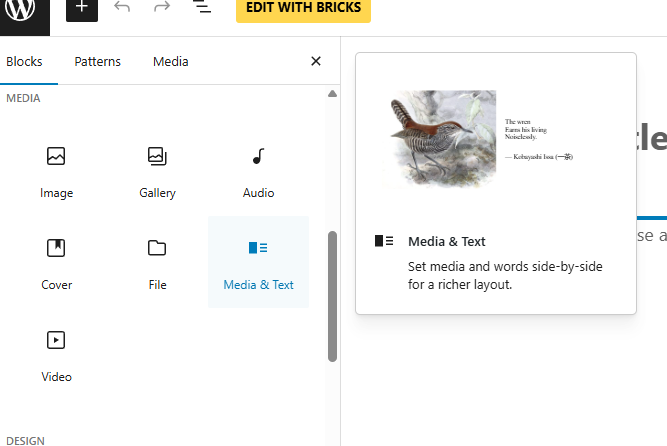

3. **Text Formatting**
   - Select text to reveal the inline formatting toolbar
   - Apply formatting such as bold, italic, links, and inline code
   - Use the Format tab in the sidebar for additional text formatting options
   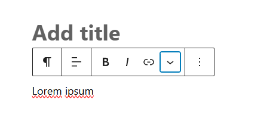

4. **Block Manipulation**
   - **Select blocks**: Click on a block to select it
   - **Move blocks**: Use the up/down arrows or drag the six-dot handle
   - **Transform blocks**: Change one block type to another using the transform option
   - **Duplicate blocks**: Use the duplicate button in the block toolbar
   - **Remove blocks**: Use the delete/backspace key or the three-dot menu

5. **Advanced Block Features**
   - **Block patterns**: Pre-designed block layouts that can be inserted and customized
   - **Reusable blocks**: Save blocks or block combinations for reuse across the site
   - **Block groups**: Combine multiple blocks into a single unit for easier management
   - **Columns**: Create multi-column layouts with adjustable widths
   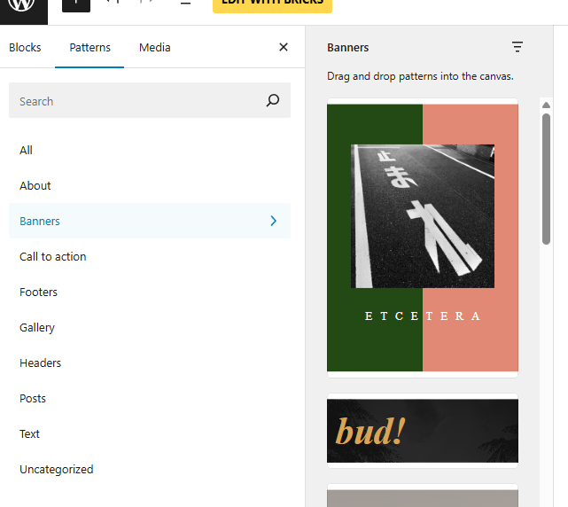

6. **Document Settings**
    - **Status & Visibility**: Publication status, visibility, and scheduling
    - **Permalink**: View and edit the post's or page URL
    - **Categories & Tags**: Content organization options
    - **Featured Image**: Visual representation of the post or page
    - **Excerpt**: Custom summary for listings and social sharing

7. **Previewing and Publishing**
   - Use the Preview button to see how the post or page will appear on the frontend
   - Save drafts to continue editing later
   - Schedule posts or pages for future publication
   - Publish immediately when the content is ready
   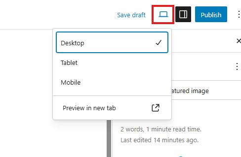

**Best Practices for Gutenberg:**

- Start with a clear content structure in mind
- Use headings (H2, H3, etc.) to create a logical hierarchy
- Break content into manageable sections using appropriate blocks
- Utilize white space and separators to improve readability
- Test how your content appears on different screen sizes using the preview function
- Save your work frequently using the Save Draft option

#### Creation of Content using Bricks Editor Process

The Bricks Builder is a powerful visual editor plugin for WordPress that offers an alternative to Gutenberg with advanced design capabilities. Below is a detailed guide on creating posts or pages using the Bricks editor:

1. **Accessing Bricks Editor for Posts and Pages**
   - Create a new post or page or edit an existing one
   - Look for the "Edit with Bricks" button in the WordPress admin bar
   - Click to switch from the default WordPress editor to Bricks
   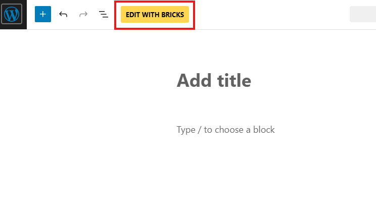

2. **Understanding the Bricks Interface**
   - **Top Bar**: Contains save options, responsive controls, and global settings
   - **Left Panel**: Elements panel for adding content blocks
   - **Canvas**: The main editing area where you build your content
   - **Right Panel**: Structure panel and element settings
   - **Bottom Bar**: Revision history, keyboard shortcuts, and additional tools
   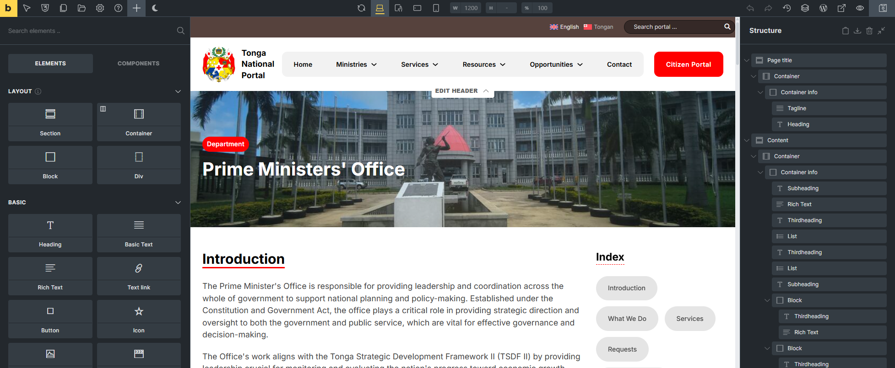

3. **Adding Elements**
   - Click the "+" icon in the left panel to open the elements library
   - Browse categories or search for specific elements:
     - **Layout elements**: Section, Container, Block and Div
     - **Basic elements**: Text, Heading, Button, Image, Video, etc.
     - **General elements**: Dropdown, Toggle, List, Accordion, Tabs, etc.
     - **Media elements**: Image Gallery, Carousel, Slider, etc.
     - **Query elements**: Pagination, Summaries, etc.
     - **Wordpress elements**: Posts, Sidebar, Search, etc.
     - **Single elements**: Post Content, Post Title, Featured Image, etc.
     - **Filter elements**: Datepicker, Checkbox, Radio, Select, etc.
   - Drag elements onto the canvas or click to add them
   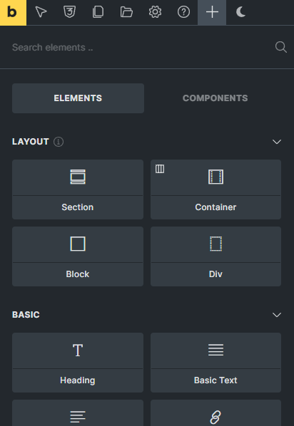

4. **Structuring Content**
   - Use Section elements as main containers for your content
   - Add Container elements within sections to create layout structures
   - Implement multi-column layouts using the Division element
   - Nest elements to create complex content structures

5. **Styling Elements**
   - Select any element to open its settings in the right panel
   - Use the Style tab to modify:
     - Typography (font, size, weight, line height, etc.)
     - Colors (text, background, borders)
     - Spacing (margin, padding)
     - Borders and shadows
     - Animations and effects
   - Apply global styles or create custom styles for individual elements

6. **Responsive Design**
   - Use the responsive mode buttons in the top bar to preview different device sizes
   - Apply device-specific styling using the device icons in the settings panel
   - Set different layouts, visibility, and styling for desktop, tablet, and mobile
   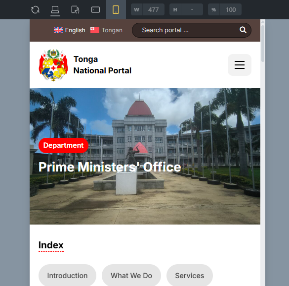

7. **Dynamic Data Integration**
   - Use dynamic data tags to pull content from WordPress:
     - Post title, content, excerpt
     - Custom fields and meta data
     - Categories, tags, and taxonomies
     - Author information
   - Click the "Thunder" icon in applicable settings to access dynamic data options
   - Dyanmic variables for pages are also available
   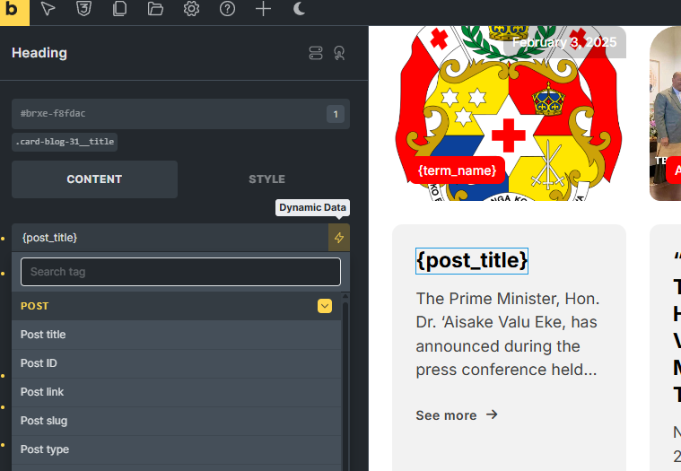

8. **Saving and Publishing**
   - Use the save options in the top bar:
     - **Preview**: View how the content will appear on the frontend
     - **Save**: Save the changes made
   - Access revision history from the bottom bar if needed

**Best Practices for Bricks Editor:**

- Plan your layout structure before starting to build
- Use consistent spacing and styling throughout your content
- Create and use global styles for consistent design across the site
- Test your design across different device sizes
- Save your work frequently to avoid losing changes
- Consider creating templates for common post layouts to save time

### Content Translation Management with WPML Plugin

The WPML (WordPress Multilingual) plugin provides comprehensive tools for translating posts and other content into multiple languages. Below is a detailed guide on managing post translations using the WPML plugin:

1. **Creating a New Multilingual Post or Page**
   - Create a post or page in your primary language as normal
   - Publish the content
   - Notice the language indicator in the post or page editor showing the current language
   - Use the "+" icon next to other languages in the language metabox to add translations

2. **Translating Existing Content**
   - Navigate to "WPML" > "Translation Management"
   - Select the content you want to translate
   - Choose the target language(s)
   - Select the translation method:
     - **Translate yourself**: Create translations directly in WordPress
     - **Send to translation service**: Use professional translation services
     - **Duplicate content**: Copy content to create similar posts or pages in other languages
    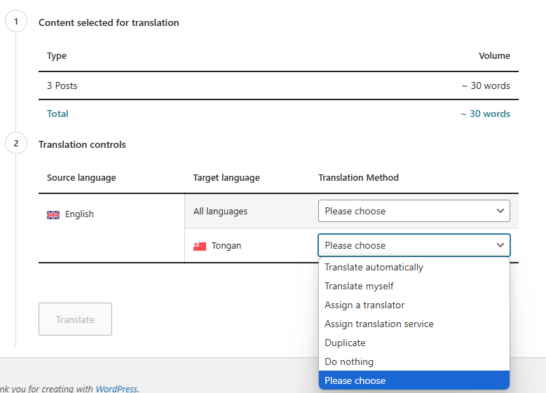

3. **Translation Editor Interface**
   - When translating yourself, WPML provides a side-by-side translation editor
   - Original content appears on the left
   - Translation fields appear on the right
   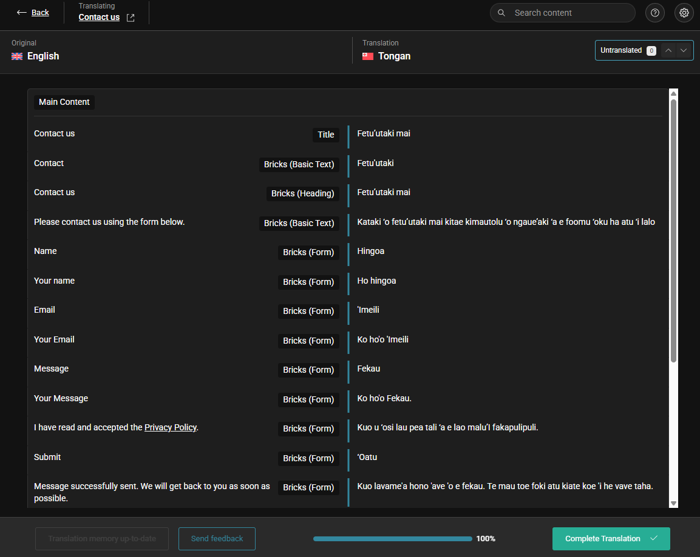

4. **Managing Content Translation Status**
   - Navigate to "WPML" > "Translations"
   - View the translation status of all content:
     - Needs translation
     - In progress
     - Needs updating (original content changed)
     - Complete
   - Filter by language, content type, and translation status
   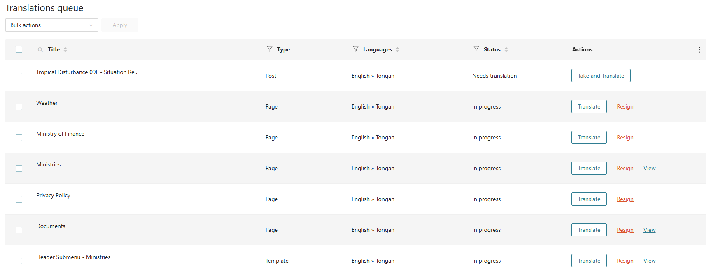

5. **Translating Post Taxonomies**
   - Navigate to "WPML" > "Taxonomy Translation"
   - Select the taxonomy type (Categories, Tags, etc.)
   - Translate each term name and description
   - Synchronize hierarchies between languages
   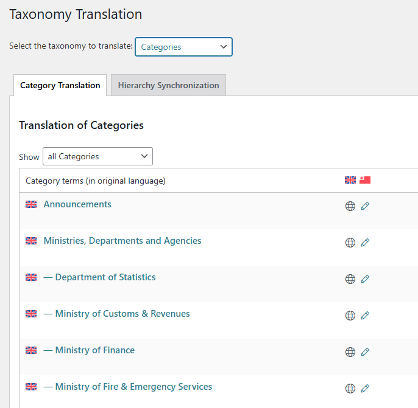

**Best Practices for Multilingual Content:**

- Maintain consistent structure across all language versions
- Adapt content for cultural differences rather than just translating literally
- Keep the same publishing schedule for all languages when possible
- Use language-specific SEO keywords and metadata
- Regularly check for untranslated content or outdated translations
- Consider using professional translation services for important content
- Test the user experience in each language to ensure proper functionality

### Content Social Sharing with FS Poster Plugin

FS Poster is a powerful WordPress plugin that enables automatic sharing of posts or pages to multiple social media platforms. Below is a detailed guide on managing social sharing of content using the FS Poster plugin:

1. **Setting Up FS Poster**
   - Navigate to "FS Poster" > "Accounts" in the WordPress admin
   - Connect your social media accounts:
     - Facebook
     - Instagram
     - LinkedIn
     - Pinterest
     - Telegram
     - And other supported platforms
   - Authorize each account following the platform-specific authentication process
   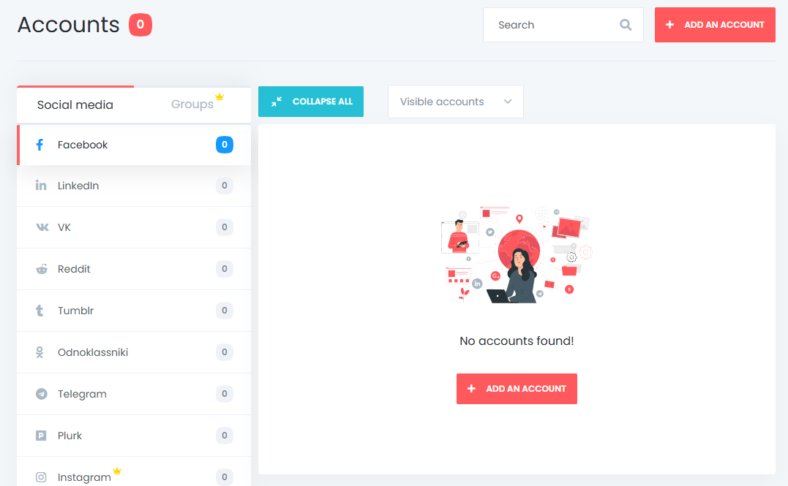

2. **Configuring Default Sharing Settings**
   - Navigate to "FS Poster" > "Settings"
   - Set global defaults for:
     - Share content automatically
     - FS Poster role visibility
     - Toggle post sharing logs

3. **Sharing Options in Content Editor**
   - When creating or editing a post or page, locate the FS Poster metabox
   - Select which social accounts to share to
   - Customize the sharing message for each platform
   - Upload custom images for specific platforms
   - Enable/disable automatic sharing for this post

4. **Customizing Share Content**
   - Use dynamic tags in your share messages:
     - `{title}` - Content title
     - `{excerpt}` - Content excerpt
     - `{content}` - Content (truncated)
     - `{link}` - Content URL
     - `{tags}` - Content tags as hashtags
     - `{author}` - Content author name
   - Customize hashtags and mentions for each platform
   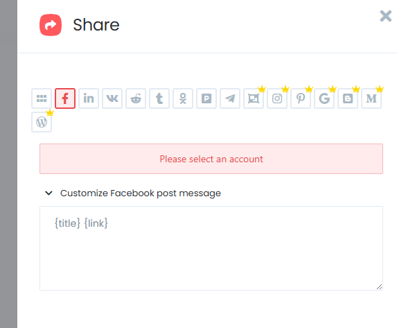

5. **Monitoring Share Performance**
   - Navigate to "FS Poster" > "Logs"
   - View the status of all shares:
     - Successful shares
     - Failed shares with error messages
     - Pending scheduled shares
   - Filter logs by date, platform, and status
   - Resend failed shares with a single click

**Best Practices for Social Sharing:**

- Customize messages for each platform's unique audience and format
- Use high-quality images optimized for each social platform
- Vary your messaging for recurring shares to prevent repetition
- Monitor engagement metrics to refine your sharing strategy
- Respect each platform's posting frequency limits to avoid being flagged as spam