# Generic WordPress Functionalities

This document provides a comprehensive overview of the generic WordPress functionalities available in the Tonga National Portal administration panel.

## Authentication System

### Definition

The WordPress Authentication System is a comprehensive security framework that manages user identity verification and access control within the WordPress administration panel. It ensures that only authorized users can access the admin dashboard and its various functionalities based on their assigned roles and permissions.

Key components of the authentication system include:

- **User credentials storage**: Securely stores usernames and password hashes in the WordPress database
- **Login mechanism**: Processes user login attempts and validates credentials
- **Session management**: Creates and maintains secure user sessions after successful authentication
- **Access control**: Restricts access to specific areas based on user roles and capabilities
- **Security features**: Implements protection against unauthorized access attempts

The authentication system serves as the gateway to the WordPress administration panel, providing a balance between security and usability while protecting sensitive site data and functionality.

### Login Process

The WordPress login process follows a structured sequence of steps to verify user identity and establish a secure session. Below is a detailed explanation of the standard login workflow:

1. **Accessing the Login Page**
   - Navigate to the login URL.
   - The system presents a login form requesting username/email and password
   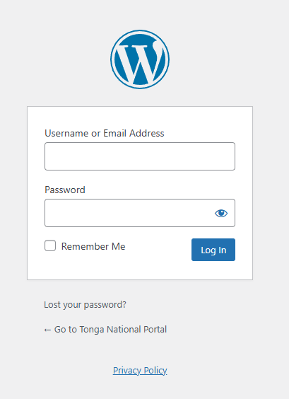

2. **Credential Submission**
   - User enters their username or email address and password
   - User clicks the "Log In" button or presses Enter to submit credentials
   - The form data is submitted via POST request to the server

3. **Server-side Validation**
   - WordPress validates the submitted credentials against stored user data
   - The system checks if the username/email exists in the database
   - If found, the submitted password is verified against the stored password hash
   - Failed login attempts may trigger security measures (like temporary lockouts)

4. **Session Establishment**
   - Upon successful validation, WordPress creates a new authenticated session
   - Authentication cookies are set in the user's browser:
     - `wordpress_[hash]`: Contains the authenticated user information
     - `wordpress_logged_in_[hash]`: Indicates the user is logged in
     - `wordpress_sec_[hash]`: Used for password-based cookie authentication
   - These cookies are encrypted and contain expiration timestamps

5. **Redirection**
   - New users are typically directed to their profile page
   - Returning users are redirected to:
     - The admin dashboard by default
     - A specific page if a redirect parameter was included in the login URL
     - The page they were attempting to access before being prompted to log in
     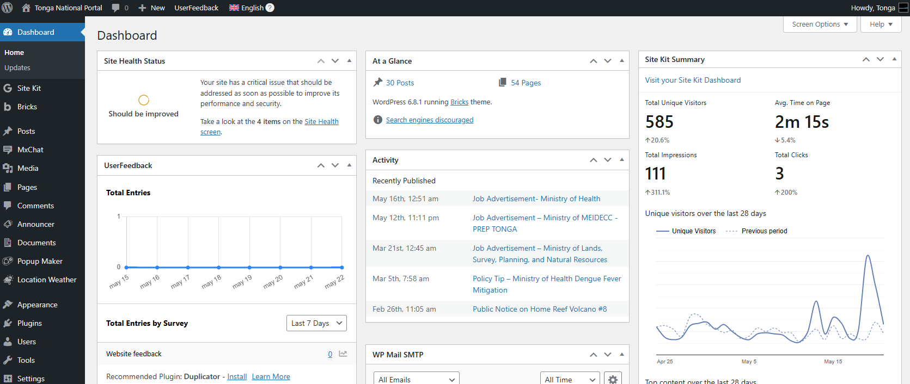

**Important Security Considerations:**

- WordPress uses nonces (number used once) to prevent CSRF attacks during login
- Failed login attempts are logged and may trigger security measures
- The login page can be protected with additional security layers (like 2FA)
- All login communication should occur over HTTPS to prevent credential interception

### Authentication Methods

WordPress supports multiple authentication methods to accommodate different security requirements and user preferences. Each method offers distinct advantages in terms of security, convenience, and implementation complexity.

#### 1. Standard Username/Password Authentication

The default authentication method built into WordPress core:

- **Implementation**: Users enter their username/email and password on the login form
- **Security Level**: Basic (can be enhanced with password policies)
- **User Experience**: Familiar login process requiring memorization of credentials
- **Best Practices**:
  - Enforce strong password policies
  - Implement account lockouts after failed attempts
  - Regularly prompt for password changes

#### 2. Two-Factor Authentication (2FA)

Adds an additional verification layer beyond passwords:

- **Implementation**: Requires plugins like "Two Factor Authentication" or "Wordfence"
- **Security Level**: High (significantly reduces account compromise risk)
- **Methods**:
  - Time-based One-Time Passwords (TOTP) via authenticator apps
  - SMS verification codes
  - Email verification codes
  - Hardware security keys (like YubiKey)
- **User Flow**:
  1. User enters username/password
  2. System prompts for the second factor
  3. User provides the verification code or uses the security key

#### 3. Single Sign-On (SSO)

Allows authentication through external identity providers:

- **Implementation**: Requires plugins like "OAuth Single Sign On" or "SAML SSO"
- **Security Level**: Varies based on the identity provider's security
- **Providers**:
  - Google Workspace
  - Microsoft Azure AD
  - Facebook
  - Twitter
  - Other OAuth/SAML providers
- **Benefits**:
  - Reduces password fatigue
  - Centralizes authentication management
  - Often includes additional security features

#### 4. Application Passwords

Secure method for API and application access:

- **Implementation**: Built into WordPress core (since version 5.6)
- **Security Level**: High (limited-scope access tokens)
- **Use Cases**:
  - Mobile apps
  - REST API access
  - Programmatic site management
- **Management**: Users can create and revoke application-specific passwords from their profile

#### 5. Cookie-Based Authentication

The standard method WordPress uses to maintain sessions:

- **Implementation**: Built into WordPress core
- **Security Level**: Moderate
- **Cookie Types**:
  - Authentication cookies
  - Login cookies
  - Session cookies
- **Security Considerations**:
  - Cookies are encrypted
  - Include expiration timestamps
  - Can be configured for different lifespans

**Implementation Considerations:**

- Multiple authentication methods can be used simultaneously
- Authentication can be customized via hooks and filters
- Enterprise environments often require more robust methods (SSO, 2FA)
- All authentication should occur over HTTPS connections

### Logout Process

The WordPress logout process securely terminates user sessions and removes authentication cookies to prevent unauthorized access. Understanding this process is crucial for maintaining security and managing user sessions effectively.

#### Standard Logout Procedure

1. **Initiating Logout**
   - User clicks the "Log Out" link in the admin bar or profile menu
   - This link points to: `wp-login.php?action=logout`
   - A nonce parameter is included to prevent CSRF attacks
   

2. **Server-side Processing**
   - WordPress validates the logout request and nonce
   - The system clears the user's session data from the server
   - All WordPress authentication cookies are invalidated:
     - `wordpress_[hash]`
     - `wordpress_logged_in_[hash]`
     - `wordpress_sec_[hash]`

3. **Confirmation and Redirection**
   - User receives confirmation of successful logout
   - System redirects to:
     - The login page by default
     - A custom URL if specified in the configuration

#### Automatic Logout Scenarios

WordPress may automatically terminate sessions under certain conditions:

- **Session Expiration**
  - Authentication cookies have built-in expiration times
  - Default session length is 2 days (configurable)
  - After expiration, users must re-authenticate

- **Password Changes**
  - When a user changes their password, all existing sessions are terminated
  - This security measure prevents access with compromised credentials

- **User Role Changes**
  - Modifications to a user's role or capabilities may trigger session termination
  - Ensures users can't retain access beyond their current permissions

- **Manual Session Management**
  - Administrators can force-logout users using plugins
  - Useful for security incidents or maintenance periods

#### Security Best Practices

- **Complete Logout**
  - Users should be instructed to close their browser after logout for complete session termination
  - Some browser features (like session restore) may retain cookies

- **Idle Session Timeout**
  - Consider implementing automatic logout after periods of inactivity
  - Requires additional plugins or custom code
  - Particularly important for shared computers or public environments

- **Logout Verification**
  - Confirm successful logout to users
  - Provide clear instructions if additional steps are needed

- **Multi-device Management**
  - Modern WordPress installations track login sessions across devices
  - Users can view and terminate specific sessions from their profile

**Technical Implementation Note:**
The logout process uses the `wp_logout()` function which triggers the 'wp_logout' action hook, allowing developers to perform additional cleanup or logging operations during logout.

## Users Management

### Definition

The WordPress Users Management system is a comprehensive framework that allows administrators to create, modify, and manage user accounts within the WordPress platform. It provides tools for controlling access to the website's administrative functions based on predefined roles and capabilities.

Key components of the Users Management system include:

- **User accounts**: Individual profiles containing personal information, credentials, and role assignments
- **Role-based access control**: Predefined sets of permissions that determine what actions users can perform
- **User capabilities**: Granular permissions that can be assigned or removed from specific roles
- **User metadata**: Additional information associated with user accounts
- **Authentication management**: Tools for password resets, account recovery, and security

The Users Management system serves as the foundation for WordPress's security model, ensuring that users have appropriate access to site functionality while protecting sensitive operations from unauthorized access.

### User Addition Process

Adding new users to a WordPress site follows a structured workflow that can be performed by administrators. Below is a detailed explanation of the user addition process:

1. **Accessing the Users Section**
   - Log in to the WordPress admin dashboard
   - Navigate to "Users" > "Add User" in the left sidebar menu
   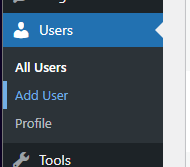
   - [Screenshot Recommended] *Users menu in the WordPress admin sidebar*

2. **Completing the New User Form**
   - Fill in the required fields:
     - Username (required): A unique identifier that cannot be changed later
     - Email (required): A valid email address for the user
     - Password (optional): A strong password or leave blank to auto-generate
     - Confirm Password (if entering manually)
     - First Name (optional)
     - Last Name (optional)
     - Website (optional)
     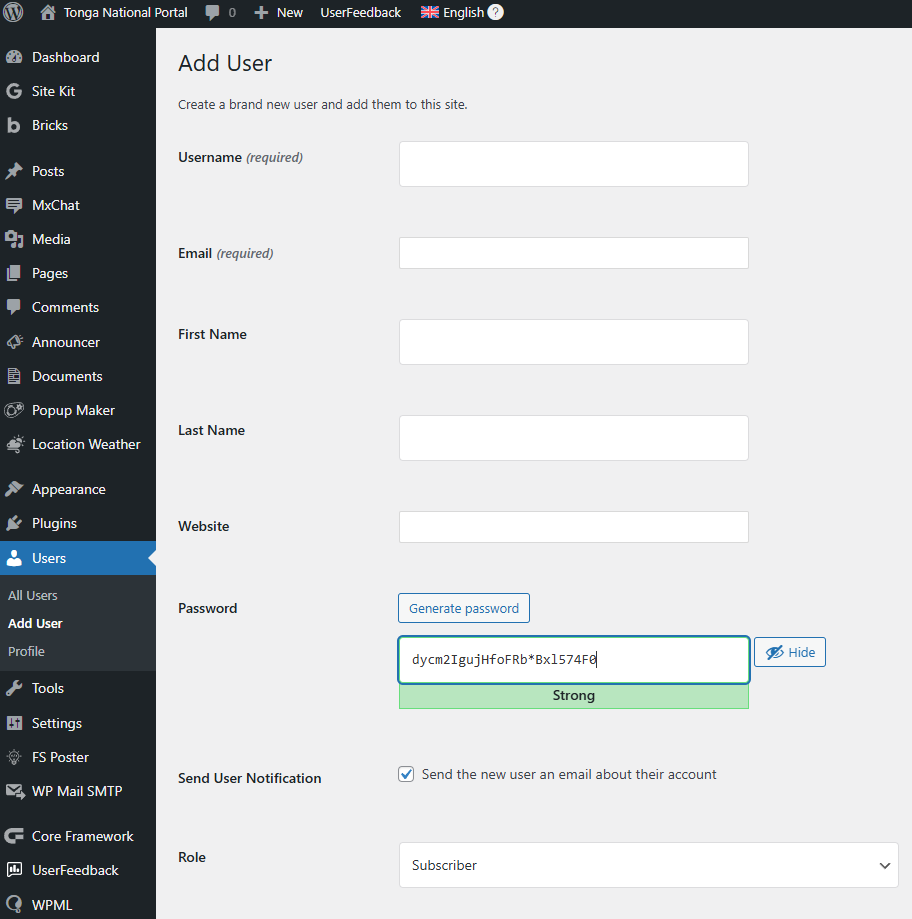
   - [Screenshot Recommended] *Add New User form with all fields visible*

3. **Setting the User Role**
   - Select an appropriate role from the dropdown menu:
     - Administrator
     - Editor
     - Author
     - Contributor
     - Subscriber
   - The selected role determines what actions the user can perform on the site
   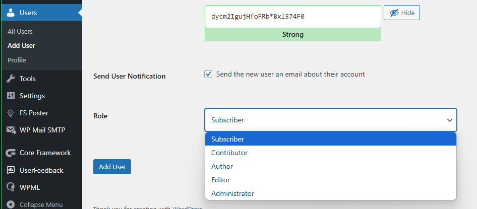

4. **Additional Options**
   - "Send User Notification" checkbox: When selected, WordPress sends the new user an email with their account details
   - In multisite installations, additional options may appear for site assignment

5. **Creating the User Account**
   - Click the "Add New User" button to create the account
   - WordPress validates the information and creates the user account
   - A success message appears confirming the user creation

**Important Considerations:**

- Usernames must be unique across the entire WordPress installation
- Email addresses must be unique and valid, as they are used for account recovery
- Passwords should follow security best practices (minimum length, complexity)
- Consider the principle of least privilege when assigning roles (assign only the permissions necessary for the user's tasks)
- In multisite installations, users can be added to specific sites or the entire network

### Sending Password Reset

The WordPress password reset functionality allows administrators to help users regain access to their accounts when they forget their passwords. This process maintains security while providing a straightforward recovery mechanism.

#### Administrator-Initiated Password Reset

1. **Accessing User Management**
   - Log in to the WordPress admin dashboard
   - Navigate to "Users" > "All Users" in the left sidebar
   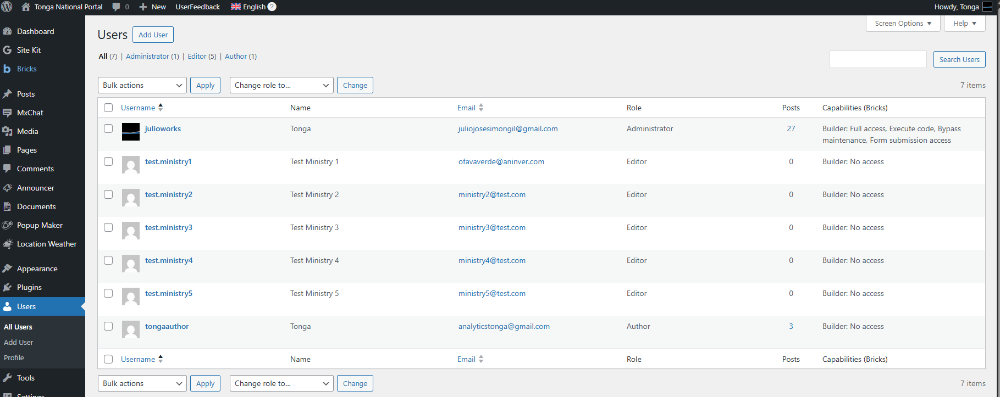
   - [Screenshot Recommended] *Users listing page showing all user accounts*

2. **Locating the User**
   - Find the user account that needs a password reset using the search box or by browsing the list
   - Hover over the user's name to reveal action links

3. **Initiating the Reset**
   - Click on the "Send password reset" link that appears when hovering over the user's name
   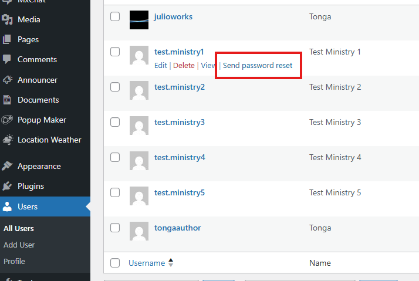
   - [Screenshot Recommended] *Hover state showing the "Send password reset" link*

4. **Confirmation**
   - WordPress displays a confirmation message indicating that the password reset email has been sent
   - The system automatically generates a unique, secure reset link and sends it to the user's registered email address

#### User-Initiated Password Reset

1. **Accessing the Login Page**
   - User navigates to the WordPress login page (typically /wp-login.php)
   - Clicks on the "Lost your password?" link below the login form

2. **Requesting Password Reset**
   - User enters their username or email address in the provided field
   - Clicks the "Get New Password" button

3. **Email Delivery**
   - WordPress sends a password reset link to the user's registered email address
   - The email contains a secure, time-limited link to reset the password

4. **Setting a New Password**
   - User clicks the link in the email, which directs them to a password reset page
   - User enters a new password (and confirms it)
   - Clicks "Reset Password" to save the changes

5. **Confirmation and Login**
   - WordPress confirms the password has been changed
   - User can now log in with the new password

**Security Considerations:**

- Password reset links expire after a limited time (typically 24 hours)
- Reset links can only be used once
- The system validates that the request comes from the same IP address that initiated it
- Failed reset attempts are logged for security monitoring
- Consider implementing additional security measures like two-factor authentication for sensitive accounts

### User Roles

WordPress implements a role-based access control system that assigns specific capabilities to predefined user roles. Each role represents a set of permissions that determine what actions users can perform within the WordPress administration panel.

1. **Super Administrator**
   
   The Super Administrator role exists only in WordPress Multisite installations and has complete control over the entire network of sites.
   
   **Capabilities include:**
   - All Administrator capabilities for every site in the network
   - Manage network settings and configurations
   - Create and delete sites within the network
   - Install and activate themes and plugins network-wide
   - Manage user accounts across all sites
   - Add and remove sites from the network
   - Upgrade WordPress core, themes, and plugins for the entire network
   
   **Best suited for:**
   - Technical managers responsible for the entire WordPress network
   - Organization owners or highest-level administrators
   
   **Security note:** This role should be assigned very sparingly due to its extensive capabilities.

2. **Administrator**
   
   The Administrator role has complete control over a single WordPress site, with access to all administrative features.
   
   **Capabilities include:**
   - Manage all site content (posts, pages, media)
   - Install, activate, and delete themes and plugins
   - Add and manage users
   - Modify site settings and options
   - Edit theme files and customize site appearance
   - Import and export site content
   - Update WordPress core, themes, and plugins
   - Moderate comments
   
   **Best suited for:**
   - Site owners
   - Primary site managers
   - Technical administrators
   
   **Security note:** Limit the number of administrators to reduce security risks.

3. **Editor**
   
   The Editor role has full control over content management but cannot modify site settings or access technical features.
   
   **Capabilities include:**
   - Create, edit, publish, and delete any posts or pages (including those by other users)
   - Moderate comments
   - Manage categories, tags, and links
   - Upload files and media
   - Access to the WordPress dashboard
   
   **Best suited for:**
   - Content managers
   - Editorial team leaders
   - Senior content creators
   
   **Security note:** Editors cannot install plugins or themes, which helps maintain site security.

4. **Author**
   
   The Author role can create and manage their own content but has limited access to content created by others.
   
   **Capabilities include:**
   - Create, edit, publish, and delete their own posts
   - Upload files and media for their own content
   - View comments, including those awaiting moderation
   - Access to the WordPress dashboard
   
   **Best suited for:**
   - Regular content contributors
   - Blog writers
   - Staff members who need to publish content
   
   **Security note:** Authors cannot edit or delete content created by other users.

5. **Contributor**
   
   The Contributor role can create and edit their own posts but cannot publish them directly.
   
   **Capabilities include:**
   - Create and edit their own posts (but not publish them)
   - Cannot upload media files
   - View comments on their own posts
   - Access to the WordPress dashboard
   
   **Best suited for:**
   - Guest writers
   - Infrequent content contributors
   - New team members during probation periods
   
   **Security note:** All content from Contributors requires review and approval by an Editor or Administrator before publication.

6. **Subscriber**
   
   The Subscriber role has minimal capabilities, primarily focused on managing their own profile.
   
   **Capabilities include:**
   - Read content (including private content if enabled)
   - Manage their own profile
   - Change their password
   - Comment on posts (if comments are enabled)
   
   **Best suited for:**
   - Registered readers
   - Newsletter subscribers
   - Community members
   - Customers who need access to protected content
   
   **Security note:** Subscribers have no publishing capabilities and cannot make changes to site content or settings.

**Role Management Best Practices:**

- Regularly audit user roles to ensure appropriate access levels
- Follow the principle of least privilege when assigning roles
- Consider using role management plugins for more granular control
- Document which roles have access to sensitive operations
- Create custom roles for specific workflow needs when standard roles are insufficient

## Navigation Menu Management

### Definition

The WordPress Navigation Menu Management system is a comprehensive framework that allows administrators to create, organize, and customize website navigation menus. It provides a user-friendly interface for controlling the structure, appearance, and functionality of navigation elements throughout the website.

Key components of the Navigation Menu Management system include:

- **Menu locations**: Theme-defined positions where menus can be displayed (header, footer, sidebar)
- **Menu items**: Individual navigation elements that can include pages, posts, custom links, and other content types
- **Menu hierarchy**: Parent-child relationships that create dropdown or nested menu structures
- **Custom link support**: Ability to add links to external websites or specific sections within the site
- **Menu customization**: Options for adding CSS classes, setting link targets, and customizing item appearance

The Navigation Menu Management system serves as the primary tool for creating intuitive site navigation, ensuring visitors can easily find and access content throughout the WordPress website.

### Adding a New Item Menu

Adding new items to a WordPress navigation menu follows a structured workflow that can be performed by administrators or users with menu editing capabilities. Below is a detailed explanation of the menu item addition process:

1. **Accessing the Menu Editor**
   - Log in to the WordPress admin dashboard
   - Navigate to "Appearance" > "Menus" in the left sidebar
   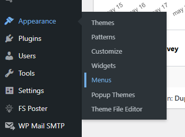

2. **Selecting a Menu to Edit**
   - Choose an existing menu from the dropdown at the top of the page, or
   - Create a new menu by clicking the "create a new menu" link
   - Enter a name for the new menu if creating one
   - Click "Create Menu" button

3. **Adding Items to the Menu**
   - Use the panels on the left side of the screen to select items to add:
     - **Pages**: Select from published pages
     - **Posts**: Select from published posts
     - **Custom Links**: Enter a URL and link text
     - **Categories**: Select from content categories
     - **Tags**: Select from content tags
     - **Post Types**: Select from custom post types (if available)
   - Check the boxes next to items you want to add
   - Click the "Add to Menu" button
   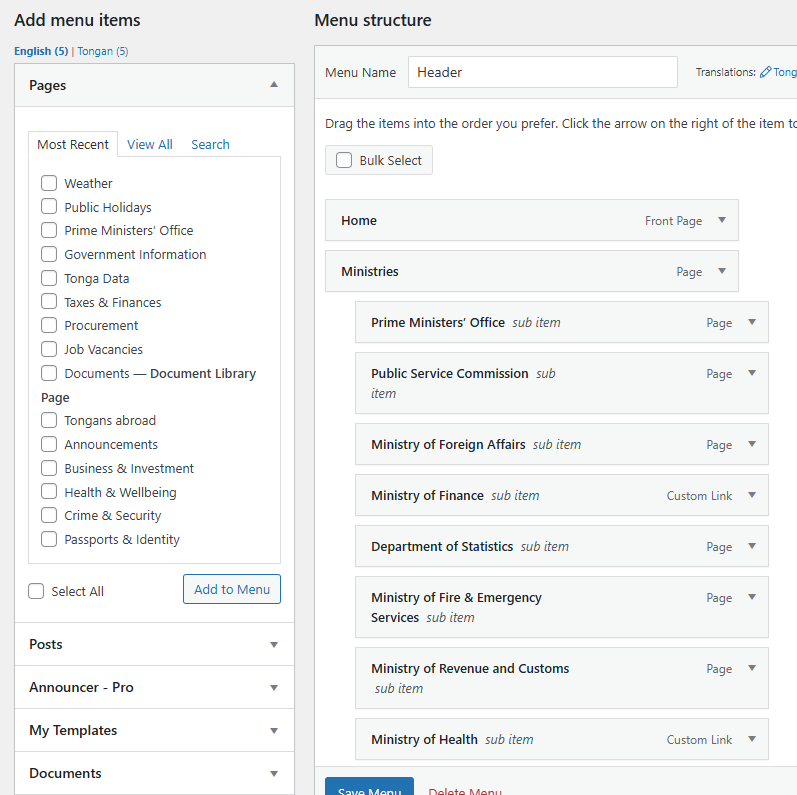

4. **Organizing Menu Structure**
   - Drag and drop menu items to reorder them
   - Drag items slightly to the right to create child items (creating dropdown menus)
   - Click on the arrow icon on a menu item to reveal additional options:
     - **Navigation Label**: The text displayed in the menu
     - **Title Attribute**: Text that appears when hovering over the menu item
     - **Open link in a new tab**: Checkbox to control link target behavior
     - **CSS Classes**: Field to add custom CSS classes
     - **Link Relationship (XFN)**: Define the relationship between the linked page and your site
     - **Description**: Additional text that some themes display with menu items

5. **Saving the Menu**
   - Click the "Save Menu" button to apply all changes
   - A success message will appear confirming the menu has been updated

**Important Considerations:**

- Menu items can be rearranged at any time by dragging and dropping
- Items can be removed by clicking the "Remove" link in the expanded item options
- Most themes support multiple menu locations, allowing different menus for different areas of the site
- The "Screen Options" tab at the top of the page allows enabling additional fields for menu items
- Custom menu items can be created using the "Links" box to point to any URL, including external websites

### Manage Special Submenus Using Bricks Plugin

The Bricks Builder plugin provides advanced capabilities for creating and managing specialized navigation submenus with enhanced styling and functionality. Below is a detailed guide on managing special submenus using the Bricks plugin:

1. **Accessing Bricks Builder Interface**
   - Log in to the WordPress admin dashboard
   - Navigate to "Bricks" in the left sidebar
   - Select the template or page where you want to manage navigation
   - Click "Edit with Bricks" to open the builder interface
   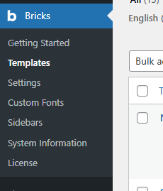

2. **Adding a Navigation Menu Element**
   - In the Bricks builder, click the "+" icon to add a new element
   - Search for "Nav Menu" in the elements panel
   - Drag the Nav Menu element to your desired location in the layout

3. **Configuring the Basic Menu Settings**
   - In the element settings panel (left side):
     - Select your WordPress menu from the "Menu" dropdown
     - Choose the menu layout type (horizontal or vertical)
     - Set the content position at Top Level menu (left, center, right)
     - Configure spacing between menu items through Gap property
     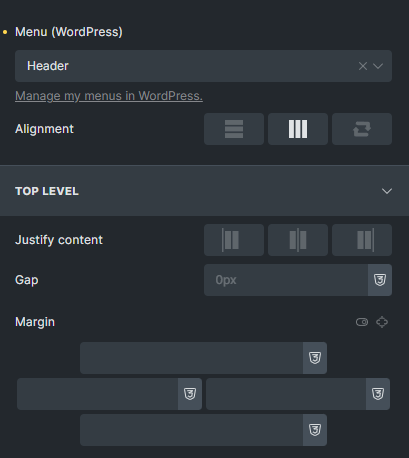

4. **Creating Special Submenu Styles**
   - Navigate to the "Dropdown" tab in the settings panel
   - Configure dropdown settings:
     - **Trigger**: Hover, click, or hover intent
     - **Animation**: Select entrance animation for submenus
     - **Width**: Set fixed or auto width for dropdown menus
     - **Position**: Adjust the position relative to parent items
     - **Offset**: Fine-tune the submenu positioning

5. **Styling Submenu Appearance**
   - In the "Style" tab:
     - Configure background colors, borders, and shadows for submenus
     - Set typography for submenu items
     - Add custom padding and margins
     - Configure hover effects and transitions
   - Use the "Submenu Item" section to style individual items within dropdowns

6. **Creating Mega Menus**
   - Enable the "Mega Menu" option for specific top-level menu items
   - Set the number of columns for the mega menu
   - Configure column widths and content alignment
   - Add custom elements within mega menu panels:
     - Images
     - Text blocks
     - Buttons
     - Dividers
     - Custom HTML

7. **Adding Custom Interactions**
   - Navigate to the "Interactions" tab
   - Add custom effects for different user actions:
     - Mouse enter/leave
     - Click/tap
     - Scroll
   - Configure animations, transitions, and transforms
   - Set timing and easing functions

8. **Mobile Menu Configuration**
   - Switch to the "Mobile" tab
   - Set the breakpoint where the menu converts to mobile view
   - Choose the mobile menu type (off-canvas, dropdown, fullscreen)
   - Configure the mobile menu toggle button appearance
   - Set animation and transition effects for mobile menu

**Important Points:**

- Bricks allows for completely different styling between main menu items and submenu items
- Custom CSS classes can be added to specific menu items for targeted styling
- The responsive preview mode helps test how menus appear on different device sizes
- Changes made in Bricks do not affect the original WordPress menu structure, only its presentation
- For complex layouts, consider using the Bricks Container element to wrap menu items
- Always test menu interactions thoroughly, especially for touch devices

### Manage Menu Translations Using WPML Plugin

The WPML (WordPress Multilingual) plugin provides comprehensive tools for translating navigation menus across multiple languages. Below is a detailed guide on managing menu translations using the WPML plugin:

1. **Verifying WPML Configuration**
   - Log in to the WordPress admin dashboard
   - Navigate to "WPML" > "Languages" in the left sidebar
   - Ensure all required languages are added and active
   - Check that language switcher settings are configured
   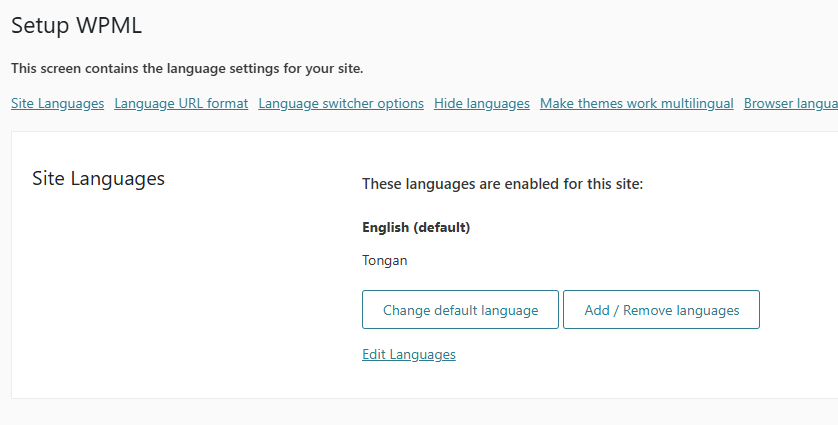

2. **Accessing the Menu Translation Interface**
   - Navigate to "Appearance" > "Menus" in the left sidebar
   - Select the menu you want to translate from the dropdown
   - Look for the WPML language tabs at the top of the menu editor

3. **Creating a Translated Menu**
   - Click on the tab for the language you want to create a translation for
   - You'll see two options:
     - **Create new**: Create a completely new menu for this language
     - **Translate existing**: Create a translated version of the current menu
   - Select "Translate existing" to maintain the same structure
   - Click "Create" to generate the translated menu

4. **Translating Menu Items**
   - After creating the translated menu, you'll see the original menu structure
   - Each menu item will have a "Translate" link next to it
   - Click "Translate" to open the translation panel for that item
   - Enter the translated text for:
     - **Navigation Label**: The visible menu text
     - **Title Attribute**: The tooltip text (if used)
   - Click "Save" to apply the translation
   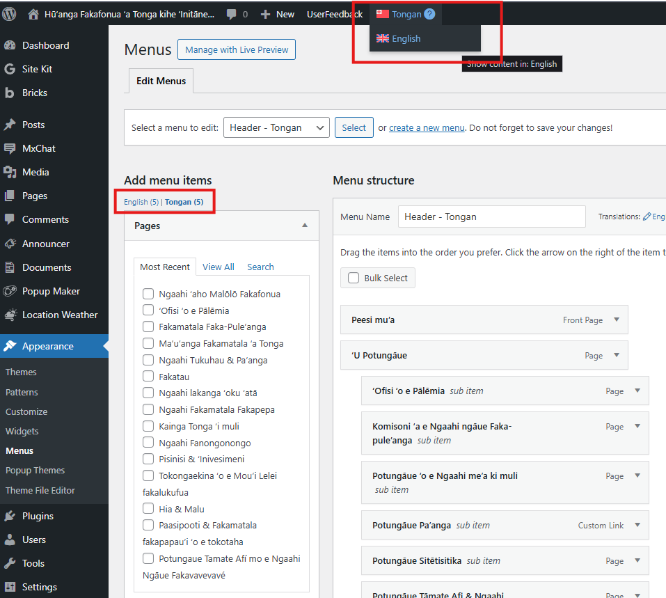

5. **Synchronizing Menu Structure**
   - If you make structural changes to your primary language menu:
     - Navigate to "WPML" > "Navigation Menus"
     - Select the menu you want to synchronize
     - Check the languages you want to update
     - Click "Synchronize" to apply the structural changes across languages

6. **Managing Language-Specific Menu Items**
   - Some menu items may need to be different in specific languages
   - To create language-specific items:
     - Switch to the specific language tab in the menu editor
     - Add new items that should appear only in that language
     - These items won't appear in other language versions

7. **Assigning Menus to Language-Specific Locations**
   - Navigate to the "Manage Locations" tab in the menu editor
   - You'll see location options for each active language
   - Assign the appropriate translated menu to each language's locations
   - Click "Save Changes" to apply the assignments

8. **Testing Menu Translations**
   - Use the language switcher on your live site to verify:
     - Menu items display correctly in each language
     - Links point to the correct translated content
     - Dropdown functionality works properly
     - Mobile menu displays translations correctly

**Important Considerations:**

- Menu items linked to translated content (like pages or posts) will automatically link to the correct language version
- Custom links need manual translation, including the URL if it points to language-specific content
- Menu structure synchronization only affects the hierarchy, not the content of menu items
- Some themes may require additional configuration to properly display translated menus
- WPML's String Translation module can be used for translating menu-related theme strings
- Regular testing across languages is essential after making menu changes
- Consider using WPML's Advanced Translation Editor for more complex menu translation projects

## Media Library

### Definition

The WordPress Media Library is a centralized repository that manages all digital assets uploaded to your WordPress site. It serves as a comprehensive file management system for images, documents, audio, video, and other media files used throughout the website.

Key components of the Media Library include:

- **File storage**: Securely stores uploaded media files in the wp-content/uploads directory
- **Metadata management**: Tracks file information such as dimensions, file size, upload date, and custom metadata
- **Organization tools**: Provides filtering, searching, and sorting capabilities for media assets
- **Image processing**: Automatically generates multiple sizes of uploaded images for different display contexts
- **Media embedding**: Facilitates easy insertion of media into posts, pages, and other content areas
- **File management**: Enables editing, deleting, and updating media files after upload

The Media Library serves as the foundation for visual and multimedia content on WordPress sites, ensuring efficient management of digital assets while providing easy access for content creators.

### View All Media

The "View All Media" interface provides a comprehensive overview of all media files uploaded to your WordPress site. This centralized view allows administrators and authorized users to browse, search, filter, and manage the entire collection of media assets.

1. **Accessing the Media Library**
   - Log in to the WordPress admin dashboard
   - Navigate to "Media" > "Library" in the left sidebar menu
   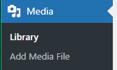

2. **Understanding the Media Library Interface**
   - **Main Display Area**: Shows thumbnails or list of media files
   - **View Options**: Toggle between Grid view (thumbnails) and List view (detailed information)
   - **Search Box**: Filter media by filename or other attributes
   - **Filter Dropdown**: Filter by media type (images, audio, video, documents)
   - **Bulk Selection**: Select multiple items for batch operations
   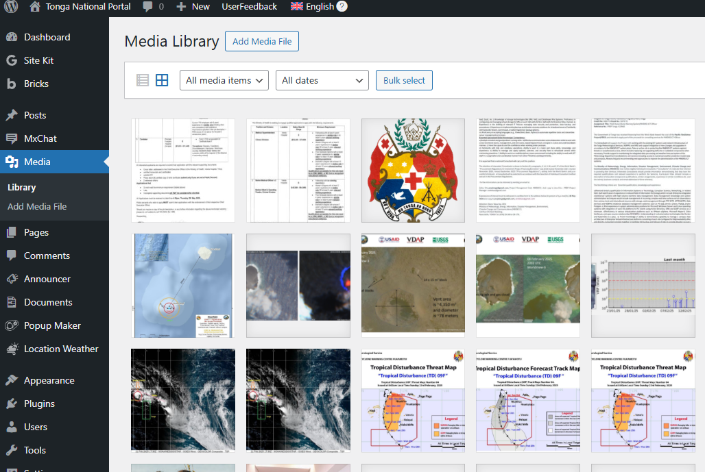

3. **Viewing Media Details**
   - Click on any media item to open its attachment details panel
   - View comprehensive information about the selected file:
     - **Preview**: Visual preview of the media file
     - **Filename**: Original name of the uploaded file
     - **File Type**: Format of the media (JPEG, PNG, PDF, MP4, etc.)
     - **Upload Date**: When the file was added to the library
     - **File Size**: Storage space occupied by the file
     - **Dimensions**: Width and height for images and videos
     - **File URL**: Direct link to the media file

4. **Organizing and Filtering Media**
   - Use the search box to find specific files by name
   - Filter by media type using the dropdown menu (All media items, Images, Audio, Video, Documents)
   - Filter by date using the date dropdown
   - In List view, sort by columns (Name, Author, Date)

5. **Managing Media Files**
   - **Edit**: Modify file title, caption, alt text, and description
   - **Delete**: Remove files from the Media Library
   - **View**: Open the file in a new browser tab
   - **Copy URL**: Get the direct link to the media file
   - **Bulk Actions**: Select multiple files to delete or edit in batch

**Important Considerations:**

- The Media Library displays all uploaded files, regardless of whether they're currently used in content
- Deleting a media file will remove it from any posts or pages where it's embedded
- Large media libraries may load slowly and benefit from additional organization plugins
- WordPress automatically organizes uploaded files into year/month folders on the server
- Regular backups of the uploads directory are essential for preserving media assets

### Add New Media

Adding new media to your WordPress site involves uploading files to the Media Library, where they become available for use throughout your content. WordPress supports various file types including images, documents, audio, and video files.

1. **Accessing the Upload Interface**
   - **Method 1**: Navigate to "Media" > "Add Media File" in the left sidebar menu
   - **Method 2**: Click "Select Files" button at the top of the Media Library screen
   - **Method 3**: Use the "Add Media" button when editing posts or pages
   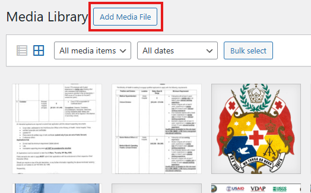

2. **Upload Methods**
   - **Drag and Drop**: Drag files directly from your computer to the upload area
   - **Select Files**: Click the "Select Files" button to browse your computer
   - **Device Camera**: Some devices allow direct capture from camera (mobile/tablet)
   

3. **File Selection Considerations**
   - **Supported File Types**:
     - Images: JPEG, PNG, GIF, WebP, SVG (if enabled)
     - Documents: PDF, DOC/DOCX, XLS/XLSX, PPT/PPTX, etc.
     - Audio: MP3, WAV, OGG, etc.
     - Video: MP4, WebM, etc.
   - **File Size Limits**: Default maximum is typically 2MB-8MB (server-dependent)
   - **Dimensions**: Very large images may be automatically scaled down

4. **Upload Process**
   - Select or drag your file(s) to the upload area
   - WordPress displays a progress bar during upload
   - Successfully uploaded files appear as thumbnails
   - Failed uploads show error messages explaining the issue

5. **Post-Upload Editing**
   - After upload, WordPress displays the attachment details screen
   - Edit the following metadata:
     - **Title**: The display name of the media file (defaults to filename)
     - **Caption**: Short text displayed below the media in some contexts
     - **Alt Text**: Description for accessibility and SEO (important for images)
     - **Description**: Longer text providing details about the media
   - For images, additional editing options may be available:
     - Crop
     - Rotate
     - Scale

6. **Inserting Media into Content**
   - When uploading via the content editor, you can immediately insert the media
   - Choose display options:
     - **Alignment**: Left, center, right, or none
     - **Link Settings**: Link to media file, attachment page, custom URL, or none
     - **Size**: Thumbnail, medium, large, or full size
   - Click "Insert into post/page" to embed the media

**Important Considerations:**

- Organize your files before uploading to maintain a clean Media Library
- Use descriptive filenames to make media easier to find later
- Always add alt text to images for accessibility and SEO benefits
- Consider image optimization plugins to reduce file sizes without quality loss
- Be mindful of copyright when uploading media; only use files you have rights to
- Regular backups of your Media Library are essential for data protection
- Consider the total storage space available on your hosting plan when uploading large files

## Platform Settings

### Definition

The WordPress Platform Settings system is a comprehensive framework that allows administrators to configure and customize core aspects of the WordPress installation. It provides centralized control over site-wide settings that affect how the website functions, appears, and interacts with users and search engines.

Key components of the Platform Settings system include:

- **General settings**: Basic site information and configuration options
- **Writing settings**: Default post categories, formats, and publishing options
- **Reading settings**: Homepage display, post visibility, and RSS feed options
- **Discussion settings**: Comment moderation and notification preferences
- **Media settings**: Image sizes, upload directories, and media handling options
- **Permalink settings**: URL structure for posts, pages, and archives
- **Privacy settings**: Privacy policy page and data handling configurations

The Platform Settings system serves as the foundation for customizing WordPress to meet specific site requirements, ensuring consistent behavior across the entire website while providing flexibility for administrators to tailor the platform to their needs.

### Basic Site Configuration

The Basic Site Configuration section, found under "Settings" > "General" in the WordPress admin panel, provides essential options for defining your site's identity and core functionality. Below is a detailed explanation of these fundamental settings:

1. **Accessing General Settings**
   - Log in to the WordPress admin dashboard
   - Navigate to "Settings" > "General" in the left sidebar menu
   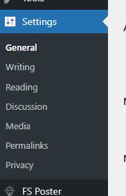

2. **Site Identity Settings**
   - **Site Title**: The name of your website, displayed in browser tabs, search results, and various theme locations
   - **Tagline**: A brief description of your site that appears in some themes and can influence SEO
   - These elements define your site's identity across the web and in search engine results

3. **Site Address Configuration**
   - **WordPress Address (URL)**: The location of your WordPress core files (typically your domain)
   - **Site Address (URL)**: The address visitors use to access your site (usually identical to WordPress Address)
   - These settings are critical for proper site functioning and should only be changed with caution

4. **Contact Information**
   - **Administration Email Address**: The primary contact email for site notifications
   - Used for administrative communications, password resets, and system alerts
   - Must be a valid, accessible email address to ensure you receive important notifications

5. **Membership Settings**
   - **Membership**: Toggle whether anyone can register for an account on your site
   - **New User Default Role**: Select the role automatically assigned to newly registered users
   - These settings control public access to your site's registration features

6. **Date and Time Configuration**
   - **Timezone**: Set your local timezone using a city reference or UTC offset
   - **Date Format**: Choose how dates appear throughout your site
   - **Time Format**: Select the preferred time display format (12 or 24-hour)
   - **Week Starts On**: Define which day is considered the first day of the week
   - These settings ensure consistent date and time display across your entire website

7. **Language Settings**
   - **Site Language**: Select the primary language for the WordPress admin interface
   - This setting affects the admin dashboard language, not necessarily the content language
   - Additional languages can be installed if needed

8. **Saving Changes**
   - Click the "Save Changes" button at the bottom of the page to apply all modifications
   - WordPress confirms successful updates with a notification message

**Important Considerations:**

- Changing the site URL settings incorrectly can make your site inaccessible
- The site title and tagline significantly impact SEO and should be chosen carefully
- The administration email should be regularly monitored as it receives critical notifications
- Allowing open registration may require additional security measures to prevent spam accounts
- Time and date settings affect post publication timestamps, comment dates, and other time-sensitive features
- Language settings only change the admin interface language, not existing content

### Media Settings

The Media Settings section in WordPress provides configuration options for how media files (images, documents, videos, etc.) are handled, stored, and displayed throughout your website. These settings help maintain consistency in media presentation while optimizing server storage and page load times.

1. **Accessing Media Settings**
   - Log in to the WordPress admin dashboard
   - Navigate to "Settings" > "Media" in the left sidebar menu

2. **Image Size Configuration**
   - **Thumbnail Size**: Define the dimensions for thumbnail images
     - Default: 150×150 pixels
     - Used in admin listings and theme-specific thumbnail displays
   - **Medium Size**: Set dimensions for medium-sized images
     - Default: 300×300 pixels maximum
     - Commonly used in blog post listings and archive pages
   - **Large Size**: Configure dimensions for large images
     - Default: 1024×1024 pixels maximum
     - Often used for featured images in single post views
   - **Crop Settings**: Choose whether images are cropped to exact dimensions or proportionally scaled
   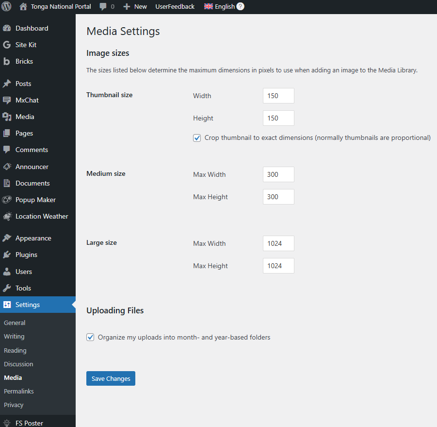

3. **File Organization Settings**
   - **Uploading Files Organization**: Toggle whether uploads should be organized into month and year-based folders
   - When enabled, creates a structured directory system (e.g., /wp-content/uploads/2025/05/)
   - Helps maintain an organized media library, especially for sites with numerous uploads

4. **Image Upload Handling**
   - When an image is uploaded, WordPress automatically creates multiple versions in different sizes
   - The original image is preserved alongside the generated thumbnail, medium, and large versions
   - These different sizes are used throughout the site based on context and theme requirements
   - Additional custom image sizes may be available depending on your active theme

5. **Maximum Upload Size**
   - While not directly configurable in the Media Settings interface, WordPress enforces upload size limits
   - The maximum upload size is determined by your hosting configuration (php.ini settings)
   - Typical limits range from 2MB to 50MB depending on your hosting plan

6. **Responsive Images**
   - WordPress automatically generates HTML for responsive images using srcset attributes
   - This allows browsers to choose the most appropriately sized image based on the user's device
   - Improves page load times and reduces bandwidth usage on mobile devices
   - No specific configuration is required as this functionality is built into core

7. **Saving Changes**
   - Click the "Save Changes" button at the bottom of the page to apply all modifications
   - WordPress confirms successful updates with a notification message

**Important Considerations:**

- Changing image dimensions does not affect existing uploads, only newly uploaded images
- Larger image dimensions provide better quality but consume more storage space and bandwidth
- The "Crop" option forces images to exact dimensions, which may distort some images
- Organizing uploads by month/year improves server file management but creates longer file paths
- Very large media libraries may benefit from third-party solutions for advanced media management
- Consider image optimization plugins to further reduce file sizes without quality loss
- Some hosting providers have strict upload size limitations that cannot be changed in WordPress settings
