# Generic WordPress Functionalities

This document provides a comprehensive overview of the generic WordPress functionalities available in the Tonga National Portal installation. These core capabilities form the foundation of the portal's content management system and are extended by custom features specific to government services.

## Content Management Capabilities

WordPress provides robust content management capabilities that allow government staff to create, edit, and organize various types of content.

### Posts and Pages

#### Posts

Posts are dynamic content entries typically used for time-sensitive content such as:

- News articles
- Press releases
- Announcements
- Updates

Key features of posts include:

- **Categories and Tags**: For organizing and filtering content
- **Featured Images**: Visual representation of the content
- **Excerpts**: Brief summaries for listings and search results
- **Comments**: Optional user engagement feature
- **Revisions**: Track changes and restore previous versions

**Technical Details:**
- Posts are stored in the `wp_posts` database table with `post_type` set to 'post'
- Each post has a unique permalink structure that can be customized in Settings > Permalinks
- Posts support custom fields for additional metadata storage
- The WordPress REST API exposes posts via the `/wp/v2/posts` endpoint

**Best Practices:**
- Use descriptive, SEO-friendly titles that include relevant keywords
- Add featured images with proper alt text for accessibility and SEO
- Write compelling excerpts that summarize the content effectively
- Categorize and tag posts consistently for better organization
- Schedule time-sensitive content to publish automatically at optimal times

**Limitations:**
- Default post listings display in reverse chronological order, which may not be ideal for all content types
- Managing large volumes of posts requires careful organization with categories and tags
- Post revisions can increase database size if not properly managed

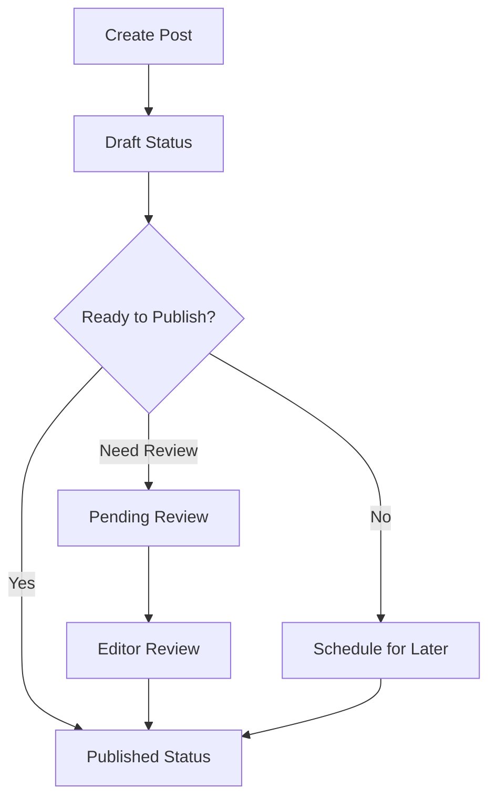

#### Pages

Pages are static content entries used for permanent or semi-permanent information such as:

- About sections
- Contact information
- Department descriptions
- Service details

Key features of pages include:

- **Hierarchical Structure**: Parent-child relationships between pages
- **Custom Templates**: Specialized layouts for different types of content
- **Order Attribute**: Control the display order in menus
- **Featured Images**: Visual elements to enhance content
- **Revisions**: Track changes and restore previous versions

**Technical Details:**
- Pages are stored in the `wp_posts` database table with `post_type` set to 'page'
- Pages can be organized hierarchically using the `post_parent` field
- Custom page templates can be created in the theme directory with specific PHP template files
- The WordPress REST API exposes pages via the `/wp/v2/pages` endpoint

**Best Practices:**
- Create a logical hierarchical structure that reflects your organization
- Use consistent naming conventions for pages
- Implement custom page templates for specialized content layouts
- Regularly review and update static content to ensure accuracy
- Use parent-child relationships to organize related content

**Limitations:**
- Pages don't support categories or tags without custom modifications
- Complex page hierarchies can become difficult to manage
- Custom page templates require theme development knowledge

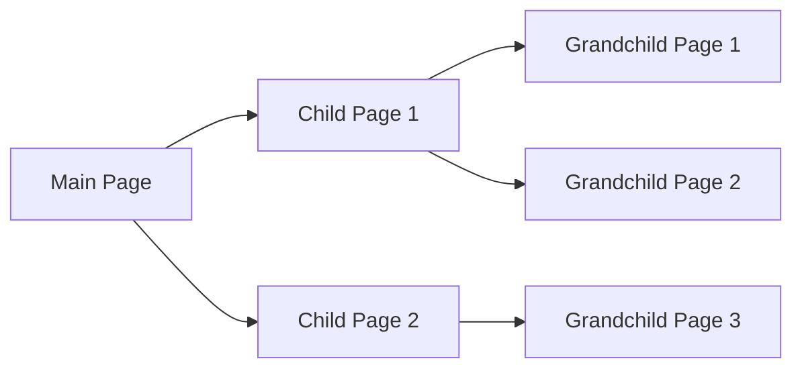

### Content Editor

The Tonga National Portal uses the WordPress Block Editor (Gutenberg) enhanced with Bricks Builder for content creation and editing:

- **Block-Based Editing**: Content is created using modular blocks
- **Rich Text Formatting**: Text styling, links, tables, and more
- **Media Integration**: Easily embed images, videos, and documents
- **Reusable Blocks**: Save and reuse content across the portal
- **Custom Blocks**: Specialized blocks for government-specific content

**Technical Details:**
- The Block Editor uses JavaScript (React) to create a dynamic editing experience
- Blocks are stored as HTML comments with JSON attributes in the post content
- Custom blocks can be created using JavaScript and registered with the `registerBlockType` function
- Bricks Builder extends WordPress with a visual drag-and-drop interface that generates clean code

**Best Practices:**
- Use appropriate blocks for different content types (headings, paragraphs, lists, etc.)
- Create reusable blocks for frequently used content components
- Maintain consistent styling across blocks for a cohesive appearance
- Use columns and groups to create complex layouts
- Test content appearance on both desktop and mobile devices

**Limitations:**
- Learning curve for users accustomed to the Classic Editor
- Some complex layouts may require custom block development
- Plugin compatibility issues can occur with certain block types
- Performance can degrade with extremely complex page layouts

![Screenshot: WordPress Block Editor with government content blocks]
(Here a screenshot would show the WordPress editor interface with custom blocks for government content, including the Bricks Builder interface with the sidebar panel showing available blocks and the main editing area with government-specific content blocks)

### Content Organization

Content can be organized using:

- **Categories**: Hierarchical taxonomy for broad classification
- **Tags**: Non-hierarchical taxonomy for specific topics
- **Custom Taxonomies**: Specialized classification systems (e.g., Ministries, Services)
- **Custom Fields**: Additional metadata for enhanced content organization

**Technical Details:**
- Taxonomies are stored in the `wp_terms`, `wp_term_taxonomy`, and `wp_term_relationships` tables
- Custom taxonomies can be registered using the `register_taxonomy()` function
- Custom fields are stored as post meta in the `wp_postmeta` table
- Term metadata can be stored in the `wp_termmeta` table for additional taxonomy information

**Best Practices:**
- Develop a clear taxonomy strategy before creating content
- Use hierarchical categories for broad organizational structure
- Use non-hierarchical tags for specific topics or keywords
- Create custom taxonomies for government-specific classification needs
- Document taxonomy guidelines for content creators

**Limitations:**
- Default WordPress search doesn't fully leverage taxonomies without customization
- Managing large taxonomy hierarchies can become complex
- Custom taxonomies require development knowledge to implement
- Inconsistent taxonomy application can lead to organizational problems

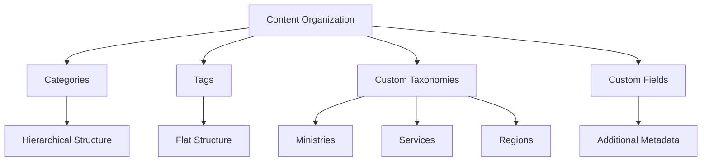

## User Management and Role Capabilities

The Tonga National Portal implements WordPress's comprehensive user management system with role-based access control.

### User Roles

The portal uses the following standard WordPress roles with customized permissions:

1. **Super Administrator**: Complete access to all portal features and network settings
   - Manage network settings
   - Install and activate plugins and themes
   - Create and manage sites
   - Manage all user accounts

2. **Administrator**: Complete access to features and settings of a specific site
   - Manage site settings
   - Create and edit all content
   - Manage users
   - Install plugins and themes

3. **Editor**: Content management responsibilities
   - Create, edit, publish, and delete any content
   - Moderate comments
   - Manage categories, tags, and links
   - Cannot modify site settings or install plugins/themes

4. **Author**: Content creation with limited editing rights
   - Create, edit, publish, and delete their own content
   - Upload media files
   - Cannot modify others' content or site settings

5. **Contributor**: Limited content creation rights
   - Create and edit their own posts (but cannot publish)
   - Cannot upload media files
   - Cannot modify site settings or others' content

6. **Subscriber**: Basic access for registered users
   - Read content (including restricted content if applicable)
   - Manage their own profile
   - Comment on posts (if enabled)

**Technical Details:**
- User roles and capabilities are stored in the `wp_options` table (single site) or `wp_sitemeta` table (multisite)
- Capabilities are checked using the `current_user_can()` function
- Role capabilities can be modified using the `add_role()`, `remove_role()`, and `add_cap()` functions
- User data is stored in the `wp_users` table, with role information in the `wp_usermeta` table

**Best Practices:**
- Follow the principle of least privilege when assigning roles
- Regularly audit user accounts and remove unnecessary access
- Use custom roles for specific departmental needs rather than overloading standard roles
- Document role capabilities for administrative staff
- Implement strong password policies for all user levels

**Limitations:**
- Default WordPress roles may not perfectly align with government organizational structures
- Role management becomes more complex in multisite environments
- Capability conflicts can occur with certain plugin combinations
- No built-in time-based access restrictions or temporary role assignments

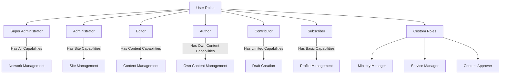

### Custom Roles

In addition to standard roles, the Tonga National Portal implements custom roles specific to government operations:

1. **Ministry Manager**: Department-specific administrative capabilities
   - Manage content for specific ministry/department
   - Create and publish service information
   - Moderate comments on ministry content
   - Access ministry-specific analytics

2. **Service Manager**: Focused on government service content
   - Create and update service information
   - Process service requests
   - Generate service reports
   - Respond to service inquiries

3. **Content Approver**: Content workflow management
   - Review and approve content before publication
   - Provide feedback on content submissions
   - Ensure content meets government standards
   - Track content approval workflows

**Technical Details:**
- Custom roles are created using the `add_role()` function with specific capabilities
- Role capabilities can be checked programmatically using `current_user_can()`
- Custom capabilities can be registered and assigned to specific roles
- Role restrictions can be implemented at the template level using conditional checks

**Best Practices:**
- Create custom roles that align with actual organizational responsibilities
- Document custom role capabilities clearly for administrators
- Implement a role review process when organizational structures change
- Use capability checks in templates to control access to specific content
- Consider implementing a role management plugin for complex role structures

**Limitations:**
- Custom roles require development knowledge to implement properly
- Role capabilities don't automatically apply to new content types
- Plugins may not respect custom capabilities without specific configuration
- Role management becomes more complex as the number of custom roles increases

### User Management Features

Administrators can manage users through these features:

- **User Registration**: Control who can register and how
- **Profile Management**: User information and preferences
- **Role Assignment**: Assign appropriate access levels
- **Multi-site Capabilities**: Manage users across multiple sites
- **User Activity Tracking**: Monitor user actions for security

**Technical Details:**
- User registration settings are controlled in Settings > General
- User data is stored in the `wp_users` table with metadata in `wp_usermeta`
- User capabilities are checked against role definitions during each request
- WordPress multisite uses a shared user table across all network sites
- Activity tracking requires additional plugins or custom development

**Best Practices:**
- Disable open registration for government portals
- Implement strong password policies and two-factor authentication
- Regularly audit user accounts and remove inactive users
- Document the user creation and role assignment process
- Implement a formal offboarding process for departing staff

**Limitations:**
- Limited built-in user activity tracking
- Basic profile fields may not capture all required government staff information
- No built-in support for organizational hierarchy representation
- Password policies require additional plugins to enforce

![Screenshot: User management interface]
(Here a screenshot would show the user management dashboard with custom roles, displaying the list of users with their roles, including the custom government roles, and the edit user screen showing role assignment options)

## Comment Management

The comment system allows for public engagement and feedback on portal content.

### Comment Features

- **Moderation Queue**: Review comments before publication
- **Spam Protection**: Automatic filtering of spam comments
- **Threaded Comments**: Hierarchical discussion structure
- **Email Notifications**: Alerts for new comments
- **Comment Editing**: Administrative editing capabilities

**Technical Details:**
- Comments are stored in the `wp_comments` table with metadata in `wp_commentmeta`
- Comment moderation settings are controlled in Settings > Discussion
- Akismet plugin integration provides advanced spam protection
- Comment notifications use the WordPress mail system
- The comment moderation interface is accessible via Comments in the admin menu

**Best Practices:**
- Enable comment moderation for all government content
- Create clear commenting guidelines for citizens
- Assign specific staff to monitor and respond to comments
- Establish response timeframes for public inquiries
- Document a process for escalating important comments to relevant departments

**Limitations:**
- Basic spam protection requires third-party services like Akismet
- Email notifications may be unreliable without proper mail server configuration
- Limited built-in analytics for comment engagement
- No automatic routing of comments to relevant departments
- Limited customization of the comment form without development

### Comment Settings

Administrators can configure:

- **Comment Approval**: Automatic or manual approval requirements
- **Comment Registration**: Whether users must be registered to comment
- **Comment Notifications**: Who receives email alerts about new comments
- **Comment Moderation**: Triggers for automatic moderation (links, keywords)
- **Comment Blacklist**: Words, IPs, or emails that trigger automatic rejection

**Technical Details:**
- Comment settings are stored in the `wp_options` table
- Moderation triggers use pattern matching against comment content
- Comment approval status is stored in the `comment_approved` field
- Comment notifications use the wp_mail() function
- Comment blacklists are processed before content is saved to the database

**Best Practices:**
- Require manual approval for first-time commenters
- Create a moderation list with government-specific terms
- Configure email notifications to go to relevant department staff
- Regularly review and update blacklist terms
- Implement a comment response workflow for government staff

**Limitations:**
- Basic blacklist functionality uses simple pattern matching
- Limited automation for routing comments to appropriate staff
- No built-in sentiment analysis for comment content
- Email notification system requires proper mail server configuration

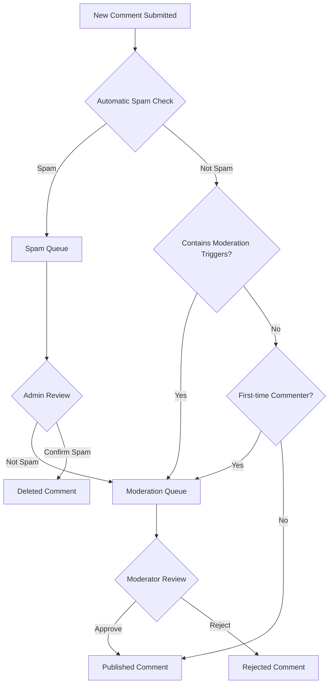

## Menu and Navigation Management

The Tonga National Portal uses WordPress's menu management system for creating and organizing navigation structures.

### Menu Creation and Management

- **Custom Menu Builder**: Drag-and-drop interface for menu creation
- **Multiple Menu Locations**: Different menus for different areas of the site
- **Hierarchical Menus**: Multi-level dropdown navigation
- **Custom Links**: Add external or internal links to menus
- **Menu Items Customization**: CSS classes, target attributes, and titles

**Technical Details:**
- Menus are stored as a custom post type with relationships in the `wp_postmeta` table
- Menu locations are registered by the theme using `register_nav_menus()`
- Menu items can be posts, pages, custom post types, categories, tags, or custom links
- Menu display is controlled by template files like `nav-menu.php` or Walker classes
- Custom menu attributes can be added using the `wp_nav_menu_item_custom_fields` hook

**Best Practices:**
- Create a clear, logical menu structure that reflects government organization
- Limit main navigation to essential items (7±2 items)
- Use descriptive, concise menu labels
- Implement consistent navigation patterns across the portal
- Test menu usability on both desktop and mobile devices
- Use menu locations consistently across the site

**Limitations:**
- Complex mega menus require additional plugins or custom development
- Limited styling options without CSS customization
- Mobile menu behavior depends on theme implementation
- Performance can degrade with extremely large menu structures
- Menu items don't automatically update when content titles change

### Navigation Features

- **Breadcrumb Navigation**: Show content hierarchy and location
- **Mobile-Responsive Menus**: Adapt to different screen sizes
- **Mega Menus**: Enhanced dropdown menus for complex navigation
- **Current Page Highlighting**: Visual indication of active page
- **Accessibility Features**: Keyboard navigation and screen reader support

**Technical Details:**
- Breadcrumbs can be implemented using theme functions or plugins
- Mobile menu behavior is controlled by theme JavaScript and CSS
- Mega menus typically require custom Walker classes or specialized plugins
- Current page highlighting uses the `current-menu-item` CSS class
- Accessibility features rely on proper ARIA attributes and keyboard event handling

**Best Practices:**
- Implement breadcrumb navigation for deep content hierarchies
- Ensure all navigation is accessible via keyboard
- Test navigation with screen readers
- Provide clear visual indicators for current location
- Design mobile navigation for touch interaction
- Document the menu structure and update process

**Limitations:**
- Advanced navigation features often require additional plugins
- Breadcrumb generation may not work correctly with custom post types
- Mega menu performance can impact page load times
- Mobile navigation usability depends heavily on implementation quality

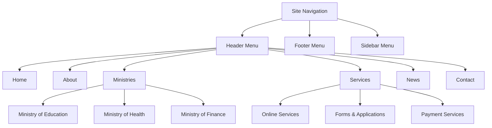

![Screenshot: Menu management interface]
(Here a screenshot would show the menu management interface with government department structure)

## Widget and Sidebar Management

Widgets allow for flexible content placement in designated areas of the portal.

### Widget Areas

The Tonga National Portal includes these widget areas:

- **Main Sidebar**: Primary sidebar for most pages
- **Footer Widgets**: Multiple widget areas in the footer
- **Homepage Widgets**: Special widget areas for the homepage
- **Department Sidebars**: Custom sidebars for different departments
- **Service Sidebars**: Specialized widget areas for service pages

**Technical Details:**
- Widget areas (sidebars) are registered using the `register_sidebar()` function
- Widget settings are stored in the `wp_options` table
- Widget display is controlled by template files like `sidebar.php`
- Dynamic sidebars are implemented using the `dynamic_sidebar()` function
- Custom widget areas can be created for specific post types or templates

**Best Practices:**
- Use consistent widget patterns across similar pages
- Prioritize important information in prominent widget areas
- Regularly review and update widget content
- Test widget appearance on different screen sizes
- Document the purpose and content guidelines for each widget area

**Limitations:**
- Widget styling is highly dependent on theme implementation
- Limited layout control within widget areas
- Widget visibility conditions require additional plugins
- Performance can degrade with widget-heavy pages
- Widget content is not version-controlled like regular content

### Available Widgets

Standard WordPress widgets available include:

- **Text Widget**: Custom text or HTML content
- **Recent Posts**: Display recent content
- **Pages Widget**: List of pages
- **Calendar**: Date-based navigation
- **Categories**: List of content categories
- **Custom Menu**: Display a custom navigation menu
- **Search**: Search functionality
- **Media**: Images, audio, or video content

**Technical Details:**
- Core widgets are registered using the `wp_register_widget()` function
- Widget classes extend the `WP_Widget` class
- Widget output is controlled by the `widget()` method in each widget class
- Widget settings forms are generated by the `form()` method
- Widget settings are updated using the `update()` method

**Best Practices:**
- Use the Text widget with HTML for custom formatted content
- Configure Recent Posts widgets to show relevant content only
- Use Custom Menu widgets for secondary navigation
- Implement search widgets in easily discoverable locations
- Test widget accessibility with keyboard navigation and screen readers

**Limitations:**
- Basic widgets have limited styling options
- Content filtering options are minimal without customization
- Dynamic content capabilities require custom widget development
- Limited conditional display options without additional plugins

### Custom Widgets

The portal includes custom widgets specific to government needs:

- **Service Finder**: Quick access to government services
- **Document Browser**: Access to recent or important documents
- **Contact Information**: Ministry or department contact details
- **Announcement Ticker**: Scrolling or highlighted announcements
- **Event Calendar**: Upcoming government events
- **Social Media Feed**: Official government social media updates

**Technical Details:**
- Custom widgets are created by extending the `WP_Widget` class
- Widget registration occurs during the `widgets_init` action hook
- Custom widget settings are stored in the `wp_options` table
- Widget templates can be overridden in the theme directory
- Advanced widgets may use AJAX for dynamic content loading

**Best Practices:**
- Create widgets with clear, specific purposes
- Implement caching for widgets that fetch external data
- Design widgets with consistent styling
- Provide clear configuration options for administrators
- Document the purpose and configuration of custom widgets

**Limitations:**
- Custom widgets require development resources to create and maintain
- External data dependencies can affect performance and reliability
- Widget updates may require code changes rather than content edits
- Complex widgets may have browser compatibility issues

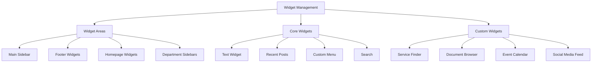

## Theme Customization Options

The Tonga National Portal uses a custom theme built with Bricks Builder that offers extensive customization options.

### Theme Customizer

The WordPress Theme Customizer provides a visual interface for theme modifications:

- **Colors**: Primary, secondary, and accent color schemes
- **Typography**: Font families, sizes, and styles
- **Layout Options**: Content width, sidebar positions
- **Header Options**: Logo, navigation style, header layout
- **Footer Options**: Footer content, layout, and styling
- **Background**: Background colors or images

**Technical Details:**
- Customizer settings are registered using the `customize_register` action hook
- Settings are stored in the `wp_options` table
- Controls are rendered using various control classes (text, color, image, etc.)
- Live preview is enabled through JavaScript
- Customizer sections organize related settings

**Best Practices:**
- Implement a consistent color scheme based on government branding guidelines
- Use web-safe or Google Fonts for typography
- Ensure sufficient contrast for accessibility
- Test customizations across different devices and browsers
- Document brand guidelines for future customizations

**Limitations:**
- Some advanced customizations may require direct code editing
- Performance can degrade with many live preview settings
- Theme updates may override customizations if not properly implemented
- Limited layout control compared to page builders
- Some settings may conflict with plugin functionality

### Bricks Builder Customization

Bricks Builder extends theme customization with:

- **Visual Editing**: WYSIWYG interface for layout design
- **Template System**: Create and apply templates to different content types
- **Global Elements**: Reusable components across the site
- **Responsive Controls**: Device-specific layout adjustments
- **Custom CSS/JS**: Advanced styling and functionality

**Technical Details:**
- Bricks Builder stores layouts in the database as structured JSON
- Templates can be assigned to specific content types, taxonomies, or conditions
- Global elements are stored as a custom post type
- Responsive settings use CSS media queries for different breakpoints
- Custom code is stored and enqueued through WordPress hooks

**Best Practices:**
- Create and use global elements for consistent design
- Build responsive layouts starting with mobile-first design
- Establish template hierarchies for different content types
- Document the purpose and usage of custom templates
- Implement performance optimization for complex layouts

**Limitations:**
- Learning curve for new users
- Complex layouts may impact page load performance
- Template management becomes challenging with many custom templates
- Custom code requires development knowledge
- Plugin conflicts can occur with certain page builder elements

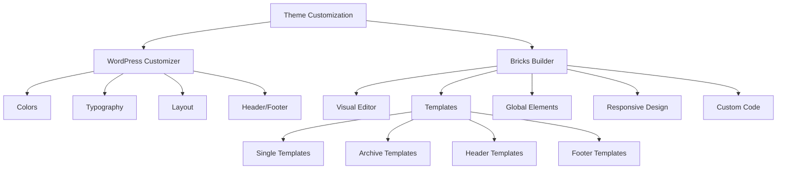

![Screenshot: Theme customization interface]
(Here a screenshot would show the theme customizer with Tonga government branding options)

## Media Library Management

The WordPress Media Library provides comprehensive tools for managing digital assets.

### Media Management Features

- **Centralized Repository**: Single location for all uploaded files
- **File Organization**: Organize media by date or custom folders
- **Search Functionality**: Find media by filename, date, or type
- **Bulk Selection**: Select and modify multiple files at once
- **Media Editing**: Basic image editing capabilities

**Technical Details:**
- Media files are stored in the `wp-content/uploads` directory by default
- Media information is stored as attachment post types in the `wp_posts` table
- Media metadata is stored in the `wp_postmeta` table
- The media library uses AJAX for dynamic loading and filtering
- Image sizes are generated automatically based on theme and settings

**Best Practices:**
- Use descriptive filenames for better searchability
- Add alt text to all images for accessibility
- Optimize images before uploading to reduce file size
- Organize media using a consistent folder structure or taxonomy
- Regularly clean up unused media files
- Implement a media naming convention for government assets

**Limitations:**
- Basic folder organization requires additional plugins
- Limited built-in media types recognition
- Search functionality is basic without enhancements
- Large media libraries can become difficult to navigate
- Default image editor has limited capabilities

### Supported Media Types

The portal supports various media types:

- **Images**: JPEG, PNG, GIF, WebP
- **Documents**: PDF, DOC/DOCX, XLS/XLSX, PPT/PPTX
- **Audio**: MP3, WAV, OGG
- **Video**: MP4, WebM
- **Other**: CSV, ZIP, and other file formats

**Technical Details:**
- Allowed file types are controlled by the `upload_mimes` filter
- File type detection uses both extension and MIME type checking
- Document previews require additional plugins or services
- Video and audio playback use HTML5 native players
- File size limits are controlled by PHP and server settings

**Best Practices:**
- Use web-optimized formats for images (WebP, optimized JPEG)
- Convert documents to PDF for consistent viewing experience
- Provide transcripts or captions for audio and video content
- Compress large files before uploading
- Include metadata in document properties for better searchability

**Limitations:**
- Large file uploads may fail due to server limitations
- Document indexing for search requires additional plugins
- Video hosting may be better served by external services
- Limited metadata extraction from uploaded files
- No built-in Digital Asset Management (DAM) features

### Media Upload and Integration

- **Drag-and-Drop Upload**: Easy file uploading
- **Media Insertion**: Insert media into content with a few clicks
- **Featured Images**: Assign representative images to content
- **Galleries**: Create collections of images
- **Attachment Pages**: Dedicated pages for media items
- **Responsive Images**: Automatic resizing for different devices

**Technical Details:**
- Upload handling uses the `wp_handle_upload()` function
- Media insertion uses shortcodes or HTML in the content
- Featured images are stored as post thumbnail IDs in post meta
- Galleries use the `[gallery]` shortcode or block
- Responsive images use the `srcset` and `sizes` attributes
- Image sizes are defined by the theme using `add_image_size()`

**Best Practices:**
- Use featured images consistently across content types
- Optimize images for web before uploading
- Create standardized gallery layouts for consistent presentation
- Add comprehensive metadata to media files
- Implement a media upload workflow for government departments

**Limitations:**
- Basic media workflow may not meet complex approval requirements
- Limited media version control without additional plugins
- Gallery layouts depend on theme implementation
- Media organization becomes challenging with large libraries
- No built-in digital rights management

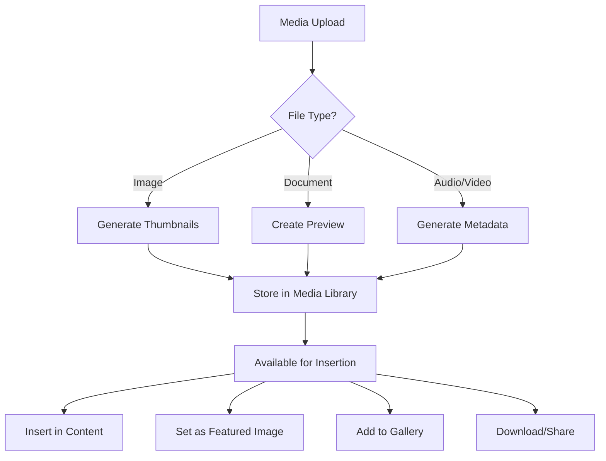

![Screenshot: Media library interface]
(Here a screenshot would show the media library with government documents and images)

## Search Functionality

The Tonga National Portal implements enhanced search capabilities to help users find government information quickly.

### Basic Search Features

- **Site-wide Search**: Search across all content types
- **Search Results Highlighting**: Highlight search terms in results
- **Relevance Sorting**: Display most relevant results first
- **Filter by Content Type**: Narrow results to specific content types
- **Search Analytics**: Track common search terms

**Technical Details:**
- WordPress search uses the `WP_Query` class with the 's' parameter
- Search queries the post title, content, and excerpt fields by default
- Results are displayed using the search.php template
- Relevance is determined by title matches and content matches
- Search forms use the `get_search_form()` function

**Best Practices:**
- Place search forms in consistent, prominent locations
- Implement clear search results pages with filtering options
- Use descriptive titles and content for better search indexing
- Monitor search analytics to identify common queries
- Create content based on common search terms
- Test search functionality with typical government service queries

**Limitations:**
- Default WordPress search has limited content coverage
- No built-in fuzzy matching or spelling correction
- Limited relevance algorithm compared to dedicated search solutions
- Performance can degrade with large content databases
- No built-in search for file contents (PDFs, documents)

### Enhanced Search Capabilities

The portal extends WordPress's search with:

- **Faceted Search**: Filter results by taxonomy, date, or custom fields
- **Live Search**: Real-time search suggestions as users type
- **Multilingual Search**: Search across both English and Tongan content
- **Document Content Search**: Search within PDF and document contents
- **Advanced Operators**: Support for AND, OR, NOT, and phrase searching

**Technical Details:**
- Enhanced search features are implemented through custom plugins
- Faceted search uses AJAX to filter results dynamically
- Live search uses JavaScript to query the WordPress REST API
- Document search requires indexing of file contents
- Multilingual search integrates with WPML's language management

**Best Practices:**
- Implement clear search instructions for advanced features
- Design mobile-friendly search interfaces
- Provide helpful suggestions for common searches
- Create custom search experiences for different sections
- Regularly analyze search logs to improve content findability

**Limitations:**
- Advanced search features increase server load
- Document indexing requires additional resources
- Complex search implementations may have browser compatibility issues
- Search performance depends on server capabilities
- Multilingual search accuracy varies by language

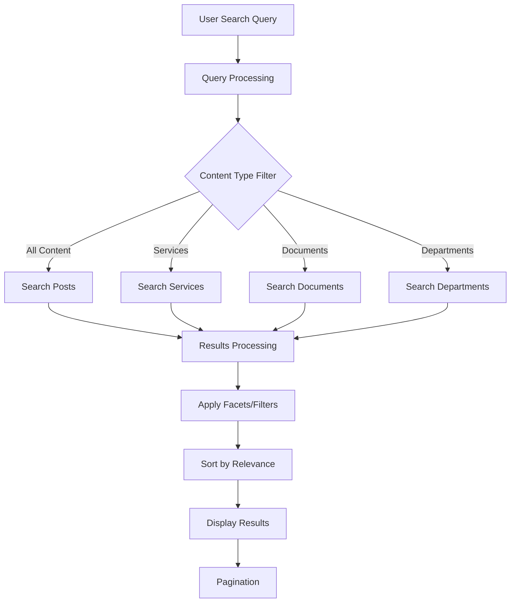

![Screenshot: Search results page]
(Here a screenshot would show search results for a government service, displaying the search results page with faceted filters on the left side, highlighted search terms in the results, and options to filter by content type, department, and date)

## SEO Capabilities

The Tonga National Portal includes search engine optimization features to improve visibility and accessibility.

### Built-in SEO Features

WordPress provides these SEO capabilities:

- **SEO-friendly URLs**: Clean, readable permalinks
- **Customizable Page Titles**: Control how titles appear in search results
- **Meta Descriptions**: Custom descriptions for search engine listings
- **Image Alt Text**: Accessibility and SEO for images
- **XML Sitemaps**: Help search engines discover content

**Technical Details:**
- Permalinks are configured in Settings > Permalinks and stored in .htaccess
- Page titles use the `wp_title()` function and can be customized by themes
- Meta descriptions can be added via theme functions or plugins
- Alt text is stored in the `wp_postmeta` table for each image
- WordPress 5.5+ includes built-in XML sitemap functionality

**Best Practices:**
- Use descriptive, keyword-rich permalinks for all content
- Create unique, compelling title tags for each page (50-60 characters)
- Write meta descriptions that encourage clicks (150-160 characters)
- Add descriptive alt text to all images
- Ensure all important content is included in the sitemap
- Regularly check for and fix broken links

**Limitations:**
- Basic WordPress has limited SEO customization options
- Default title format may not be optimal for SEO
- No built-in meta description field in the editor
- Limited control over sitemap configuration
- No built-in SEO analysis or recommendations

### Enhanced SEO Features

The portal extends SEO capabilities with:

- **Schema Markup**: Structured data for enhanced search listings
- **Social Media Integration**: Open Graph and Twitter Card support
- **SEO Analysis**: Content optimization suggestions
- **Redirect Management**: Handle URL changes and prevent broken links
- **Breadcrumb Navigation**: Improve site structure for search engines
- **Focus Keywords**: Target specific keywords for content

**Technical Details:**
- Schema markup uses JSON-LD format in the page header
- Open Graph tags are added to the `<head>` section of each page
- SEO analysis uses algorithms to evaluate content quality and keyword usage
- Redirects are managed through server configuration or plugin databases
- Breadcrumbs use structured data markup for search engine recognition
- Focus keywords are stored as post meta and used for content analysis

**Best Practices:**
- Implement appropriate schema types for government content
- Configure social media previews for all important pages
- Optimize content based on SEO analysis recommendations
- Set up 301 redirects for any changed URLs
- Maintain a consistent breadcrumb structure
- Research and target relevant keywords for government services

**Limitations:**
- Schema implementation requires technical knowledge
- Social media platforms may cache previews, requiring manual refresh
- SEO analysis is algorithmic and may not account for all factors
- Complex redirect rules can impact site performance
- Keyword optimization must balance SEO with readability and user experience

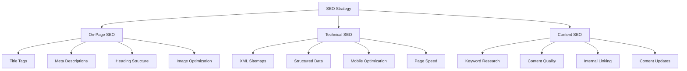

## Multilingual Support via WPML

The Tonga National Portal uses the WPML (WordPress Multilingual) plugin to provide content in both English and Tongan languages.

### WPML Features

- **Content Translation**: Translate posts, pages, custom post types, and taxonomies
- **Language Switcher**: Allow users to switch between available languages
- **Translation Management**: Workflow for managing translation tasks
- **String Translation**: Translate theme and plugin text
- **Media Translation**: Translate image captions and descriptions
- **SEO Translation**: Translate meta titles, descriptions, and keywords

**Technical Details:**
- WPML creates separate posts/pages for each language version
- Translations are linked through meta relationships in the database
- Language switcher can be implemented as a menu, widget, or shortcode
- String translations are stored in a separate database table
- Translation management uses a job system with notifications
- SEO translations maintain separate metadata for each language

**Best Practices:**
- Translate all user-facing content for consistent experience
- Maintain consistent terminology across translations
- Use professional translators familiar with government terminology
- Translate meta information for proper SEO in both languages
- Test navigation and functionality in all supported languages
- Keep the language switcher visible and accessible on all pages

**Limitations:**
- Translation process can be time-consuming for large sites
- Automatic translation tools may not handle specialized terminology well
- Some plugins may not be fully compatible with multilingual setup
- Performance impact with multiple language versions
- Complex content structures require careful translation management

### Translation Workflow

The portal implements this translation workflow:

1. **Content Creation**: Create content in the primary language (English)
2. **Translation Assignment**: Assign content for translation to Tongan
3. **Translation Process**: Translate content using the WPML interface
4. **Review and Approval**: Review translations for accuracy
5. **Publication**: Publish translated content
6. **Maintenance**: Update translations when original content changes

**Technical Details:**
- Translation jobs are tracked in the WPML Translation Management module
- Email notifications alert translators of new assignments
- Translation memory stores previously translated segments
- Translation status is tracked for each piece of content
- Content updates trigger notifications for translators

**Best Practices:**
- Establish clear roles for content creators and translators
- Create a glossary of government terms for consistent translation
- Set up regular translation schedules for new content
- Implement a review process for all translations
- Train staff on proper use of the translation interface
- Document the translation workflow for all content types

**Limitations:**
- Manual notification system can lead to missed updates
- No built-in quality assurance for translations
- Limited automation for translation workflows
- Translation memory requires consistent terminology usage
- No built-in support for third-party translation services

### Language Configuration

The portal is configured with:

- **Default Language**: English
- **Secondary Language**: Tongan
- **Language Detection**: Based on user preference or browser settings
- **URL Format**: Language code in URL (e.g., /to/ for Tongan pages)
- **Content Synchronization**: Keep content structure consistent across languages

**Technical Details:**
- Language settings are stored in the WordPress options table
- URL formats can be configured as directory (/to/), domain (to.example.com), or parameter (?lang=to)
- Language detection uses cookies to remember user preferences
- Browser language detection uses the Accept-Language HTTP header
- Content synchronization maintains relationships between translated content

**Best Practices:**
- Use directory-based language URLs for SEO benefits
- Implement hreflang tags for search engines
- Configure proper fallbacks for untranslated content
- Test language switching on all page types
- Ensure consistent navigation structure across languages

**Limitations:**
- Some server configurations may have issues with certain URL formats
- Browser detection is not always accurate for user preferences
- Content synchronization can be complex for dynamic content
- Cookie-based language selection requires proper cookie handling
- URL-based language selection impacts all site URLs

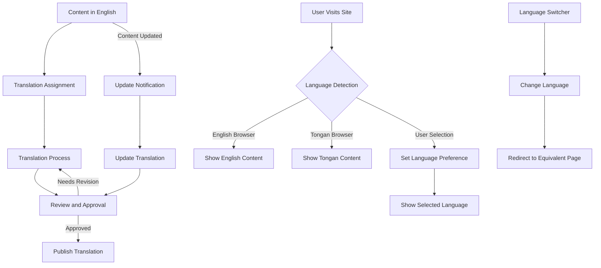

![Screenshot: WPML translation interface]
(Here a screenshot would show the WPML translation interface with English to Tongan translation, displaying the side-by-side translation editor with the original English content on the left and Tongan translation fields on the right, along with translation status indicators and workflow controls)

## Conclusion

The generic WordPress functionalities described in this document provide the foundation for the Tonga National Portal's content management capabilities. These features are extended and customized to meet the specific needs of government service delivery and citizen engagement. Government staff should familiarize themselves with these core capabilities to effectively manage and maintain the portal content.

For more information on custom functionalities specific to government services, please refer to the [Module Functionalities](./module-functionalities.md) documentation.