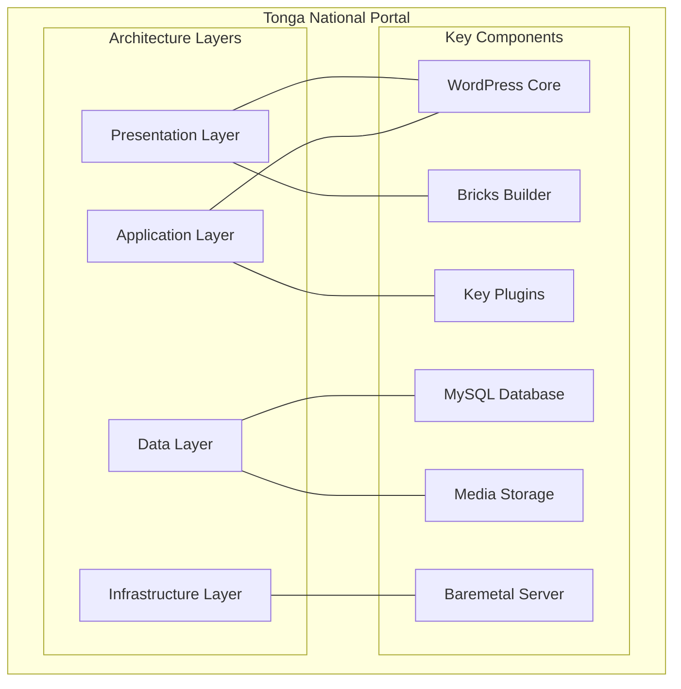

## Overview and Purpose

The **Tonga National Portal** is the official digital gateway to Tonga's government services and information. It serves as a centralized platform that connects citizens, businesses, and visitors with essential government resources, services, and information. The portal represents a significant milestone in Tonga's digital transformation journey, aiming to enhance government transparency, improve service delivery, and increase citizen engagement.

<Note>
The primary purposes of the Tonga National Portal include:

- Providing a **single point of access** to all government services and information
- Enabling **efficient e-government services** for citizens, businesses, and visitors
- Improving **transparency and accountability** in government operations
- Facilitating **digital communication** between the government and citizens
</Note>

## Technology Stack

The Tonga National Portal is built using modern web technologies to ensure reliability, security, and ease of maintenance:

<Tabs>
  <Tab title="Content Management System">
    **WordPress 6.8.1**
    
    - Provides a robust and flexible foundation for content management
    - Offers extensive plugin ecosystem for extended functionality
    - Ensures regular security updates and long-term support
  </Tab>
  <Tab title="Template Builder">
    **Bricks Builder**
    
    - Enables visual design and layout customization
    - Provides responsive design capabilities for all device types
    - Offers modular components for consistent design across the portal
  </Tab>
  <Tab title="Additional Technologies">
    - **PHP 8.1+**: Server-side scripting language
    - **MySQL 8.0**: Database management system
    - **HTML5/CSS3/JavaScript**: Front-end web technologies
    - **SSL/TLS Encryption**: For secure data transmission
  </Tab>
  <Tab title="Key Plugins">
    <CardGroup cols={2}>
      <Card title="Announcer Pro" icon="bullhorn">
        Powers the emergency alert/notification system
      </Card>
      <Card title="Location Weather Pro" icon="cloud-sun">
        Provides current weather information display
      </Card>
      <Card title="UserFeedback Premium" icon="comments">
        Enables the feedback collection system
      </Card>
      <Card title="Document Library Lite" icon="folder-open">
        Manages the document repository functionality
      </Card>
      <Card title="WPML" icon="language">
        Supports multilingual content in Tongan and English
      </Card>
      <Card title="MxChat" icon="robot">
        Enables the TongaAI chatbot functionality
      </Card>
    </CardGroup>
  </Tab>
</Tabs>

## Main Features and Capabilities

The Tonga National Portal offers a comprehensive set of features designed to serve both citizens and government officials:

<Tabs>
  <Tab title="For Citizens and Public Users">
    <CardGroup cols={2}>
      <Card title="Ministries Directory" icon="building-government">
        Comprehensive directory of all government ministries, their functions, leadership, and contact information
      </Card>
      <Card title="Government Services Directory" icon="list-check">
        Categorized listing of all available government services with detailed information on how to access them
      </Card>
      <Card title="Alert/Notification System" icon="bell">
        Prominent emergency alerts for critical situations (e.g., Dengue Fever Outbreak, Tropical Disturbance)
      </Card>
      <Card title="Weather Information" icon="cloud-sun">
        Current weather conditions including temperature, weather icon, and time/date
      </Card>
      <Card title="Document Repository" icon="folder-open">
        Access to public documents, reports, and official publications
      </Card>
      <Card title="News and Announcements" icon="newspaper">
        Latest updates from government ministries and departments
      </Card>
      <Card title="Job Advertisements" icon="briefcase">
        Listings of government and public sector employment opportunities
      </Card>
      <Card title="Multilingual Support" icon="language">
        Content available in Tongan and English languages
      </Card>
      <Card title="Search Functionality" icon="magnifying-glass">
        Advanced search capabilities across all portal content
      </Card>
      <Card title="TongaAI Chatbot" icon="robot">
        AI-powered virtual assistant that helps users navigate the portal
      </Card>
    </CardGroup>

    <Tip>
      The Government Services Directory is organized into specific categories:
      - Family & children
      - Health & wellbeing
      - Business & Investment
      - Passports & ID
      - Crime & security
    </Tip>
  </Tab>
  <Tab title="For Government Staff">
    <CardGroup cols={2}>
      <Card title="Content Management System" icon="pen-to-square">
        User-friendly interface for updating and publishing content
      </Card>
      <Card title="Workflow Management" icon="diagram-project">
        Approval processes for content publication
      </Card>
      <Card title="User Management" icon="users">
        Role-based access control for different levels of administrative access
      </Card>
      <Card title="Analytics Dashboard" icon="chart-line">
        Insights into portal usage and popular services
      </Card>
      <Card title="Document Management" icon="file-lines">
        Versioning and organization of official documents
      </Card>
    </CardGroup>
  </Tab>
</Tabs>

## Target Audience

The Tonga National Portal is designed to serve multiple user groups:

<Tabs>
  <Tab title="Primary Audiences">
    <CardGroup cols={2}>
      <Card title="Citizens of Tonga" icon="user">
        Individuals seeking government information, services, or wanting to engage with public sector entities
      </Card>
      <Card title="Businesses and Organizations" icon="building">
        Local enterprises requiring government services, permits, or regulatory information
      </Card>
      <Card title="Government Employees" icon="id-badge">
        Staff from various ministries and departments who use the portal for information sharing and service delivery
      </Card>
      <Card title="International Visitors and Investors" icon="globe">
        Foreigners seeking information about Tonga, visa requirements, investment opportunities, or tourism information
      </Card>
    </CardGroup>
  </Tab>
  <Tab title="User Personas">
    <AccordionGroup>
      <Accordion title="Tongan Citizens">
        - Urban and rural residents seeking government services
        - Varying levels of digital literacy and internet access
        - Both Tongan and English language users
      </Accordion>
      <Accordion title="Government Staff">
        - Content managers responsible for publishing ministry information
        - Service administrators who manage online applications and forms
        - IT personnel maintaining the technical aspects of the portal
      </Accordion>
      <Accordion title="Business Community">
        - Local business owners seeking permits and licenses
        - Foreign investors researching opportunities in Tonga
        - Industry associations accessing regulatory information
      </Accordion>
      <Accordion title="International Users">
        - Tourists planning visits to Tonga
        - Researchers and academics studying Tonga
        - Tongan diaspora maintaining connections with their homeland
      </Accordion>
    </AccordionGroup>
  </Tab>
</Tabs>

## System Architecture

The Tonga National Portal follows a modular architecture designed for scalability and ease of maintenance:

<Frame>

</Frame>

<Steps>
  <Step title="Presentation Layer">
    - Responsive front-end interface built with Bricks Builder
    - Theme customized to reflect Tongan government branding
    - Accessibility features compliant with international standards
  </Step>
  <Step title="Application Layer">
    - WordPress core functionality and custom plugins
    - Authentication and authorization systems
    - Integration services for external systems
  </Step>
  <Step title="Data Layer">
    - MySQL database for content storage
    - File storage for documents and media
    - Caching mechanisms for performance optimization
  </Step>
  <Step title="Infrastructure Layer">
    - Baremetal server hosting on Ubuntu 24.04 LTS
    - Minimum hardware specifications: 4 cores CPU, 16GB RAM, 100GB SSD storage
    - High-speed internet connection with 1Gbps bandwidth
    - Backup and disaster recovery systems
  </Step>
</Steps>

<Callout type="info">
  This architecture ensures the portal can evolve over time to meet changing needs while maintaining performance, security, and reliability.
</Callout>