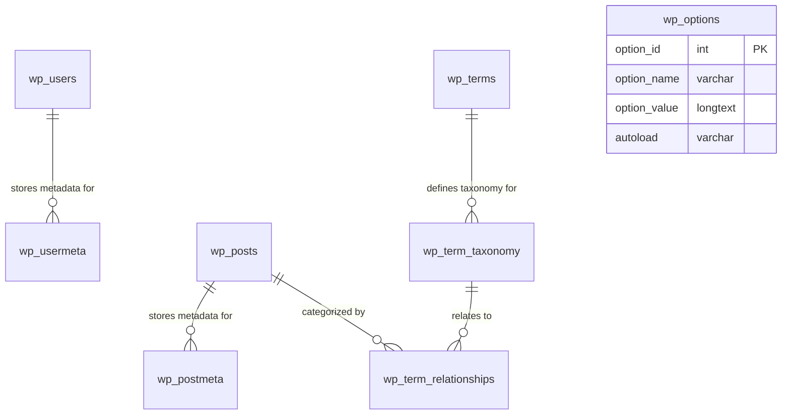
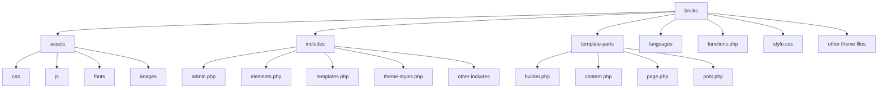
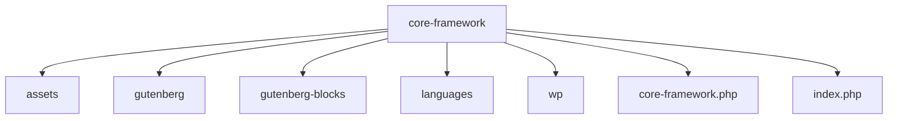
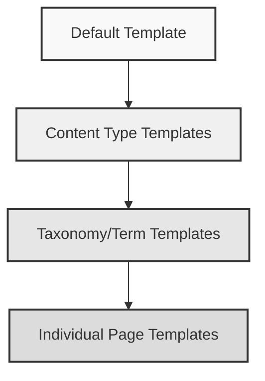
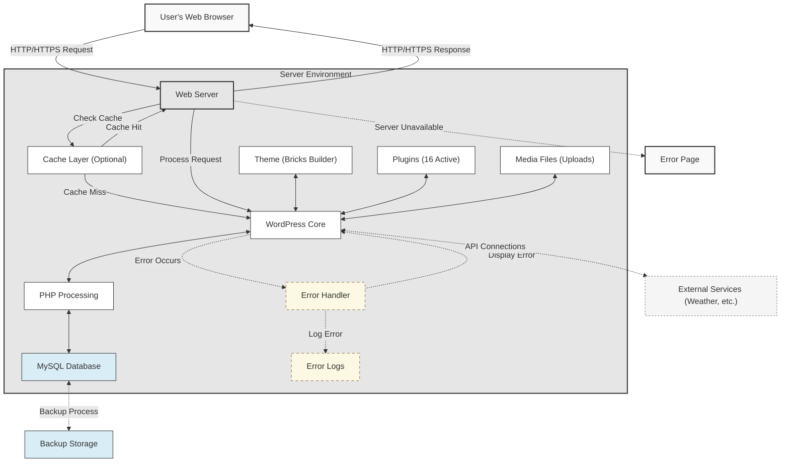
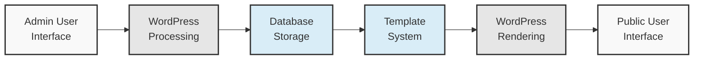
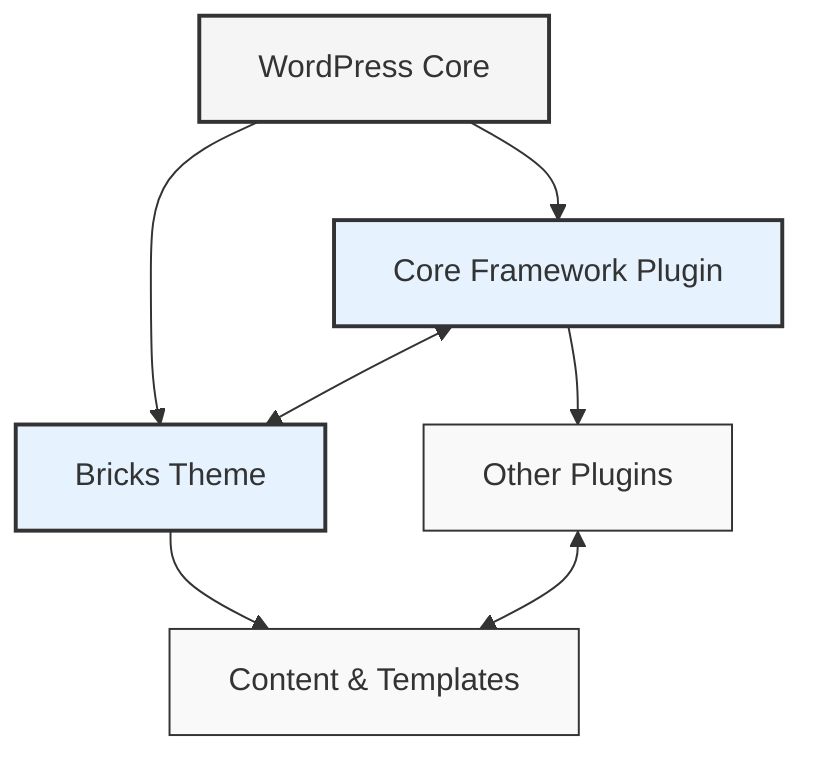
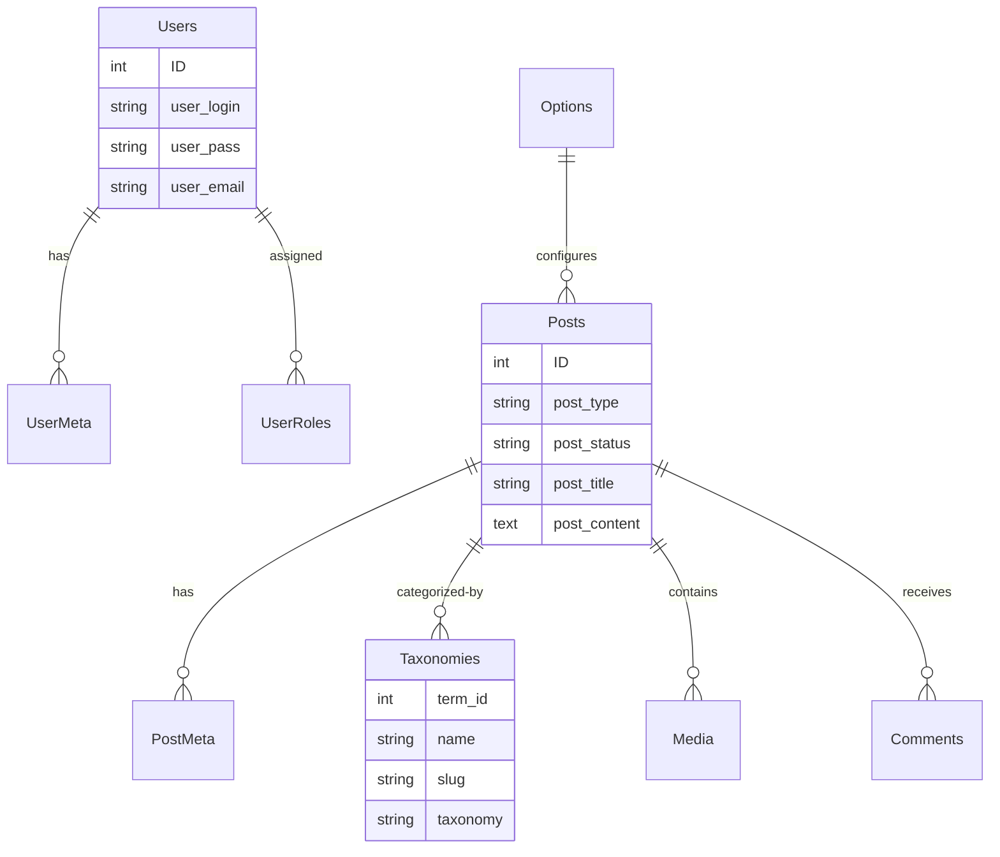

# Platform Structure

This document provides a comprehensive overview of the WordPress architecture and structure of the Tonga National Portal platform.

## WordPress Architecture Overview

The Tonga National Portal is built on WordPress 6.8.1, a robust and flexible content management system that powers over 40% of websites worldwide. The platform leverages WordPress's core functionality while extending it with plugins to meet the specific needs of Tonga's government services portal.

### Core Architecture

#### Overview for Non-Technical Users

The Tonga National Portal uses WordPress as its foundation, which can be thought of as a digital framework that manages all the content and functionality of the website. Think of WordPress as the engine and chassis of a car, while the plugins, themes, and design elements are like the body, interior, and special features that make it uniquely suited for Tonga's government services.

The WordPress architecture consists of several key components:

1. **Core System**: The fundamental WordPress software that provides basic functionality
2. **Theme**: The Bricks Builder theme that controls how the portal looks and behaves
3. **Plugins**: Additional software components that extend functionality
4. **Database**: Where all content and settings are stored
5. **Media Library**: Storage system for images, documents, and other files

This architecture allows for:

- **Ease of Content Management**: Government staff can easily update content without technical knowledge
- **Flexibility**: The portal can be extended with new features as needs evolve
- **Security**: Regular updates to protect against vulnerabilities
- **Scalability**: The ability to handle increasing amounts of content and traffic

#### Technical Implementation

From a technical perspective, the WordPress architecture follows the Model-View-Controller (MVC) pattern, although with some WordPress-specific adaptations:

- **Model**: WordPress's database abstraction layer and core functions that interact with the database
- **View**: Theme templates and Bricks Builder elements that render the front-end interface
- **Controller**: WordPress core functions, hooks system, and custom PHP code that process requests

The request lifecycle in WordPress follows this general flow:

1. A user requests a URL on the Tonga National Portal
2. WordPress's core routing system determines what content to display
3. The appropriate template files from the theme are loaded
4. Hooks and filters modify and enhance the content
5. The final HTML is rendered and sent to the user's browser

### Extension Architecture

The Tonga National Portal extends the core WordPress architecture through:

1. **Custom Post Types**: Specialized content types for government services, departments, forms, etc.
2. **Custom Taxonomies**: Classification systems for organizing content
3. **Custom Fields**: Additional data associated with content
4. **Bricks Builder Templates**: Specialized layouts for different types of content

This extension architecture allows the portal to serve as a comprehensive government services platform while maintaining the benefits of the WordPress ecosystem.

## Database Structure

WordPress uses a relational database (MySQL 8.0) with a specific schema for the Tonga National Portal.

### Core WordPress Tables

The standard WordPress database includes these core tables:

1. **wp_posts**: Stores all content including pages, posts, attachments, and custom post types
2. **wp_users**: Contains user account information
3. **wp_usermeta**: Stores additional user metadata
4. **wp_comments**: Holds comments and comment metadata
5. **wp_terms**, **wp_term_taxonomy**, **wp_term_relationships**: Manage categories, tags, and custom taxonomies
6. **wp_options**: Stores site configuration settings
7. **wp_postmeta**: Contains additional metadata for posts and pages

### Plugin Tables

The database also includes tables created by installed plugins:

1. **wp_actionscheduler_***:  Tables for the Action Scheduler library used by various plugins
2. **wp_bricks_***:  Tables for the Bricks Builder theme functionality
3. **wp_core_framework_presets**: Stores presets for the Core Framework plugin
4. **wp_fs_***: Tables for the FS Poster Lite plugin
5. **wp_icl_***: Tables for the WPML multilingual plugin (Sitepress Multilingual CMS)
6. **wp_mxchat_***: Tables for the MXChat Basic plugin
7. **wp_userfeedback_***: Tables for the UserFeedback Premium plugin
8. **wp_wpmailsmtp_***: Tables for the WP Mail SMTP plugin

### Database Relationships

The database uses several key relationships to connect different types of content:

**Technical Context for IT Staff:**

- **Performance Implications:** The `wp_posts` and `wp_postmeta` tables grow the fastest and can impact query performance. Consider implementing table partitioning for these tables if content exceeds 100,000 entries.
- **Indexing Strategy:** Custom indexes should be added to `wp_postmeta` for meta_keys that are frequently queried, especially for custom fields used in government service listings.
- **Backup Considerations:** The relationship between posts and metadata means both tables must be backed up simultaneously to maintain referential integrity.
- **Security Note:** User data in `wp_users` and `wp_usermeta` contains sensitive information. Ensure database-level encryption and proper access controls.
- **Maintenance Tip:** Regular optimization of these tables (particularly `wp_options` which can accumulate transients) is essential for maintaining performance.

### Technical Details

The database uses InnoDB as the storage engine, with UTF-8mb4 character encoding to support multilingual content (both English and Tongan). Indexes are created on frequently queried columns to optimize performance.

## File System Organization

The Tonga National Portal follows WordPress's standard file system organization with additional directories and files for plugins and themes.

### Core Directory Structure

```mermaid
graph TD
    A[tonga-national-portal] --> B[wp-admin]
    A --> C[wp-content]
    A --> D[wp-includes]
    A --> E[WordPress core files]
    
    C --> F[themes]
    C --> G[plugins]
    C --> H[uploads]
    C --> I[languages]
    
    F --> F1[bricks]
    F --> F2[twentytwentyfive]
    F --> F3[twentytwentyfour]
    
    G --> G1[announcer-pro]
    G --> G2[core-framework]
    G --> G3[document-library-lite]
    G --> G4[fs-poster-lite]
    G --> G5[google-site-kit]
    G --> G6[location-weather-pro]
    G --> G7[mxchat-basic]
    G --> G8[otgs-installer-plugin]
    G --> G9[popup-maker]
    G --> G10[sitepress-multilingual-cms]
    G --> G11[userfeedback-premium]
    G --> G12[userfeedback-question-types]
    G --> G13[userfeedback-targeting]
    G --> G14[wp-mail-smtp]
    G --> G15[wp-matrix-cyberphilosophy]
    G --> G16[wpml-string-translation]
    
    H --> H1[2024]
    H --> H2[2025]
```

**Technical Context for IT Staff:**

- **File Permissions:** Critical security consideration - `wp-admin` and `wp-includes` should be set to 755, while configuration files should be 440/400.
- **Deployment Pipeline:** When deploying updates, exclude the `wp-content/uploads` directory to prevent overwriting user-uploaded content.
- **Backup Strategy:** Implement differential backups for the `wp-content/uploads` directory (which grows rapidly) and full backups for the rest of the installation.
- **Performance Optimization:** The `wp-content/plugins` directory contains 16 active plugins, which can impact load times. Consider implementing a plugin audit process to maintain only essential functionality.
- **Security Scanning:** Regular malware scans should focus on the `wp-content` directory, particularly the `uploads` folder, which is the most common target for malicious file uploads.
- **Maintenance Workflow:** When updating WordPress core, create a staging environment first to test compatibility with the custom Bricks theme and Core Framework plugin.

### Bricks Theme Structure

The Bricks theme used for the Tonga National Portal follows a modular organization:

**Technical Context for IT Staff:**

- **Customization Strategy:** Custom modifications should be implemented through child themes or the Core Framework plugin rather than directly editing Bricks theme files to maintain upgrade compatibility.
- **Performance Considerations:** The `assets/js` directory contains JavaScript files that should be minified and combined in production to reduce HTTP requests and improve page load times.
- **Critical Files:** `functions.php` and `includes/elements.php` are the most critical files for theme functionality - changes here can have cascading effects throughout the site.
- **Caching Implementation:** Implement browser caching for the `assets` directory with appropriate cache headers (1 week for CSS/JS, 1 month for fonts/images).
- **Maintenance Workflow:** When updating the Bricks theme, always back up the `includes/templates.php` file as it contains custom template configurations specific to the Tonga National Portal.
- **Security Note:** The theme's PHP files, especially in the `includes` directory, should be regularly audited for security vulnerabilities as they execute with the same privileges as WordPress core.

### Core Framework Plugin Structure

The Core Framework plugin provides additional functionality for the Tonga National Portal:

**Technical Context for IT Staff:**

- **Critical Component:** The Core Framework plugin is a foundational component that extends WordPress functionality specifically for the Tonga National Portal. Any failure in this plugin will affect multiple site features.
- **Dependency Chain:** This plugin is a dependency for several custom features in the Bricks theme implementation. Updates must be tested thoroughly in staging before deployment.
- **Custom Development:** The `wp` directory contains custom WordPress hooks and filters that integrate with core WordPress functionality. Changes here require thorough testing across the entire site.
- **Performance Impact:** The Gutenberg blocks implemented in the `gutenberg` and `gutenberg-blocks` directories add custom editor functionality but can impact admin dashboard performance on lower-end devices.
- **Versioning Strategy:** Implement semantic versioning for this plugin with detailed changelog documentation to track changes over time.
- **Security Consideration:** The `index.php` file prevents directory listing and should never be modified or removed as it's a security measure.

## Theme Structure Using Bricks Template Builder

The Tonga National Portal uses the Bricks Builder as its template builder, providing a flexible and powerful way to create and manage the portal's design and layout.

### Bricks Builder Overview

Bricks Builder is a visual page builder for WordPress that allows for the creation of complex layouts without writing code. It uses a modular approach with elements that can be combined to create pages.

#### Key Components

1. **Templates**: Pre-designed layouts that can be applied to different types of content
2. **Sections**: Reusable layout blocks that can be included in multiple pages
3. **Elements**: Individual components like text, images, buttons, etc.
4. **Global Settings**: Site-wide design settings for consistency

### Bricks Templates System

The Bricks theme uses a custom post type called `bricks_template` to store templates. These templates can be assigned to different parts of the site:

1. **Header Templates**: Applied to the site header
2. **Content Templates**: Applied to the main content area
3. **Footer Templates**: Applied to the site footer
4. **Single Templates**: Applied to individual posts or pages

Templates can be assigned based on conditions, such as post type, taxonomy, or specific pages.

### Template Hierarchy

The template hierarchy determines which template is used for different types of content:

**Technical Context for IT Staff:**

- **Template Resolution Performance:** The template hierarchy follows a cascade pattern where WordPress checks for increasingly specific templates. This process can impact page load times if the hierarchy is too deep or complex.
- **Caching Strategy:** Implement page caching with different TTL (Time To Live) values based on template specificity - longer cache times for default templates, shorter for specific page templates.
- **Development Workflow:** When creating new templates, start with the most specific level needed to minimize the cascade effect and improve rendering performance.
- **Maintenance Consideration:** Template changes at higher levels (Default Template) will affect all content unless overridden by more specific templates. Always test changes at the Default Template level across multiple content types.
- **Multilingual Implementation:** With WPML active, each template in this hierarchy may have language-specific versions, effectively doubling the template complexity. Ensure language-specific templates follow the same hierarchy.
- **Debugging Tip:** When troubleshooting template issues, use the 'What Template' plugin or add `<?php global $template; echo $template; ?>` to identify which template file is being used for a specific page.

### Technical Implementation

Bricks templates are stored in the WordPress database and can be exported/imported as JSON files. The templates use a combination of HTML, CSS, and JavaScript, with dynamic content inserted through WordPress functions and custom code.

## Plugin Functionalities Overview

The Tonga National Portal extends WordPress's content management capabilities through custom post types, taxonomies, and other elements provided by the installed plugins.

### Multilingual Support

The site uses WPML (WordPress Multilingual) plugin to provide multilingual support for content in both English and Tongan languages. This includes:

1. **Translation Management**: Tools for managing translations of content
2. **String Translation**: Translation of interface strings
3. **Language Switcher**: Interface for users to switch between languages

### Document Management

The Document Library Lite plugin provides document management capabilities:

1. **Document Organization**: Tools for organizing and categorizing documents
2. **Document Search**: Advanced search functionality for documents
3. **Document Display**: Various ways to display documents on the site

### User Feedback

The UserFeedback Premium plugin allows for collecting feedback from site visitors:

1. **Survey Creation**: Tools for creating surveys
2. **Question Types**: Various question types for different feedback needs
3. **Targeting**: Ability to target surveys to specific users or pages

### Weather Information

The Location Weather Pro plugin provides weather information for different locations in Tonga:

1. **Weather Display**: Current weather conditions
2. **Forecast**: Weather forecasts for future days
3. **Location-based**: Weather information for different locations

### Chat Support

The MXChat Basic plugin provides an AI-driven chatbot solution that enhances user engagement and support on the Tonga National Portal:

1. **AI-Powered Conversations**: Leverages advanced AI models from OpenAI (including GPT-4o, GPT-4o-mini, GPT-4-turbo, and GPT-4) to provide intelligent, context-aware responses to user queries
2. **Knowledge Database Integration**: Features a customizable knowledge base that stores information securely on the website and uses advanced vector embedding to match user queries with relevant content, ensuring accurate and context-aware responses
3. **Multiple Content Sources**: Supports various methods for adding content to the knowledge base:
   - Manual submission through the admin dashboard
   - URL submission for automatic content extraction
   - Sitemap submission for comprehensive site content integration
   - WooCommerce product integration (for e-commerce sections)
4. **Customizable Appearance**: Offers extensive theme and color customization options to align with the portal's design, including:
   - Customizable chat widget colors and backgrounds
   - Personalized chatbot icon upload capability
   - Floating widget or embedded implementation options
5. **AI Instruction Configuration**: Allows administrators to provide specific instructions to the AI to ensure accurate, contextually relevant responses that align with government service goals
6. **Privacy and Security**: Operates on a "bring your own key" system where all interactions remain within the website's hosting environment, ensuring data privacy and security
7. **Testing and Quality Assurance**: Includes AI-powered testing agents that can simulate real user interactions to help test and refine the chatbot's responses and capabilities
8. **Multilingual Support**: Compatible with the portal's bilingual requirements, supporting both English and Tongan languages

The MXChat implementation on the Tonga National Portal serves as a virtual assistant, helping visitors navigate government services, find information, and get answers to common questions without requiring human intervention, thereby improving service delivery efficiency.

## Programming Methodology

The Tonga National Portal uses a combination of programming methodologies to balance WordPress conventions with modern development practices.

### WordPress Coding Standards

The portal follows WordPress coding standards for consistency and compatibility:

- PHP code follows the WordPress PHP Coding Standards
- JavaScript code follows the WordPress JavaScript Coding Standards
- CSS follows the WordPress CSS Coding Standards
- Accessibility follows WCAG 2.1 AA standards

### Modular Development

The portal uses a modular development approach:

1. **Core WordPress**: Provides the foundation
2. **Bricks Theme**: Handles presentation and layout
3. **Plugins**: Add specific features that can be enabled/disabled

This modular approach allows for:

- **Easier Maintenance**: Components can be updated independently
- **Feature Toggling**: Features can be enabled/disabled as needed
- **Code Reuse**: Common functionality is centralized
- **Separation of Concerns**: Code is organized by responsibility

## Component Interaction Diagrams

This section provides visual representations of how different components of the Tonga National Portal interact with each other. These diagrams help understand the system's architecture, data flow, and component relationships.

### System Architecture Diagram

This diagram illustrates the overall system architecture of the Tonga National Portal, showing how user requests flow through the WordPress-based system. It highlights the server environment components, caching mechanisms, core WordPress elements, and error handling paths. The diagram helps understand the technical infrastructure that powers the portal.

### Content Flow Diagram

This diagram shows how content flows through the Tonga National Portal system, from creation in the admin interface to display on the public-facing website. It illustrates the content lifecycle, including processing, storage, template application, and rendering phases. This helps understand how content is managed and delivered to users.

### Plugin Interaction Diagram

This diagram depicts how various plugins interact with the WordPress core and with each other within the Tonga National Portal. It shows the relationships between the core framework plugin, Bricks theme, and other plugins, highlighting how they collaborate to create and manage content and templates. This helps understand the plugin architecture and dependencies.

### Data Relationship Diagram

This entity-relationship diagram illustrates the database structure of the Tonga National Portal, showing how different data entities (users, posts, taxonomies, etc.) relate to each other. It details the key fields in each entity and the relationships between them, providing insight into how data is organized and connected within the system. This helps understand the underlying data model that supports the portal's functionality.

## Conclusion

The Tonga National Portal leverages WordPress's flexible architecture while extending it with plugins and the Bricks theme to meet the specific needs of a government services platform. The combination of WordPress core, Bricks Builder, and various plugins creates a powerful and maintainable platform that can evolve to meet the changing needs of Tonga's digital government initiatives.

The modular architecture ensures that:

1. Content can be easily managed by non-technical staff
2. New features can be added without disrupting existing functionality
3. The platform can scale to accommodate increasing content and traffic
4. Security can be maintained through regular updates
5. The user experience remains consistent across different sections of the portal

This platform structure provides a solid foundation for the Tonga National Portal's current functionality and future growth.