# Plugin Functionalities

This document provides comprehensive information about all the plugins installed on the Tonga National Portal, including their features, configuration, and usage guidelines.

## Announcer Pro

### Description

Announcer Pro is a premium WordPress plugin developed by Aakash Web that enables website administrators to create and display eye-catching notification bars (also called message banners or sticky bars) on their WordPress websites. As a standalone plugin with enhanced capabilities beyond the free version, Announcer Pro provides a comprehensive solution for displaying important announcements, promotional messages, special offers, and time-sensitive information to website visitors in an engaging and non-intrusive manner.

The plugin allows for complete customization of announcement appearance, positioning, and behavior, making it an essential tool for increasing user engagement, driving conversions, and communicating important information effectively across your website.

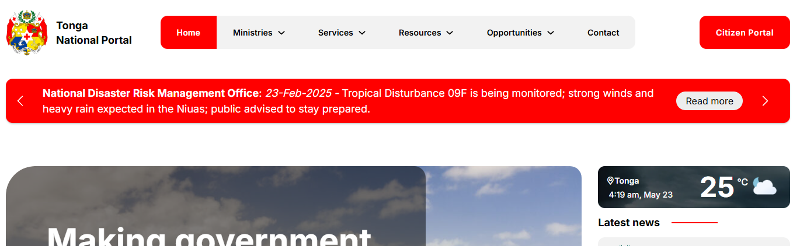

### Key Features

- **Multiple Announcement Creation**: Create and manage unlimited announcements with different designs, content, and configurations.
  
- **Flexible Positioning**: Place announcements at the top, bottom, or custom positions on your website with precise control over appearance.
  
- **Multiple Messages Support**: Display multiple messages within a single announcement bar that rotate automatically like a ticker.
  
- **Advanced Targeting Options**: Control announcement visibility based on specific pages, posts, user roles, devices, and custom conditions.
  
- **Visitor Conditions**: Target visitors based on specific criteria
  
- **Countdown Timer**: Add dynamic countdown timers to create urgency for limited-time offers, sales, or events.
  
- **Animation Effects**: Apply attention-grabbing animations to both announcements and call-to-action buttons to increase engagement.
  
- **Scheduling Options**: Set specific date and time ranges for announcements to automatically display and expire.
  
- **Shortcode Support**: Insert announcements anywhere on your site using simple shortcodes, including within posts, pages, and widgets.
  
- **Responsive Design**: Ensure announcements display properly across all devices with mobile-friendly layouts.
  
- **Close Button Customization**: Configure how and when users can dismiss announcements, with options to remember user preferences.
  
- **Analytics Integration**: Track announcement performance with built-in view and click statistics.

### Adding a New Announcement

Creating a new announcement in Announcer Pro involves a straightforward process that allows for extensive customization:

1. **Access the Announcer Dashboard**:
   - Log in to your WordPress admin panel
   - Navigate to "Announcer" in the left sidebar menu
   - Click on "Add New" to create a new announcement
   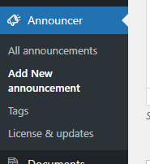

2. **Configure Basic Settings**:
   - Enter a descriptive title for internal reference
   - Add your announcement message in the content editor
     - Use the rich text editor to format text, add links, and insert media
     - Include call-to-action buttons as needed
   - Select the announcement type (notification bar, floating banner, etc.)

3. **Design Your Announcement**:
   - Choose from pre-designed templates or create a custom design
   - Set colors for background, text, and buttons
   - Configure typography settings (font family, size, weight)
   - Add borders, shadows, and other visual elements
   - Adjust padding and spacing for optimal appearance
   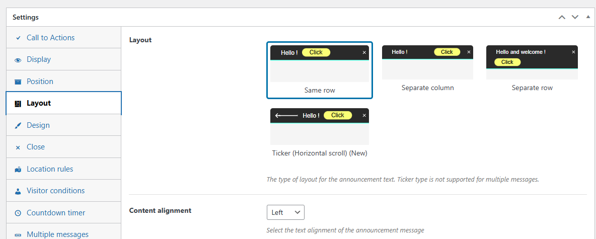

4. **Position the Announcement**:
   - Select placement location (top, bottom, or custom position)
   - Configure display behavior (fixed, static, or slide-in)
   - Set z-index to control stacking with other page elements
   - Adjust responsive behavior for different screen sizes

5. **Save and Publish**:
   - Click "Save Draft" to save your work without publishing
   - Use "Preview" to see how the announcement will appear on your site
   - Click "Publish" to make the announcement live on your website

### Announcement Configuration

After creating a basic announcement, Announcer Pro offers extensive configuration options to fine-tune its behavior and targeting:

1. **Display Conditions**:
   - **Page Targeting**: Select specific pages, posts, categories, or custom post types where the announcement should appear
   - **Exclusion Rules**: Define pages or sections where the announcement should not be shown
   - **Device Targeting**: Choose to display on desktop, mobile, tablet, or specific devices only
   - **User Targeting**: Show announcements based on user roles, login status, or custom user attributes
   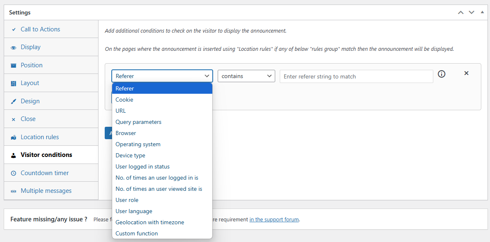

2. **Timing Controls**:
   - **Schedule**: Set start and end dates/times for the announcement
   - **Display Frequency**: Control how often the announcement appears to the same visitor
   - **Delay Options**: Add a time delay before showing the announcement
   - **Scroll Trigger**: Display the announcement after the user scrolls to a certain point

3. **Advanced Visitor Conditions**:
   - **Referrer Source**: Show announcements only to visitors coming from specific websites or search engines
   - **Query Parameters**: Target based on URL parameters (useful for campaign tracking)
   - **Cookie-Based Rules**: Display based on the presence or value of specific cookies

4. **Behavior Settings**:
   - **Close Button Options**: Customize appearance and behavior of the close button
   - **Cookie Duration**: Set how long the announcement remains hidden after a user closes it
   - **Animation Settings**: Configure entrance and exit animations
   - **Interaction Triggers**: Define actions that cause the announcement to appear or disappear
   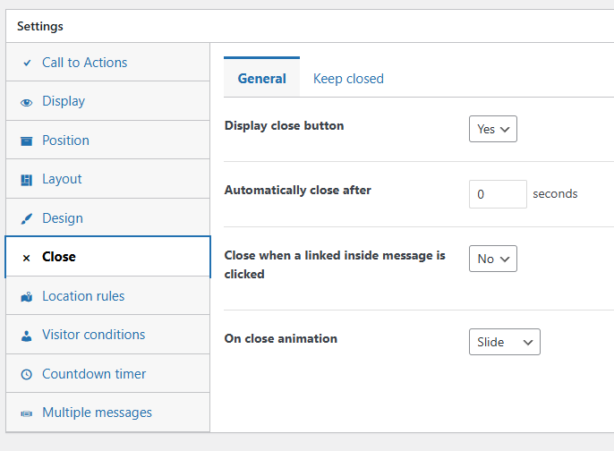

5. **Multiple Messages Configuration**:
   - Add multiple content blocks to a single announcement
   - Configure rotation speed and transition effects
   - Set display order (sequential or random)
   - Control navigation options for users to browse messages

6. **Countdown Timer Setup**:
   - Select timer style and appearance
   - Set the target date and time
   - Configure what happens when the countdown ends
   - Customize labels and formatting

### Best Practices

To maximize the effectiveness of your announcements while maintaining a positive user experience, follow these best practices:

1. **Content Optimization**:
   - Keep messages clear, concise, and action-oriented
   - Use compelling call-to-action text that creates urgency or interest
   - Ensure text is readable against the background color
   - Limit announcements to one key message rather than cramming multiple offers
   - Use proper grammar and spelling to maintain professionalism

2. **Design Considerations**:
   - Match announcement design with your website's branding
   - Use contrasting colors to make announcements stand out without being jarring
   - Ensure text size is readable on all devices
   - Leave sufficient padding around text and buttons
   - Test appearance across different screen sizes [Screenshot Recommended]

3. **Strategic Timing and Targeting**:
   - Avoid showing too many announcements simultaneously
   - Use scheduling to display time-sensitive offers only when relevant
   - Target announcements to the most appropriate audience segments
   - Consider user journey and intent when determining where announcements appear
   - Implement frequency capping to prevent announcement fatigue

4. **Performance Optimization**:
   - Compress images used in announcements
   - Minimize the use of complex animations on mobile devices
   - Test site loading speed with announcements active
   - Consider using asynchronous loading for announcements

## Document Library

### Description

Document Library Lite is a powerful WordPress plugin developed by Barn2 Plugins that creates a comprehensive document management system for the Tonga National Portal. This plugin enables administrators to organize, display, and manage various types of documents in a professional and user-friendly manner. It transforms the portal into a centralized repository where government documents, forms, reports, and publications can be easily accessed, searched, and downloaded by citizens and staff.

The plugin creates a dedicated 'Documents' section in the WordPress admin panel, separate from other content types, allowing for specialized document management. Documents are displayed in a clean, responsive table layout that makes it easy for users to find what they need through instant search, sorting, and filtering capabilities.

Document Library Lite serves as an essential tool for government transparency and information dissemination, making it simple for the Tonga National Portal to maintain an organized collection of official documents that citizens can access anytime.

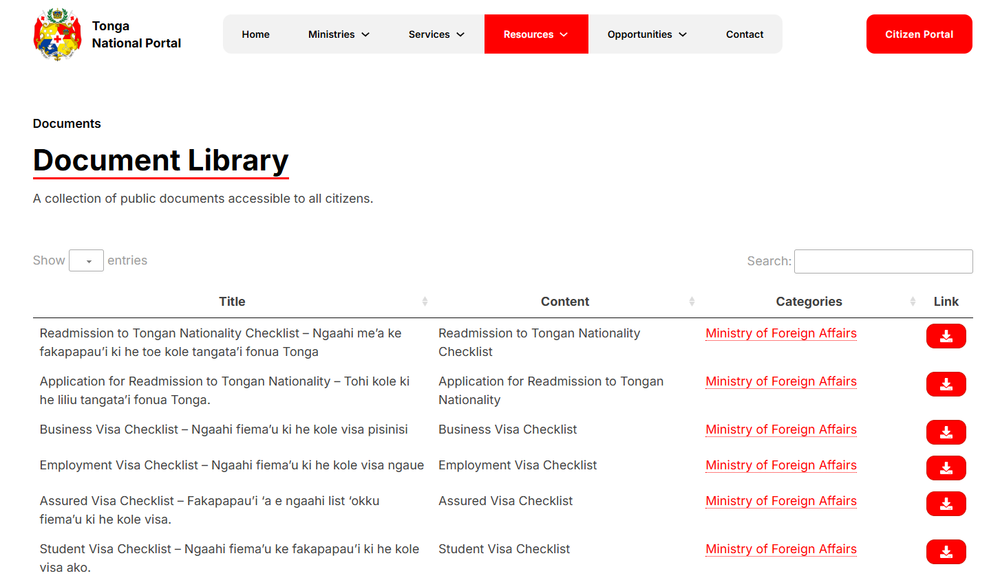

### Key Features

- **Dedicated Document Management**: Creates a separate 'Documents' custom post type in WordPress admin for specialized document handling and organization.

- **Table Layout Display**: Presents documents in a clean, professional table format that's easy to navigate and scan.

- **Instant Search Functionality**: Allows users to quickly find specific documents by typing keywords that filter results in real-time.

- **Sorting and Filtering**: Enables users to sort documents by various criteria (date, title, etc.) and filter by categories or tags.

- **Document Categories and Tags**: Provides robust organization options through hierarchical categories and flexible tagging systems.

- **File Type Support**: Handles various file formats including PDF, Word documents, Excel spreadsheets, PowerPoint presentations, images, and more.

- **Download Management**: Tracks and manages document downloads with direct download links for easy access.

- **Shortcode Integration**: Includes the `[doc_library]` shortcode to display document libraries anywhere on the portal.

- **Responsive Design**: Ensures the document library displays properly across all devices, from desktop computers to mobile phones.

- **User-Friendly Interface**: Features an intuitive interface that requires no technical knowledge for citizens to navigate and use.

- **SEO-Friendly Structure**: Improves document discoverability through search engines with proper document indexing.

### Adding a New Document

Adding documents to the Document Library Lite plugin involves a straightforward process that ensures proper organization and accessibility:

1. **Access the Documents Section**:
   - Log in to the WordPress admin panel
   - Navigate to "Documents" in the left sidebar menu
   - Click on "Add New" to create a new document entry
   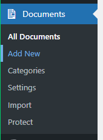

2. **Enter Document Information**:
   - Add a descriptive title for the document
   - Write a summary or description in the main content area
   - (Optional) Add a shorter excerpt that will appear in the document library listing
   - Set a featured image if relevant to the document (e.g., cover page thumbnail)

3. **Upload the Document File**:
   - Scroll to the "Document Details" meta box
   - Click "Upload File" or drag and drop your file into the designated area
   - Supported formats include PDF, DOC, DOCX, XLS, XLSX, PPT, PPTX, and various image formats
   - For larger files, ensure they don't exceed the server's maximum upload size
   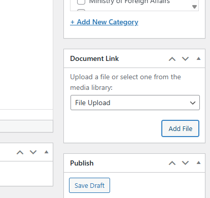

4. **Organize with Categories and Tags**:
   - Assign the document to relevant categories (e.g., "Forms", "Reports", "Legislation")
   - Add tags to further classify the document (e.g., "2023", "Tax", "Healthcare")
   - Categories provide hierarchical organization while tags offer flexible cross-referencing
   - Consider creating a consistent category structure for better organization

5. **Set Document Attributes**:
   - Configure additional document properties:
     - Document date (publication or effective date)
     - Version number (if applicable)
     - Status (Draft, Published, etc.)
     - Access level (Public, Registered Users, etc.)

6. **Preview and Publish**:
   - Use the "Preview" button to check how the document will appear
   - Click "Publish" to make the document live on the portal
   - Alternatively, use "Schedule" to set a future publication date

### Best Practices

To maximize the effectiveness of the Document Library and ensure a positive user experience, follow these best practices:

1. **Document Organization Strategy**:
   - Develop a clear, consistent categorization system before adding many documents
   - Create a balanced category hierarchy that's neither too shallow nor too deep
   - Use descriptive category names that make sense to citizens (avoid government jargon)
   - Implement a standardized tagging convention for cross-referencing related documents
   - Consider creating category-specific document libraries for different sections of the portal

2. **Document Naming and Metadata**:
   - Use clear, descriptive titles that include key information (e.g., "2023 Tax Filing Form - Individual")
   - Include relevant dates in document titles or descriptions when applicable
   - Write concise but informative document descriptions
   - Add complete metadata (categories, tags, dates) to improve searchability
   - Use consistent naming conventions across similar document types

3. **File Optimization**:
   - Convert text-heavy documents to searchable PDFs rather than image scans
   - Compress large files to improve download speeds without sacrificing quality
   - Use PDF bookmarks and table of contents for lengthy documents
   - Ensure documents are accessible according to web standards (proper headings, alt text, etc.)
   - Consider breaking very large documents into logical sections for easier consumption

---

## Location Weather Pro

### Description

Location Weather Pro is a premium WordPress plugin developed by ShapedPlugin, LLC that enables website administrators to display accurate, real-time weather information and forecasts for any location worldwide on their WordPress websites. The plugin retrieves weather data from OpenWeatherMap (OWM), a comprehensive weather data and forecast API provider, and presents it in visually appealing, customizable formats.

As a powerful weather forecasting solution, Location Weather Pro transforms the Tonga National Portal into an informative resource for citizens seeking current weather conditions, hourly updates, extended forecasts, and weather alerts. The plugin offers multiple display options including widgets, shortcodes, and block editor integration, making it flexible for various implementation needs across the portal.

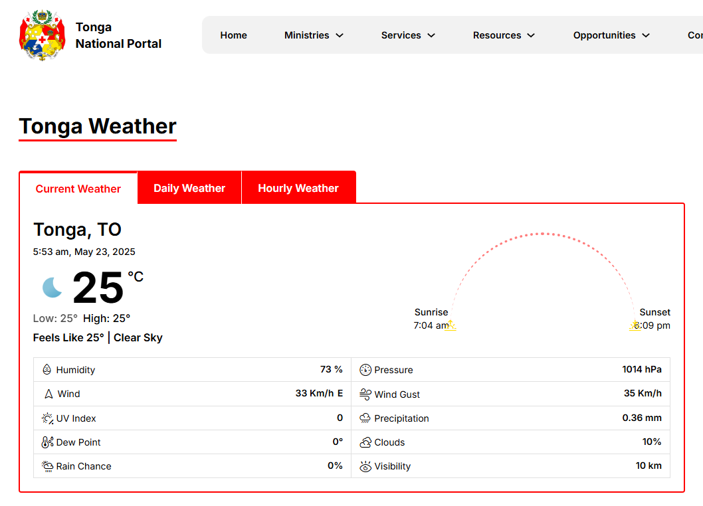

### Key Features

- **Real-time Weather Data**: Displays current temperature, weather conditions, humidity, wind speed and direction, pressure, visibility, and more for any location worldwide.

- **Multiple Location Methods**: Supports various ways to specify locations:
  - City name (e.g., "Nuku'alofa, TO")
  - City ID (OpenWeatherMap unique city identifier)
  - ZIP code with country code
  - Geographic coordinates (latitude and longitude)
  - Auto-detect visitor's location (with user permission)

- **Comprehensive Forecast Options**:
  - Hourly forecasts (up to 48 hours)
  - Daily forecasts (up to 16 days)
  - Detailed weather parameters for each forecast period

- **Multiple Display Layouts**:
  - Vertical layout
  - Horizontal layout
  - Weather card design
  - Minimal design
  - Customizable templates

- **Advanced Customization**:
  - 5 different weather icon sets
  - Custom background images or colors
  - Typography controls (font family, size, color)
  - Responsive design settings for all devices
  - Temperature unit selection (°C or °F)
  - 12-hour or 24-hour time format

- **Weather Alerts Integration**: Displays severe weather alerts and warnings for the selected location.

- **Weather Map**: Interactive weather map showing precipitation, temperature, wind, and cloud layers.

- **Multilingual Support**: Compatible with WPML and other translation plugins for displaying weather information in multiple languages.

- **Shortcode System**: Easy implementation anywhere on the site using shortcodes with various parameters.

- **Widget Ready**: Drag-and-drop widget functionality for sidebars and widget areas.

### Configuration

Setting up Location Weather Pro involves several key steps to ensure accurate weather data display:

1. **API Key Configuration**:
   - Sign up for an OpenWeatherMap account at [openweathermap.org](https://openweathermap.org/)
   - Generate a free or paid API key from your OpenWeatherMap dashboard
   - Navigate to **Location Weather → Settings** in your WordPress admin
   - Enter your API key in the designated field and save changes
   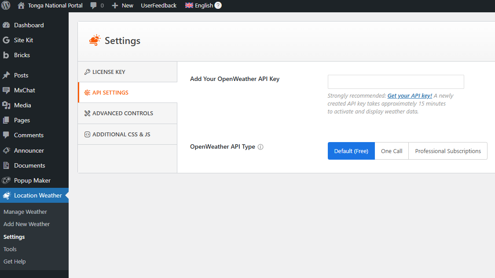

2. **Creating a New Weather Display**:
   - Go to **Location Weather → Add New**
   - Enter a descriptive title for internal reference (e.g., "Nuku'alofa Current Weather")
   - Configure the following settings:

3. **Location Settings**:
   - Select your preferred location method:
     - **City Name**: Enter city name with optional country code (e.g., "Nuku'alofa, TO")
     - **City ID**: Enter the OpenWeatherMap city ID
     - **ZIP Code**: Enter ZIP/postal code with country code
     - **Coordinates**: Enter latitude and longitude values
     - **Auto Detect**: Enable automatic location detection based on visitor's browser
   - For the Tonga National Portal, setting specific locations for major Tongan cities is recommended

4. **Display Options**:
   - **Layout Selection**: Choose from vertical, horizontal, or card layouts
   - **Template**: Select from available design templates
   - **Weather Data**: Configure which weather elements to display:
     - Current conditions (temperature, description, icon)
     - Additional details (humidity, pressure, wind, etc.)
     - Forecast options (hourly, daily, or both)
     - Sunrise/sunset times
   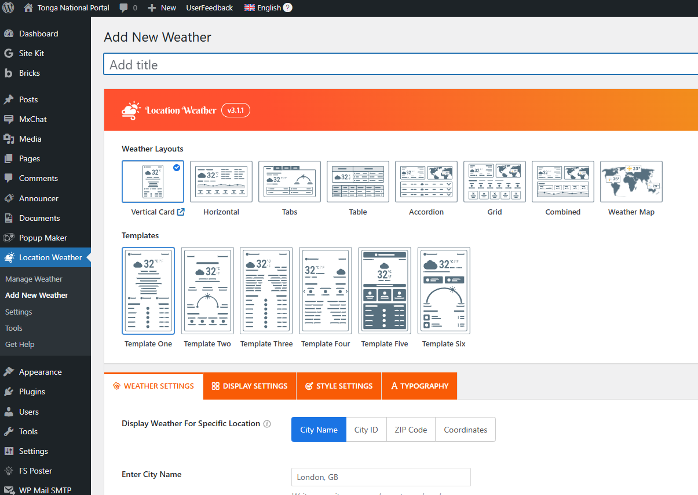

5. **Customization Settings**:
   - **Weather Icons**: Choose from 5 different icon sets
   - **Colors**: Set background, text, and accent colors
   - **Typography**: Configure font family, size, and weight
   - **Responsive Behavior**: Adjust display for different screen sizes
   - **Units**: Select temperature unit (°C or °F) and time format (12h or 24h)

6. **Advanced Options**:
   - **Cache Duration**: Set how long weather data should be cached (recommended: 1-3 hours)
   - **Fallback Data**: Configure what to display if API is unavailable
   - **Custom CSS**: Add custom styling if needed
   - **Weather Alerts**: Enable/disable severe weather alerts display

7. **Save and Generate Shortcode**:
   - Click "Publish" to save your weather display configuration
   - The plugin will generate a unique shortcode for this specific weather display

### Adding a Weather Widget to Homepage

Adding a weather widget to the Tonga National Portal homepage provides visitors with immediate access to current weather conditions:

1. **Create a Dedicated Weather Display**:
   - Follow the steps in the Configuration section to create a new weather display
   - Optimize the display for widget use by selecting a compact layout
   - Focus on current conditions and short-term forecast for homepage display
   - Save the configuration and note the generated shortcode

2. **Widget Implementation Methods**:
   
   **Method 1: Using the Built-in Widget**:
   - Navigate to **Appearance → Widgets** in your WordPress admin
   - Find the "Location Weather Pro" widget in the available widgets list
   - Drag and drop it to your desired widget area (e.g., sidebar, header, or footer)
   - Select the previously created weather display from the dropdown menu
   - Configure widget-specific settings if needed:
     - Title (optional)
     - CSS class (optional)
   - Save the widget settings

   **Method 2: Using a Shortcode in a Text Widget**:
   - Navigate to **Appearance → Widgets**
   - Add a "Text" or "Custom HTML" widget to your desired widget area
   - Paste the shortcode generated for your weather display
   - Save the widget settings

   **Method 3: Using Bricks Page Builder**:
   - If using a page builder for the homepage (Bricks)
   - Add a "Shortcode" element to your homepage design
   - Paste the weather display shortcode into the element
   - Adjust the element's styling and positioning as needed

3. **Optimizing the Homepage Weather Widget**:
   - Keep the widget compact and focused on essential information
   - Consider using auto-location detection for personalized weather
   - Use a design that complements the portal's color scheme
   - Ensure responsive behavior works well on all devices
   - For the Tonga National Portal, prioritize displaying weather for the capital city by default

### Creating a Weather Page with Shortcode

Creating a dedicated weather page allows for more comprehensive weather information display:

1. **Create Multiple Weather Displays**:
   - Create separate weather displays for major locations in Tonga
   - Configure each with appropriate settings:
     - Detailed current conditions
     - Extended forecasts (hourly and daily)
     - Weather maps if desired
     - Weather alerts for each location
   - Save each configuration and note the generated shortcodes

2. **Create a New Weather Page**:
   - Navigate to **Pages → Add New** in your WordPress admin
   - Enter an appropriate title (e.g., "Tonga Weather Forecast")
   - Add descriptive introduction text explaining the weather service

3. **Implement Weather Displays Using Shortcodes**:
   - Use the basic shortcode format: `[location-weather-pro id="X"]` where X is the display ID
   - For multiple locations, add each shortcode in a structured layout
   - Example implementation:
   
   ```
   <h2>Nuku'alofa Weather</h2>
   [location-weather-pro id="1"]
   
   <h2>Neiafu Weather</h2>
   [location-weather-pro id="2"]
   
   <h2>Pangai Weather</h2>
   [location-weather-pro id="3"]
   ```

4. **Advanced Shortcode Parameters**:
   - Customize individual instances with additional parameters:
   - `[location-weather-pro id="1" forecast="daily" days="5"]` - Show 5-day forecast only
   - `[location-weather-pro id="2" current="true" forecast="false"]` - Show current conditions only
   - `[location-weather-pro id="3" units="imperial"]` - Override temperature units

5. **Enhance the Weather Page**:
   - Add explanatory text between weather displays
   - Include a legend explaining weather icons and terminology
   - Consider adding weather safety information or seasonal weather patterns
   - Link to official weather resources for additional information

### Best Practices

To maximize the effectiveness of Location Weather Pro on the Tonga National Portal while maintaining optimal performance and user experience:

1. **API Usage Optimization**:
   - Use appropriate cache settings (2-3 hours recommended) to reduce API calls
   - Monitor API usage to stay within limits of your OpenWeatherMap plan
   - Consider upgrading to a paid API plan for higher call limits during severe weather seasons
   - Implement fallback display options in case of API unavailability

2. **Performance Considerations**:
   - Limit the number of weather displays on a single page to prevent slow loading
   - Optimize weather icons and background images for web use
   - Enable browser caching for weather assets
   - Use minimal layouts on high-traffic pages
   - Test weather displays on low-bandwidth connections

3. **Design and User Experience**:
   - Maintain consistent design language across all weather displays
   - Ensure text has sufficient contrast against backgrounds for readability
   - Use appropriate font sizes, especially for temperature and important data
   - Implement responsive designs that work well on all devices
   - Consider cultural preferences for temperature units (Tonga uses Celsius)

---

## MxChat

### Description

MxChat is a powerful AI-powered chatbot plugin for WordPress developed by MxChat that enhances the Tonga National Portal's user engagement and support capabilities. This versatile solution integrates advanced language models including OpenAI's GPT, Anthropic's Claude, Google's Gemini, xAI's Grok, and DeepSeek to provide intelligent, real-time interactions with portal visitors.

The plugin creates an intuitive chat interface that can be embedded throughout the portal, allowing citizens to quickly find information, get assistance with government services, and receive immediate responses to their queries without waiting for human support. MxChat significantly reduces the burden on support staff by handling routine inquiries automatically while providing a seamless escalation path to human agents when necessary.

What sets MxChat apart is its ability to be trained on the Tonga National Portal's specific content, including pages, posts, documents, and custom knowledge base entries. This ensures that responses are contextually relevant to Tongan government services, policies, and procedures rather than generic information. The chatbot becomes an extension of the portal's information architecture, making government resources more accessible to citizens through natural conversation.

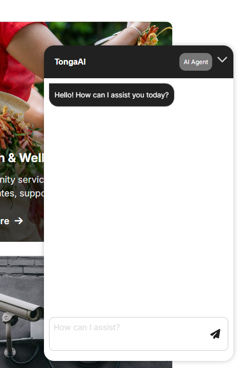

### Key Features

- **Multiple AI Model Integration**: Supports various AI models including OpenAI (GPT-3.5/4), Anthropic Claude, Google Gemini, xAI Grok, and DeepSeek, allowing administrators to choose the most appropriate model for different use cases.

- **Custom Knowledge Base**: Create and manage a specialized knowledge repository that trains the AI on Tonga-specific government information, ensuring accurate and relevant responses.

- **Website Content Training**: Automatically scans and learns from existing portal content, including pages, posts, and documents to provide contextually appropriate answers.

- **PDF Document Upload**: Import PDF documents directly into the knowledge base, making government forms, reports, and publications searchable by the chatbot.

- **Conversation Memory**: Maintains context throughout user interactions, allowing for natural, flowing conversations with appropriate follow-up responses.

- **Multilingual Support**: Communicates with citizens in both English and Tongan languages, making government services more accessible to all citizens.

- **Customizable Chat Interface**: Fully adaptable chat window appearance including colors, fonts, positioning, and behavior to match the Tonga National Portal's design.

- **Shortcode Implementation**: Easy embedding of the chatbot anywhere on the portal using simple shortcodes, with options for different configurations.

- **Chat Transcripts**: Review and analyze past conversations to improve responses and identify common citizen needs.

### LLM API Key Configuration and Selected Models

To deliver the best balance between performance, cost-efficiency, and relevance to your content, two specific AI models from OpenAI were selected: text-embedding-3-large for embedding custom knowledge, and gpt-4o-mini for generating conversational responses.

It is required to add a OpenAI Api Key for the plugin to connect to the LLMs:

   - Go to **MxChat > MxChat** in the WordPress admin menu
   - OpenAI models are already pre-selected and configured.
   - Enter your OpenAI API key.
   - Settings are automatically saved.
   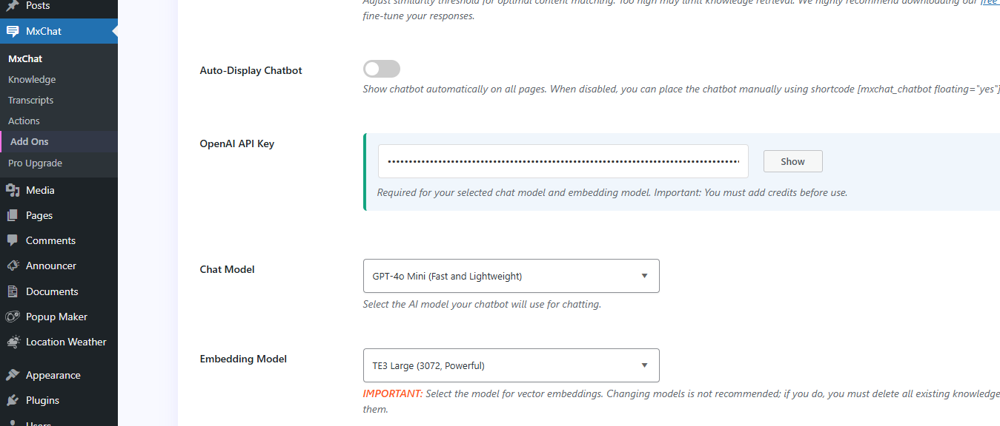

### Adding Content to the Knowledge Base

The knowledge base is the foundation of MxChat's ability to provide accurate, Tonga-specific information. Properly populating and maintaining this knowledge base is crucial for the chatbot's effectiveness:

1. **Accessing the Knowledge Base Manager**:
   - Navigate to **MxChat > Knowledge** in the WordPress admin menu
   - The Knowledge Base dashboard displays existing entries in the knowledge base and several options to import new content.
   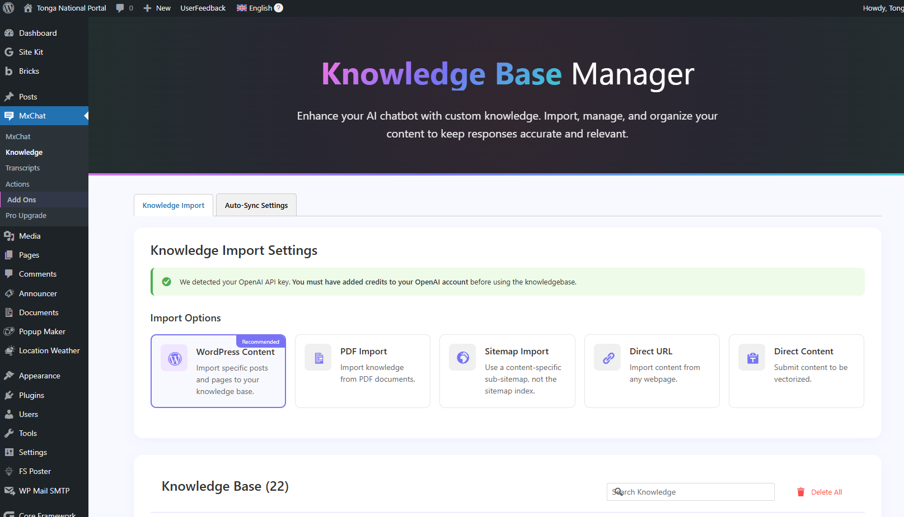

2. **Adding WordPress Content**:
   - Click on the WordPress Content button.
   - A modal will appear with all the content available in the National Portal.
   - You can filter the data by content type and using a search box at the top.
   - Select the content you want to add to the Knoledge Base.
   - Click "Process Selected Content" to add them into the Knowledge base.
   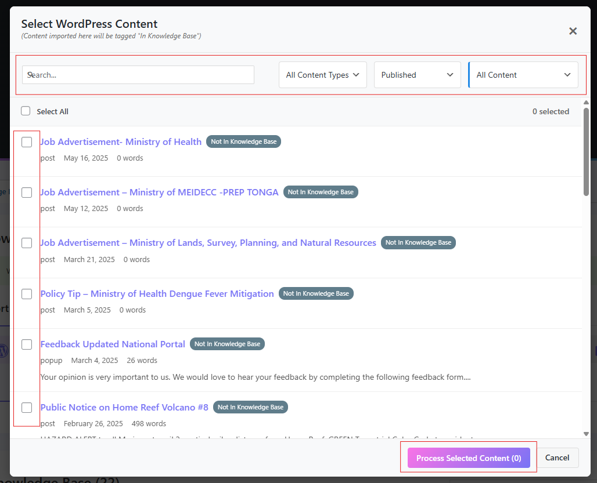

5. **Adding PDF Documents**:
   - Click on the PDF Import box.
   - Enter the URL where the PDF document is stored.
   - Click on Import to process the content.

5. **Adding Content from Sitemap**:
   - Click on the Sitempa Import box.
   - Enter the sitemap URL in the input field.
   - Make sure you use a content-specific sub-sitemap URL, not the sitemap index.
   - Click on Import to process the content.

5. **Adding Content from Any Webpage**:
   - Click on the Direct URL box.
   - Enter the URL of the website in the input field.
   - Click on Import to process the content.

5. **Add Content Directly**:
   - Click on the Direct Content box.
   - Enter the content to add in the text area.
   - Click on Import to process the content.

### Visualize Chat Transcripts

Chat transcripts provide valuable insights into citizen needs and chatbot performance. This feature is available in the Pro version of MxChat:

1. **Accessing Chat Transcripts**:
   - Navigate to **MxChat > Transcripts** in the WordPress admin menu
   - The transcripts dashboard displays recent conversations with a search box
   - Conversations can be exported to excel file
   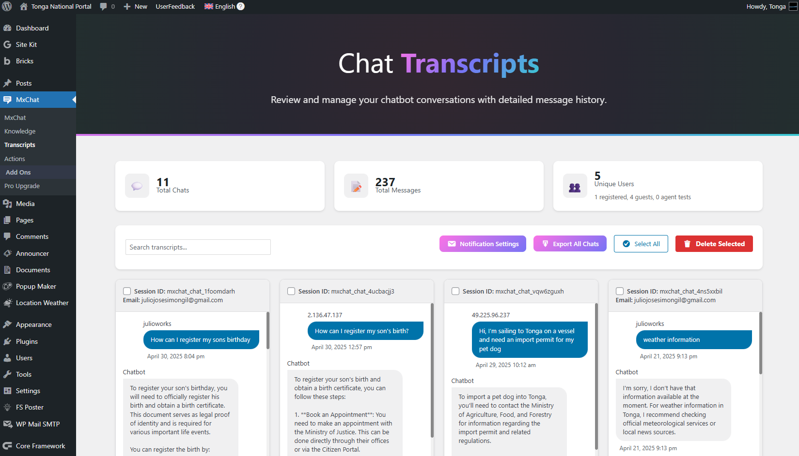

2. **Reviewing Individual Conversations**:
   - It is possible to scroll in a specific conversation to review the content
   - Every conversation has a Session ID
   - This Session ID is searchable
   - It is possible to delete individual conversations

3. **Identifying Improvement Opportunities**:
   - Common questions the AI struggled to answer correctly
   - Knowledge gaps based on user queries

4. **Managing Transcript Data**:
   - Configure transcript retention policies in the settings
   - Manually delete sensitive conversations if needed
   - Export transcript archives for compliance or backup purposes

### Embedding Chatbox in Tonga National Portal

MxChat can be embedded throughout the Tonga National Portal using shortcodes on specific pages or in all pages using a simple portal wide configuration:

1. **Basic Shortcode Implementation**:
   - The standard shortcode to embed the chatbot is: `[mxchat_chatbot floating="yes"]`
   - This will display the chatbot with default settings as configured in the admin panel
   - Place this shortcode in any page, post, or widget area where you want the chatbot to appear

2. **Customized Shortcode Options**:
   - Modify the chatbot appearance and behavior for specific pages using parameters:
   ```
   [mxchat_chatbot 
     floating="yes" # Displays the chatbot as a floating widget on the page.
     floating="no"  # Embeds the chatbot directly within the page content.
   ]
   ```
   - Common parameters include:
     - `floating`: Placement of the chatbox (yes | no)

3. **Creating a Dedicated Chat Page**:
   - Create a new page titled "Chat with Us" or similar
   - Use an expanded shortcode with full-page configuration:
   ```
   [mxchat_chatbot 
     floating="no"
   ]
   ```
   - This creates a dedicated page where citizens can have extended conversations with the chatbot
   - Link to this page from the main navigation or support sections

3. **Activating the Chatbox in all pages**:
   - Is it possible to activate a floating chatbox in all pages.
   - Go to the Wordpress administration panel.
   - Go to MxChat -> MxChat section.
   - Look for the "Auto-Display Chatbot" and activate the switch.
   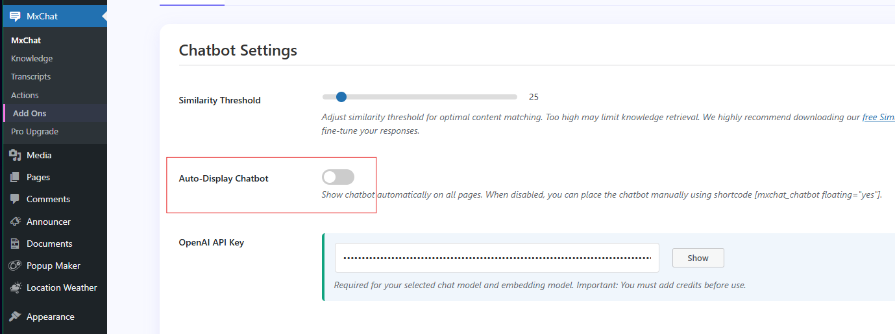

### Best Practices

To maximize the effectiveness of MxChat on the Tonga National Portal while ensuring a positive user experience:

1. **Knowledge Base Optimization**:
   - Develop a comprehensive knowledge base structure before adding content
   - Prioritize high-demand information based on common citizen inquiries
   - Use clear, conversational language that matches how citizens actually ask questions
   - Regularly update the knowledge base with new information and services
   - Remove outdated information promptly to prevent inaccurate responses
   - Create specific entries for frequently asked questions and common procedures
   - Use a consistent format and style across all knowledge base entries
   - Include practical examples and step-by-step instructions where appropriate
   - All knowledge base content must be in an unique language (English).
   - Do not mix the language contents to increase accuracy in bot responses.

2. **Conversation Prompt Design**:
   - Craft a friendly, helpful personality for the chatbot that represents the government appropriately
   - Configure welcome messages that clearly explain what the chatbot can help with
   - Create fallback responses that guide users when the AI cannot answer
   - Develop clear escalation paths to human support for complex issues
   - Use natural language and avoid technical jargon in all bot responses
   - Ensure the chatbot can handle both English and Tongan language interactions
   - Test conversations regularly to identify and fix any awkward or incorrect responses

3. **Visual Integration**:
   - Customize the chatbot appearance to match the Tonga National Portal's branding
   - Test the chat interface on multiple devices and screen sizes
   - Position the chat widget where it's visible but not intrusive

4. **Performance and Security**:
   - Regularly monitor API usage to manage costs
   - Configure reasonable token limits to balance comprehensive answers with performance
   - Ensure all personal data handling complies with privacy regulations
   - Regularly review chat transcripts to identify security or privacy concerns
   - Regularly backup the knowledge base and configuration settings

---

## Popup Maker

### Description

Popup Maker is a powerful WordPress plugin developed by Code Atlantic LLC that enables website administrators to create and manage customizable popup windows on their WordPress websites. As one of the most popular popup solutions with over 780,000 active installations, Popup Maker provides a comprehensive toolkit for creating attention-grabbing, conversion-focused popups that can significantly enhance user engagement and drive specific actions on the Tonga National Portal.

The plugin offers an intuitive interface for designing popups with various triggers, animations, and targeting options, making it suitable for a wide range of applications including announcements, newsletter signups, important notifications, content upgrades, and promotional offers. Popup Maker stands out for its flexibility, allowing administrators to create popups that integrate seamlessly with existing forms, page builders, and other WordPress plugins without requiring coding knowledge.

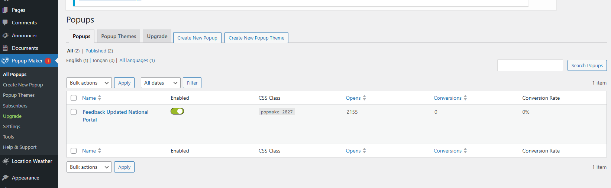

### Key Features

- **Unlimited Popup Creation**: Create and manage an unlimited number of popups with different designs, content, and configurations to serve various purposes across the portal.

- **Multiple Trigger Options**: Configure popups to appear based on various user actions.

- **Advanced Targeting Controls**: Display popups only to specific audiences.

- **Customizable Appearance**: Extensive styling options.

### Creating a Popup

Creating an effective popup in Popup Maker involves a straightforward process:

1. **Access the Popup Maker Dashboard**:
   - Log in to the WordPress admin panel
   - Navigate to "Popup Maker" in the left sidebar menu
   - Click on "Create New Popup" to create a new popup
   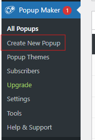

2. **Configure Basic Settings**:
   - Enter a descriptive name for internal reference (e.g., "Newsletter Signup Popup")
   - Add a title (optional) that will appear at the top of the popup

3. **Design Popup Content**:
   - Use the WordPress editor to add and format content
   - Insert text, images, videos, or other media
   - Customize typography, colors, and spacing
   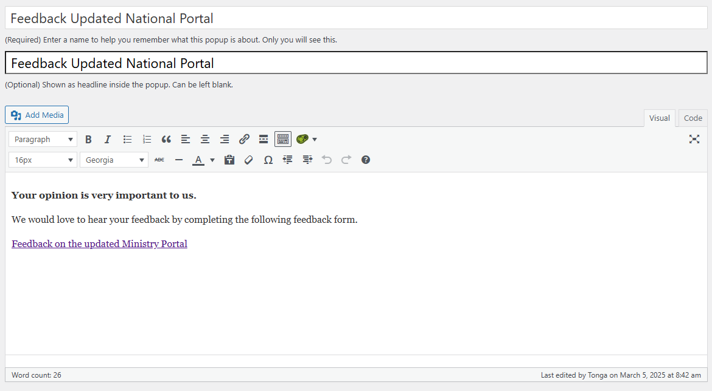

4. **Configure Trigger Settings**:
   - Navigate to the "Triggers" tab
   - Click "Add New Trigger"
   - Select the trigger type:
     - Time Delay / Auto Open 
     - Click Open 
     - Form Submission
   - Configure trigger-specific settings:
     - For time delay: set the delay in milliseconds
     - For click: specify the CSS selector for clickable elements

5. **Set Targeting Conditions**:
   - Navigate to the "Conditions" tab
   - Click "Choose a condition" select field.
   - Configure where the popup should appear:
     - All pages or specific pages/posts
     - Specific categories or tags
     - Custom post types
   - Add multiple condition groups for complex targeting scenarios
   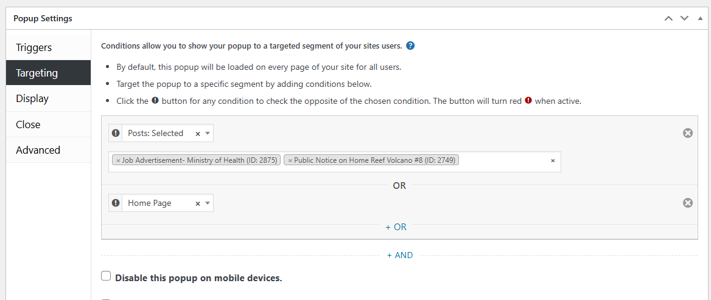

6. **Advanced Settings**:
   - Configure additional options:
     - Animation effects and timing
     - Overlay settings (color, opacity, click behavior)
     - Close button appearance and position
     - Accessibility settings
     - Z-index for proper layering with other page elements

7. **Save and Test**:
   - Click "Publish" to save the popup
   - Use the "Preview" button to test the popup behavior
   - Check appearance and functionality across different devices
   - Make adjustments as needed before final deployment

### Best Practices

To maximize the effectiveness of popups while maintaining a positive user experience on the Tonga National Portal:

1. **Strategic Popup Timing and Frequency**:
   - Avoid showing popups immediately when users land on the site
   - Allow users to engage with content before displaying popups (15-30 second delay)
   - Limit the number of popups shown in a single session
   - Use cookies to prevent showing the same popup repeatedly to returning visitors

2. **Responsive Design Considerations**:
   - Create separate popup configurations for mobile and desktop users
   - Use smaller, less intrusive popups on mobile devices
   - Ensure text is readable without zooming on all screen sizes
   - Test popups across multiple devices and browsers
   - Make close buttons easily tappable on touch screens

## Conclusion

The plugins installed on the Tonga National Portal work together to create a comprehensive, user-friendly, and efficient government portal. Regular maintenance, updates, and configuration reviews are essential to ensure optimal performance and security.