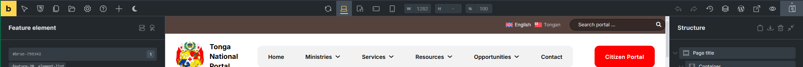
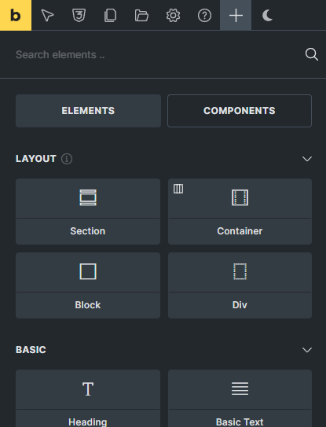
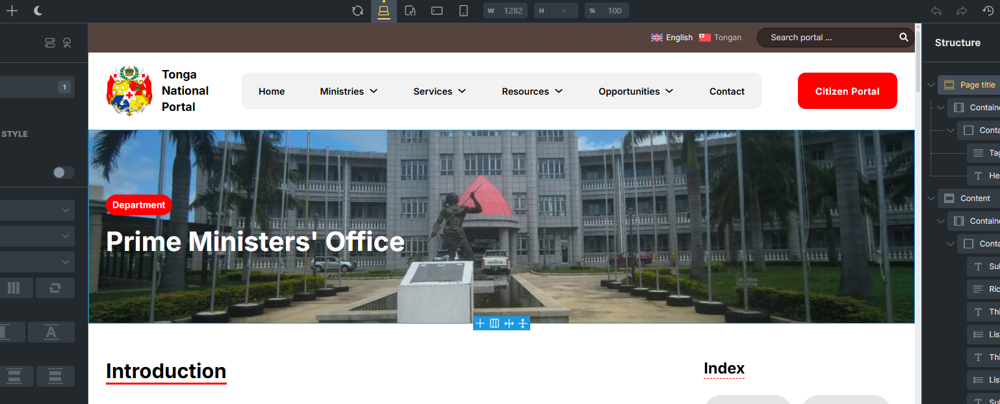
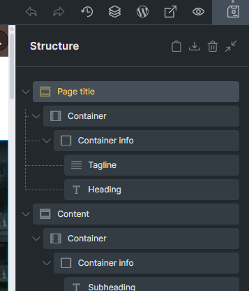
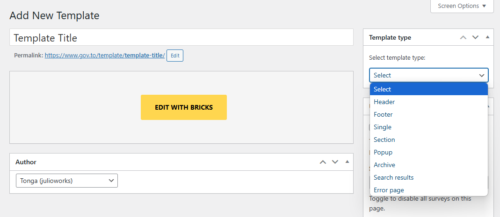
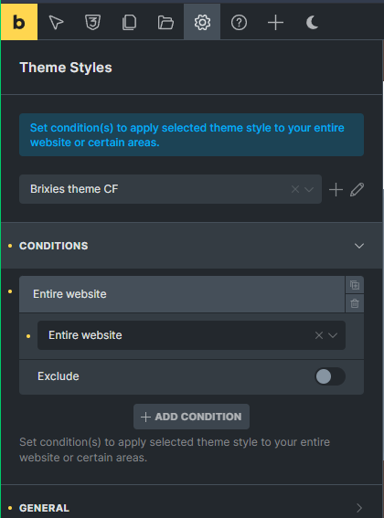
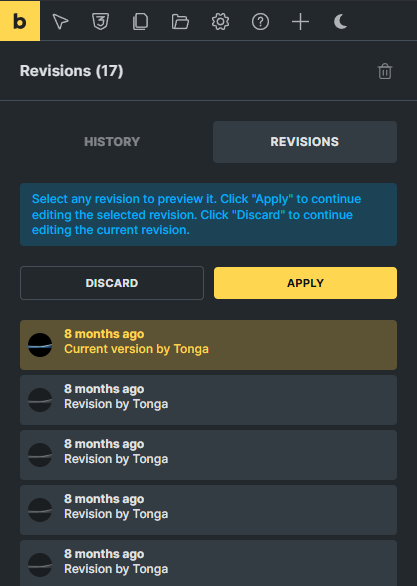
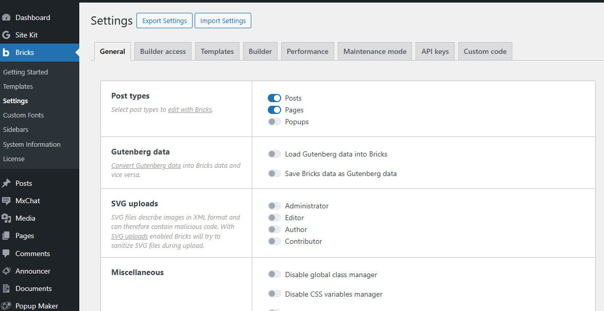
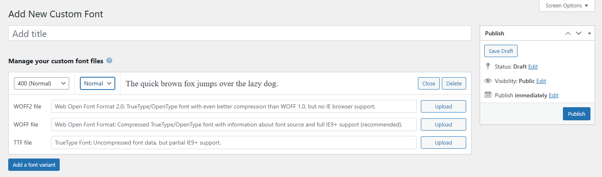
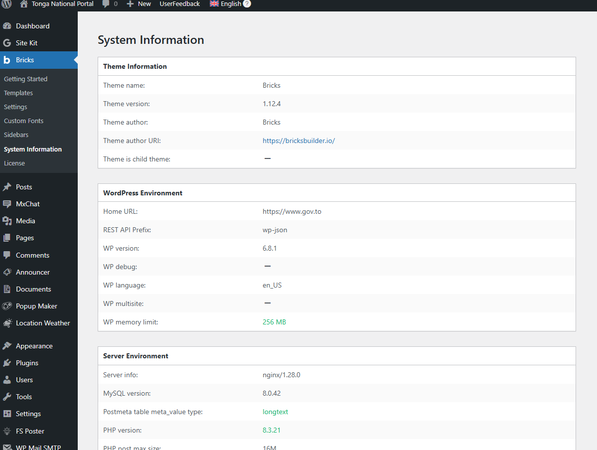

# Template Management with Bricks Builder

## Definition

Bricks Builder is a powerful WordPress page builder that allows you to create custom templates for your website without writing code. Templates in Bricks Builder are reusable layouts that define how different parts of your website appear, such as headers, footers, single posts, archive pages, and more.

Key template concepts in Bricks Builder:

- **Global Templates**: Apply to your entire website (headers, footers)
- **Content Templates**: Control how specific content types display (posts, pages, custom post types)
- **Archive Templates**: Define the layout for archive pages, category pages, and other collection displays
- **Template Conditions**: Rules that determine where and when templates are applied
- **Template Hierarchy**: The order of priority when multiple templates could apply to the same page

Templates in Bricks Builder use a visual drag-and-drop interface, making it accessible for beginners while offering advanced capabilities for experienced designers.

## Editor UI Guide

The Bricks Builder editor interface is divided into several key areas that work together to provide a comprehensive template building experience.

### Main Editor Components

1. **Top Bar**
   - Save button
   - Responsive mode toggles (desktop, tablet, mobile)
   - Settings button (opens global settings panel)
   - Preview button (view template as it will appear on the frontend)
   - Structure button (shows template structure in outline form)
   - Revisions button (access previous versions of the template)
   - Exit to Dashboard button

   

2. **Left Sidebar**
   - Elements panel: Contains all available building blocks
   - Element Configurator: Shows configurable options for the selected element
   - Settings: Access to Theme Styles and Page Settings

    

3. **Canvas Area**
   - Main working area where you build your template
   - WYSIWYG (What You See Is What You Get) interface
   - Direct editing of content and styling
   - Context-sensitive controls appear when elements are selected

   

4. **Right Sidebar**
   - Navigation area for the different page elements
   - Page elements are nestable
   - Posibility to copy and pages elements between pages

   [Screenshot Recommended: Right sidebar showing style options for a selected element]
   

### Working with Elements

1. **Adding Elements**
   - Drag elements from the left sidebar onto the canvas
   - Use the "+" button that appears when hovering over containers
   - Search for elements using the search bar at the top of the elements panel

2. **Selecting Elements**
   - Click directly on an element in the canvas
   - Use the Structure panel to select nested elements
   - Use breadcrumb navigation at the bottom of the screen

3. **Moving Elements**
   - Drag and drop elements within the canvas
   - Use the Structure panel to drag elements to new positions
   - Cut and paste elements using keyboard shortcuts or right-click menu

4. **Styling Elements**
   - Use the Style tab in the left sidebar
   - Apply global styles or create custom styles
   - Use responsive controls to adjust styling for different devices

## Manage Templates

Managing templates effectively is crucial for maintaining a well-organized website. Bricks Builder provides comprehensive tools for creating, organizing, and applying templates.

### Creating Templates

1. Navigate to Bricks > Templates in your WordPress admin dashboard
2. Click "Add New" to create a new template
3. Enter a descriptive name for your template
4. Select the template type:
   - Header
   - Footer
   - Single (for individual posts/pages)
   - Section
   - Popup
   - Archive (for collection pages)
   - Search Results
   - Error 404
5. Click "Create Template" to enter the Bricks Builder editor

### Template Conditions

Template conditions determine where your templates will be displayed on your website:

1. In the template editor, click "Settings" in the top bar
2. Navigate to "Theme Styles" -> "Conditions" tab
3. Add one or more conditions:
   - Include: Pages where the template WILL be displayed
   - Exclude: Pages where the template WILL NOT be displayed
4. Available condition types:
   - Entire Website
   - Front page
   - Post page
   - Archive
   - Search results
   - Error page
   - Terms
   - Individual
5. Save your conditions

### Template Organization

- **Naming Convention**: Use clear, descriptive names (e.g., "Product Single Template" rather than "Template 1")
- **Tags and Categories**: Assign tags and categories to templates for easier filtering
- **Template Library**: Access your saved templates from the Templates screen
- **Import/Export**: Share templates between sites using the import/export feature

### Template Priority

When multiple templates could apply to the same page, Bricks Builder uses a priority system:

1. Templates with more specific conditions take precedence over general ones
2. Custom templates override default templates
3. User-created templates override theme templates
4. Manual priority adjustment is available in template settings

### Template Revisions

Bricks Builder maintains a history of changes to your templates:

1. Click the "Revisions" button in the top bar while editing a template
2. View a list of previous versions with timestamps and author information
3. Preview any revision before restoring
4. Restore a previous version if needed
5. Compare revisions to see what changed

## Bricks Settings

Bricks Builder includes comprehensive settings that control how templates function and appear across your website.

### Global Settings

Access global settings by clicking the "Settings" icon in the top bar of the Bricks editor:

1. **General**
   - Posts types to edit with Bricks
   - Convert Gutenberg data into Bricsk and viceversa
   - Custom breakpoints
   - Other CSS global configurations

2. **Builder access**
   - Set builder access per user role

3. **Templates**
   - Automatic screenshots on edit
   - Thumbnail dimension options
   - Password protection
   - Loading templates from a remote Bricks installation

4. **Builder**
   - Autosave interval
   - Builder template
   - Canvas configurations
   - Dynamic data configurations

5. **Performance**
   - Disable options for performance
   - Cache query configuration
   - CSS loading methods

6. **Maintenance mode**
   - Toogle to activate and disable the maintenance mode
   - Template selection for maintenance
   - Baypass maintenance options

7. **API Keys**
   - API Keys for several 3rd party software

8. **Custom code**
   - Code exectuion security
   - Custom CSS code
   - Custom scripts loading

## Custom Fonts

Bricks allows you to add any font you want. From web-safe fonts to Google fonts, and of course, uploading your own custom fonts in your WordPress dashboard under Bricks > Custom Fonts. The latter which we are going to have a more in-depth look at now.

### Adding Custom Fonts

1. Navigate to Bricks > Custom Fonts in your WordPress admin dashboard
2. Click "Add New Custom Font"
3. Enter the font title (how it will appear in the font selector)
4. Click on "Add a font variant" or Edit the present one by clicking at "Edit"
5. On every variant, you can select the font weight and style
6. When editing the font variant, you can upload WOFF2, WOFF or TTF files

### Font Types Supported

The following font formats are enabled by default:

- **WOFF (Web Open Font Format)**: This is the recommend font format used by all modern browsers. Font data is compressed and therefore loads faster than the same font provided via TrueType or OpenType files. Full support for IE9+.
- **WOFF2 (Web Open Font Format 2.0)**: TrueType/OpenType font with even better compression than WOFF 1.0. No IE browser support.
- **TTF (TrueType Font)**: Uncompressed font data, but partial IE9+ support.

The recommended font format is **WOFF**, with a current browser support of 98.26%, and full support for IE9+.

### Using Custom Fonts in Templates

1. Select any text element in your template
2. Open the Style tab in the left sidebar
3. Find the Typography section
4. Select your custom font from the Font Family dropdown
5. Adjust weight, style, size, and other typography settings
6. Apply the font to specific elements or set as a global default

## System Information

The System Information section provides valuable data about your Bricks Builder installation and server environment, which is essential for troubleshooting and optimization.

### Accessing System Information

1. Navigate to Bricks > System Information in your WordPress admin dashboard
2. View comprehensive information about your setup

### Available Information

1. **Theme Information**
   - Theme version

2. **Wordpress Environment**
   - Home URL
   - Rest API prefix
   - WP environment data
   - WP memorey limit should be more than 64 MB

3. **Server Environment**
   - Server info
   - Database version
   - Postmeta table type
   - PHP environment data

4. **Active Plugins**
   - List of active plugins with versions
   - Plugin conflicts or compatibility notes
   - Required plugins status

### Using System Information for Troubleshooting

At the System Information section, you will find several variables with colors. Those variables colors can be red or green. By having all of them in green, the system is working under the recommended settings.

1. **Performance Issues**
   - Check PHP memory limits
   - Verify server resources are adequate
   - Review active plugins for conflicts

2. **Compatibility Problems**
   - Ensure PHP version meets requirements
   - Check for outdated plugins
   - Verify WordPress version compatibility

3. **Support Requests**
   - Copy system information when submitting support tickets
   - Identify potential issues before contacting support
   - Provide complete environment details for faster resolution

### Maintenance Recommendations

Based on your system information, Bricks Builder may provide recommendations for:

- PHP version upgrades
- Memory limit increases
- Plugin updates or replacements
- Server configuration changes
- Performance optimizations

Regular review of your system information helps ensure optimal performance and compatibility as your website grows and evolves.
