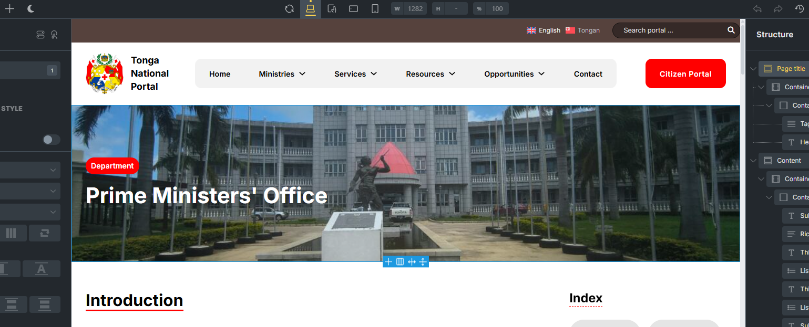
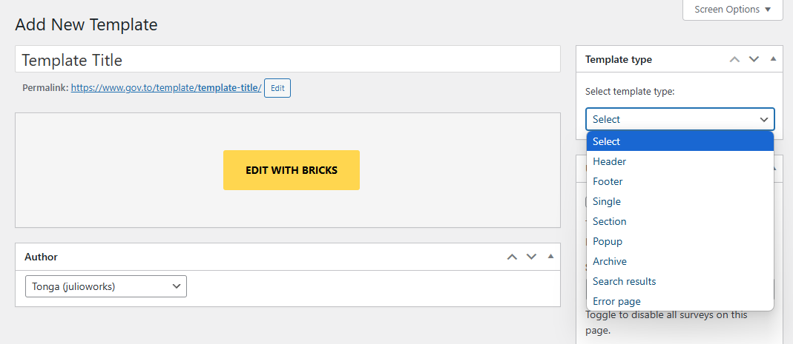
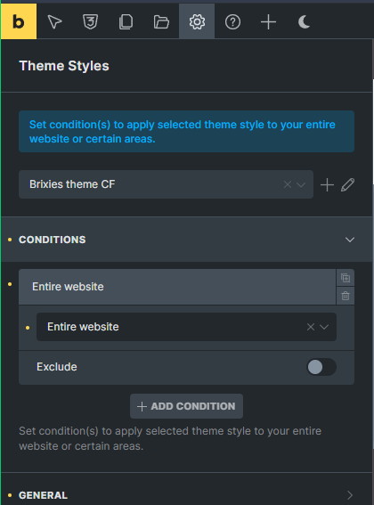
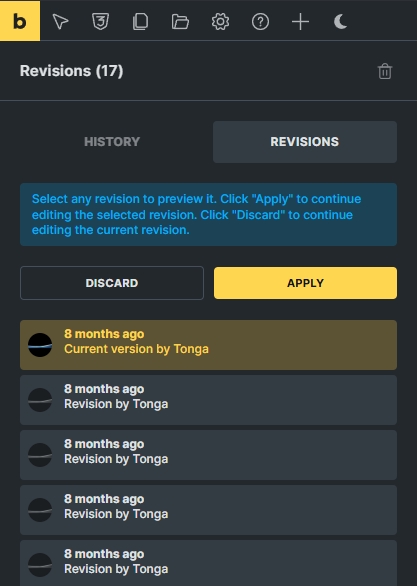

## Definition

<Card title="Bricks Builder" icon="cubes">
  Bricks Builder is a powerful WordPress page builder that allows you to create custom templates for your website without writing code. Templates in Bricks Builder are reusable layouts that define how different parts of your website appear, such as headers, footers, single posts, archive pages, and more.
</Card>

Key template concepts in Bricks Builder:

<CardGroup cols={2}>
  <Card title="Global Templates" icon="globe">
    Apply to your entire website (headers, footers)
  </Card>
  <Card title="Content Templates" icon="file-lines">
    Control how specific content types display (posts, pages, custom post types)
  </Card>
  <Card title="Archive Templates" icon="folder-open">
    Define the layout for archive pages, category pages, and other collection displays
  </Card>
  <Card title="Template Conditions" icon="filter">
    Rules that determine where and when templates are applied
  </Card>
  <Card title="Template Hierarchy" icon="sitemap">
    The order of priority when multiple templates could apply to the same page
  </Card>
</CardGroup>

<Callout type="info">
  Templates in Bricks Builder use a visual drag-and-drop interface, making it accessible for beginners while offering advanced capabilities for experienced designers.
</Callout>

## Editor UI Guide

The Bricks Builder editor interface is divided into several key areas that work together to provide a comprehensive template building experience.

### Main Editor Components

<Steps>
  <Step title="Top Bar">
    - Save button
    - Responsive mode toggles (desktop, tablet, mobile)
    - Settings button (opens global settings panel)
    - Preview button (view template as it will appear on the frontend)
    - Structure button (shows template structure in outline form)
    - Revisions button (access previous versions of the template)
    - Exit to Dashboard button
    
    <Frame>
      
    </Frame>
  </Step>
  <Step title="Left Sidebar">
    - Elements panel: Contains all available building blocks
    - Element Configurator: Shows configurable options for the selected element
    - Settings: Access to Theme Styles and Page Settings
    
    <Frame>
      
    </Frame>
  </Step>
  <Step title="Canvas Area">
    - Main working area where you build your template
    - WYSIWYG (What You See Is What You Get) interface
    - Direct editing of content and styling
    - Context-sensitive controls appear when elements are selected
    
    <Frame>
      
    </Frame>
  </Step>
  <Step title="Right Sidebar">
    - Navigation area for the different page elements
    - Page elements are nestable
    - Possibility to copy and pages elements between pages
    
    <Frame>
      
    </Frame>
  </Step>
</Steps>

### Working with Elements

<AccordionGroup>
  <Accordion title="Adding Elements">
    - Drag elements from the left sidebar onto the canvas
    - Use the "+" button that appears when hovering over containers
    - Search for elements using the search bar at the top of the elements panel
  </Accordion>
  <Accordion title="Selecting Elements">
    - Click directly on an element in the canvas
    - Use the Structure panel to select nested elements
    - Use breadcrumb navigation at the bottom of the screen
  </Accordion>
  <Accordion title="Moving Elements">
    - Drag and drop elements within the canvas
    - Use the Structure panel to drag elements to new positions
    - Cut and paste elements using keyboard shortcuts or right-click menu
  </Accordion>
  <Accordion title="Styling Elements">
    - Use the Style tab in the left sidebar
    - Apply global styles or create custom styles
    - Use responsive controls to adjust styling for different devices
  </Accordion>
</AccordionGroup>

## Manage Templates

Managing templates effectively is crucial for maintaining a well-organized website. Bricks Builder provides comprehensive tools for creating, organizing, and applying templates.

### Creating Templates

<Steps>
  <Step title="Navigate to Templates">
    Navigate to Bricks > Templates in your WordPress admin dashboard
  </Step>
  <Step title="Add New Template">
    Click "Add New" to create a new template
  </Step>
  <Step title="Name Your Template">
    Enter a descriptive name for your template
  </Step>
  <Step title="Select Template Type">
    Choose from available template types:
    - Header
    - Footer
    - Single (for individual posts/pages)
    - Section
    - Popup
    - Archive (for collection pages)
    - Search Results
    - Error 404
  </Step>
  <Step title="Create Template">
    Click "Create Template" to enter the Bricks Builder editor
  </Step>
</Steps>

<Frame>
  
</Frame>

### Template Conditions

<Callout type="info">
  Template conditions determine where your templates will be displayed on your website.
</Callout>

<Steps>
  <Step title="Access Conditions">
    In the template editor, click "Settings" in the top bar
  </Step>
  <Step title="Navigate to Conditions">
    Navigate to "Theme Styles" -> "Conditions" tab
  </Step>
  <Step title="Add Conditions">
    Add one or more conditions:
    - Include: Pages where the template WILL be displayed
    - Exclude: Pages where the template WILL NOT be displayed
  </Step>
  <Step title="Select Condition Types">
    Choose from available condition types:
    - Entire Website
    - Front page
    - Post page
    - Archive
    - Search results
    - Error page
    - Terms
    - Individual
  </Step>
  <Step title="Save Conditions">
    Save your conditions to apply them
  </Step>
</Steps>

<Frame>
  
</Frame>

### Template Organization

<CardGroup cols={2}>
  <Card title="Naming Convention" icon="tag">
    Use clear, descriptive names (e.g., "Product Single Template" rather than "Template 1")
  </Card>
  <Card title="Tags and Categories" icon="tags">
    Assign tags and categories to templates for easier filtering
  </Card>
  <Card title="Template Library" icon="book">
    Access your saved templates from the Templates screen
  </Card>
  <Card title="Import/Export" icon="file-export">
    Share templates between sites using the import/export feature
  </Card>
</CardGroup>

### Template Priority

<Callout type="warning">
  When multiple templates could apply to the same page, Bricks Builder uses a priority system.
</Callout>

<AccordionGroup>
  <Accordion title="Specificity Rules">
    Templates with more specific conditions take precedence over general ones
  </Accordion>
  <Accordion title="Custom vs Default">
    Custom templates override default templates
  </Accordion>
  <Accordion title="User vs Theme">
    User-created templates override theme templates
  </Accordion>
  <Accordion title="Manual Adjustment">
    Manual priority adjustment is available in template settings
  </Accordion>
</AccordionGroup>

### Template Revisions

<Steps>
  <Step title="Access Revisions">
    Click the "Revisions" button in the top bar while editing a template
  </Step>
  <Step title="View History">
    View a list of previous versions with timestamps and author information
  </Step>
  <Step title="Preview Revisions">
    Preview any revision before restoring
  </Step>
  <Step title="Restore Previous Versions">
    Restore a previous version if needed
  </Step>
  <Step title="Compare Changes">
    Compare revisions to see what changed
  </Step>
</Steps>

<Frame>
  
</Frame>

## Bricks Settings

Bricks Builder includes comprehensive settings that control how templates function and appear across your website.

### Global Settings

<Tabs>
  <Tab title="General">
    <AccordionGroup>
      <Accordion title="Post Types">
        Posts types to edit with Bricks
      </Accordion>
      <Accordion title="Gutenberg Integration">
        Convert Gutenberg data into Bricks and vice versa
      </Accordion>
      <Accordion title="Breakpoints">
        Custom breakpoints for responsive design
      </Accordion>
      <Accordion title="CSS Configuration">
        Other CSS global configurations
      </Accordion>
    </AccordionGroup>
  </Tab>
  <Tab title="Builder Access">
    <AccordionGroup>
      <Accordion title="User Roles">
        Set builder access per user role
      </Accordion>
    </AccordionGroup>
  </Tab>
  <Tab title="Templates">
    <AccordionGroup>
      <Accordion title="Screenshots">
        Automatic screenshots on edit
      </Accordion>
      <Accordion title="Thumbnails">
        Thumbnail dimension options
      </Accordion>
      <Accordion title="Protection">
        Password protection
      </Accordion>
      <Accordion title="Remote Loading">
        Loading templates from a remote Bricks installation
      </Accordion>
    </AccordionGroup>
  </Tab>
  <Tab title="Builder">
    <AccordionGroup>
      <Accordion title="Autosave">
        Autosave interval
      </Accordion>
      <Accordion title="Template">
        Builder template
      </Accordion>
      <Accordion title="Canvas">
        Canvas configurations
      </Accordion>
      <Accordion title="Dynamic Data">
        Dynamic data configurations
      </Accordion>
    </AccordionGroup>
  </Tab>
  <Tab title="Performance">
    <AccordionGroup>
      <Accordion title="Optimization">
        Disable options for performance
      </Accordion>
      <Accordion title="Query Cache">
        Cache query configuration
      </Accordion>
      <Accordion title="CSS Loading">
        CSS loading methods
      </Accordion>
    </AccordionGroup>
  </Tab>
  <Tab title="Maintenance Mode">
    <AccordionGroup>
      <Accordion title="Activation">
        Toggle to activate and disable the maintenance mode
      </Accordion>
      <Accordion title="Template">
        Template selection for maintenance
      </Accordion>
      <Accordion title="Bypass">
        Bypass maintenance options
      </Accordion>
    </AccordionGroup>
  </Tab>
  <Tab title="API Keys">
    <AccordionGroup>
      <Accordion title="Third-Party Integration">
        API Keys for several 3rd party software
      </Accordion>
    </AccordionGroup>
  </Tab>
  <Tab title="Custom Code">
    <AccordionGroup>
      <Accordion title="Security">
        Code execution security
      </Accordion>
      <Accordion title="CSS">
        Custom CSS code
      </Accordion>
      <Accordion title="Scripts">
        Custom scripts loading
      </Accordion>
    </AccordionGroup>
  </Tab>
</Tabs>

<Frame>
  
</Frame>

## Custom Fonts

<Callout type="info">
  Bricks allows you to add any font you want. From web-safe fonts to Google fonts, and of course, uploading your own custom fonts in your WordPress dashboard under Bricks > Custom Fonts.
</Callout>

### Adding Custom Fonts

<Steps>
  <Step title="Navigate to Custom Fonts">
    Navigate to Bricks > Custom Fonts in your WordPress admin dashboard
  </Step>
  <Step title="Add New Font">
    Click "Add New Custom Font"
  </Step>
  <Step title="Enter Font Title">
    Enter the font title (how it will appear in the font selector)
  </Step>
  <Step title="Manage Font Variants">
    Click on "Add a font variant" or Edit the present one by clicking at "Edit"
  </Step>
  <Step title="Configure Variants">
    On every variant, you can select the font weight and style
  </Step>
  <Step title="Upload Font Files">
    When editing the font variant, you can upload WOFF2, WOFF or TTF files
  </Step>
</Steps>

## System Information

<Card title="System Information" icon="info-circle">
  The System Information section provides valuable data about your Bricks Builder installation and server environment, which is essential for troubleshooting and optimization.
</Card>

### Accessing System Information

<Steps>
  <Step title="Navigate to System Information">
    Navigate to Bricks > System Information in your WordPress admin dashboard
  </Step>
  <Step title="View System Details">
    View comprehensive information about your setup
  </Step>
</Steps>

<Frame>
  
</Frame>

### Available Information

<Tabs>
  <Tab title="Theme Information">
    <AccordionGroup>
      <Accordion title="Version">
        Theme version
      </Accordion>
    </AccordionGroup>
  </Tab>
  <Tab title="WordPress Environment">
    <AccordionGroup>
      <Accordion title="URLs">
        Home URL and Rest API prefix
      </Accordion>
      <Accordion title="Environment Data">
        WP environment data
      </Accordion>
      <Accordion title="Memory Limit">
        WP memory limit should be more than 64 MB
      </Accordion>
    </AccordionGroup>
  </Tab>
  <Tab title="Server Environment">
    <AccordionGroup>
      <Accordion title="Server Information">
        Server info
      </Accordion>
      <Accordion title="Database">
        Database version and Postmeta table type
      </Accordion>
      <Accordion title="PHP Environment">
        PHP environment data
      </Accordion>
    </AccordionGroup>
  </Tab>
  <Tab title="Active Plugins">
    <AccordionGroup>
      <Accordion title="Plugin List">
        List of active plugins with versions
      </Accordion>
      <Accordion title="Compatibility">
        Plugin conflicts or compatibility notes
      </Accordion>
      <Accordion title="Required Plugins">
        Required plugins status
      </Accordion>
    </AccordionGroup>
  </Tab>
</Tabs>

### Using System Information for Troubleshooting

<Callout type="warning">
  At the System Information section, you will find several variables with colors. Those variables colors can be red or green. By having all of them in green, the system is working under the recommended settings.
</Callout>

<CardGroup cols={2}>
  <Card title="Performance Issues" icon="tachometer-alt">
    - Check PHP memory limits
    - Verify server resources are adequate
    - Review active plugins for conflicts
  </Card>
  <Card title="Compatibility Problems" icon="puzzle-piece">
    - Ensure PHP version meets requirements
    - Check for outdated plugins
    - Verify WordPress version compatibility
  </Card>
  <Card title="Support Requests" icon="headset">
    - Copy system information when submitting support tickets
    - Identify potential issues before contacting support
    - Provide complete environment details for faster resolution
  </Card>
  <Card title="Maintenance Recommendations" icon="tools">
    - PHP version upgrades
    - Memory limit increases
    - Plugin updates or replacements
    - Server configuration changes
    - Performance optimizations
  </Card>
</CardGroup>

<Note>
  Regular review of your system information helps ensure optimal performance and compatibility as your website grows and evolves.
</Note>

<Frame>
  
</Frame>

### Font Types Supported

<CardGroup cols={3}>
  <Card title="WOFF" icon="font">
    Web Open Font Format: Compressed font data for faster loading. Full support for IE9+. Recommended format with 98.26% browser support.
  </Card>
  <Card title="WOFF2" icon="font">
    Web Open Font Format 2.0: TrueType/OpenType font with even better compression than WOFF 1.0. No IE browser support.
  </Card>
  <Card title="TTF" icon="font">
    TrueType Font: Uncompressed font data, but partial IE9+ support.
  </Card>
</CardGroup>

### Using Custom Fonts in Templates

<Steps>
  <Step title="Select Text Element">
    Select any text element in your template
  </Step>
  <Step title="Open Style Tab">
    Open the Style tab in the left sidebar
  </Step>
  <Step title="Find Typography Section">
    Find the Typography section
  </Step>
  <Step title="Select Custom Font">
    Select your custom font from the Font Family dropdown
  </Step>
  <Step title="Adjust Typography Settings">
    Adjust weight, style, size, and other typography settings
  </Step>
  <Step title="Apply Font">
    Apply the font to specific elements or set as a global default
  </Step>
</Steps>